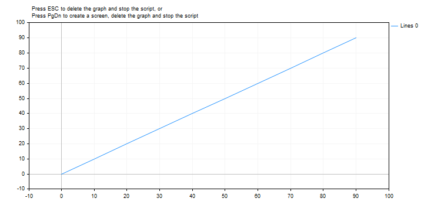

# MathArctan2

Return the angle (in radians) whose tangent is the quotient of two specified numbers.

```
double MathArctan2(
 double y     // The y coordinate of a point
 double x     // The x coordinate of a point
  );

```

Parameters

y

[in]  Y coordinate value.

x

[in]  X coordinate value.

Return Value

MathArctan2 returns an angle, θ, within the range from -π to π radians, so that MathTan(θ)=y/x.

Please note as follows:

- For (x, y) in quadrant 1, 0< θ < π/2
- For (x, y) in quadrant 2, π/2< θ ≤ π
- For (x, y) in quadrant 3, -π < θ < -π/2
- For (x, y) in quadrant 4, -π/2 < θ < 0

For points on the boundaries of the quadrants, the return value is the following:

- If y is 0 and x is not negative, θ = 0.
- If y is 0 and x is negative, θ = π.
- If y is positive and x is 0, θ = π/2.
- If y is negative and x is 0, θ = -π/2.
- If y is 0 and x is 0, θ = 0.

Note

Instead of the MathArctan2() function, you can use the atan2() function.

Example:

```
#define GRAPH_WIDTH  750
#define GRAPH_HEIGHT 350
 
#include <Graphics\Graphic.mqh>
 
CGraphic ExtGraph;
//+------------------------------------------------------------------+
//| Script program start function                                    |
//+------------------------------------------------------------------+
void OnStart()
  {
   vector delta=vector::Full(10,10);
   delta[0]=0;
//--- get 101 values from 0 to 2 pi with delta step
   vector X=delta.CumSum();
//--- calculate the arc tangent value for each value of the X vector
   vector Y=delta.CumSum();
   
   Print("vector delta = \n",delta);
   Print("vector X = \n",X);
   Print("vector Y = \n",Y);
   
//--- transfer the calculated values from vectors to arrays
   double x_array[];;
   double y_array[];;
   X.Swap(x_array);
   Y.Swap(y_array);
   
   double array[10];
   for(int i=0; i<10; i++)
     {
      array[i]=MathArctan2(y_array[i],x_array[i]);
     }
 
//--- draw a graph of the calculated vector values
   CurvePlot(x_array,y_array,clrDodgerBlue);
 
//--- wait for pressing the Escape or PgDn keys to delete the graph (take a screenshot) and exit
   while(!IsStopped())
     {
      if(StopKeyPressed())
         break;
      Sleep(16);
     }
 
//--- clean up
   ExtGraph.Destroy();
  }
//+------------------------------------------------------------------+
//| When pressing ESC, return 'true'                                 |
//| When pressing PgDn, take a graph screenshot and return 'true'    |
//| Otherwise, return 'false'                                        |
//+------------------------------------------------------------------+
bool StopKeyPressed()
  {
//--- if ESC is pressed, return 'true'
   if(TerminalInfoInteger(TERMINAL_KEYSTATE_ESCAPE)!=0)
      return(true);
//--- if PgDn is pressed and a graph screenshot is successfully taken, return 'true'
   if(TerminalInfoInteger(TERMINAL_KEYSTATE_PAGEDOWN)!=0 && MakeAndSaveScreenshot(MQLInfoString(MQL_PROGRAM_NAME)+"_Screenshot"))
      return(true);
//--- return 'false' 
   return(false);
  }
//+------------------------------------------------------------------+
//| Create a graph object and draw a curve                           |
//+------------------------------------------------------------------+
void CurvePlot(double &x_array[], double &y_array[], const color colour)
  {
   ExtGraph.Create(ChartID(), "Graphic", 0, 0, 0, GRAPH_WIDTH, GRAPH_HEIGHT);
   ExtGraph.CurveAdd(x_array, y_array, ColorToARGB(colour), CURVE_LINES);
   ExtGraph.IndentUp(30);
   ExtGraph.CurvePlotAll();
   string text1="Press ESC to delete the graph and stop the script, or";
   string text2="Press PgDn to create a screen, delete the graph and stop the script";
   ExtGraph.TextAdd(54, 9, text1, ColorToARGB(clrBlack));
   ExtGraph.TextAdd(54,21, text2, ColorToARGB(clrBlack));
   ExtGraph.Update();
  }
//+------------------------------------------------------------------+
//| Take a screenshot and save the image to a file                   |
//+------------------------------------------------------------------+
bool MakeAndSaveScreenshot(const string file_name)
  {
   string file_names[];
   ResetLastError();
   int selected=FileSelectDialog("Save Picture", NULL, "All files (*.*)|*.*", FSD_WRITE_FILE, file_names, file_name+".png");
   if(selected<1)
     {
      if(selected<0)
         PrintFormat("%s: FileSelectDialog() function returned error %d", __FUNCTION__, GetLastError());
      return false;
     }
   
   bool res=false;
   if(ChartSetInteger(0,CHART_SHOW,false))
      res=ChartScreenShot(0, file_names[0], GRAPH_WIDTH, GRAPH_HEIGHT);
   ChartSetInteger(0,CHART_SHOW,true);
   return(res);
  }

```

Result:



See also

[Real types (double, float)](/en/docs/basis/types/double), [Statistics](/en/docs/standardlibrary/mathematics/stat), [Scientific Charts](/en/docs/standardlibrary/graphics), [Client Terminal Properties](/en/docs/constants/environment_state/terminalstatus)
