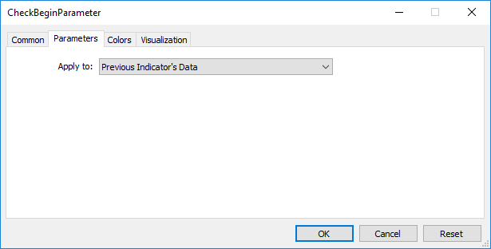

# Custom Indicators

This is the group functions used in the creation of custom indicators. These functions can't be used when writing Expert Advisors and Scripts.

| Function | Action |
| --- | --- |
| SetIndexBuffer | Binds the specified indicator buffer with one-dimensional dynamic  array  of the  double  type |
| IndicatorSetDouble | Sets the value of an indicator property of the  double  type |
| IndicatorSetInteger | Sets the value of an indicator property of the  int  type |
| IndicatorSetString | Sets the value of an indicator property of the  string  type |
| PlotIndexSetDouble | Sets the value of an indicator line property of the type  double |
| PlotIndexSetInteger | Sets the value of an indicator line property of the  int  type |
| PlotIndexSetString | Sets the value of an indicator line property of the  string  type |
| PlotIndexGetInteger | Returns the value of an indicator line property of the  integer  type |

[Indicator properties](/en/docs/customind/propertiesandfunctions) can be set using the compiler directives or using functions. To better understand this, it is recommended that you study [indicator styles in examples](/en/docs/customind/indicators_examples).

All the necessary calculations of a custom indicator must be placed in the predetermined function [OnCalculate()](/en/docs/event_handlers/oncalculate). If you use a short form of the OnCalculate() function call, like

```
int OnCalculate (const int rates_total, const int prev_calculated, const int begin, const double& price[])

```

then the rates_total variable contains the value of the total number of elements of the price[] array, passed as an input parameter for calculating indicator values.

Parameter prev_calculated is the result of the execution of OnCalculate() at the previous call; it allows organizing a saving algorithm for calculating indicator values. For example, if the current value rates_total = 1000, prev_calculated = 999, then perhaps it's enough to make calculations only for one value of each indicator buffer.

If the information about the size of the input array price would have been unavailable, then it would lead to the necessity to make calculations for 1000 values of each indicator buffer. At the first call of OnCalculate() value prev_calculated = 0. If the price[] array has changed somehow, then in this case prev_calculated is also equal to 0.

The begin parameter shows the number of initial values of the price array, which don't contain data for calculation. For example, if values of Accelerator Oscillator (for which the first 37 values aren't calculated) were used as an input parameter, then begin = 37. For example, let's consider a simple indicator:

```
#property indicator_chart_window
#property indicator_buffers 1
#property indicator_plots   1
//---- plot Label1
#property indicator_label1  "Label1"
#property indicator_type1   DRAW_LINE
#property indicator_color1  clrRed
#property indicator_style1  STYLE_SOLID
#property indicator_width1  1
//--- indicator buffers
double         Label1Buffer[];
//+------------------------------------------------------------------+
//| Custom indicator initialization function                         |
//+------------------------------------------------------------------+
void OnInit()
  {
//--- indicator buffers mapping
   SetIndexBuffer(0,Label1Buffer,INDICATOR_DATA);
//---
  }
//+------------------------------------------------------------------+
//| Custom indicator iteration function                              |
//+------------------------------------------------------------------+
int OnCalculate(const int rates_total,
                const int prev_calculated,
                const int begin,
                const double &price[])
 
  {
//---
   Print("begin = ",begin,"  prev_calculated = ",prev_calculated,"  rates_total = ",rates_total);
//--- return value of prev_calculated for next call
   return(rates_total);
  }

```

Drag it from the "Navigator" window to the window of the Accelerator Oscillator indicator and we indicate that calculations will be made based on the values of the previous indicator:



As a result, the first call of OnCalculate() the value of prev_calculated will be equal to zero, and in further calls it will be equal to the rates_total value (until the number of bars on the price chart increases).


The value of the begin parameter will be exactly equal to the number of initial bars, for which the values of the Accelerator indicator aren't calculated according to the logic of this indicator. If we look at the source code of the custom indicator Accelerator.mq5, we'll see the following lines in the [OnInit()](/en/docs/event_handlers/oninit) function:

```
//--- sets first bar from which index will be drawn
   PlotIndexSetInteger(0,PLOT_DRAW_BEGIN,37);

```

Using the function [PlotIndexSetInteger](/en/docs/customind/plotindexsetinteger)(0, [PLOT_DRAW_BEGIN](/en/docs/constants/indicatorconstants/drawstyles#enum_plot_property_integer), empty_first_values), we set the number of non-existing first values in the zero indicator array of a custom indicator, which we don't need to accept for calculation (empty_first_values). Thus, we have mechanisms to:

1. set the number of initial values of an indicator, which shouldn't be used for calculations in another custom indicator;
2. get information on the number of first values to be ignored when you call another custom indicator, without going into the logic of its calculations.
