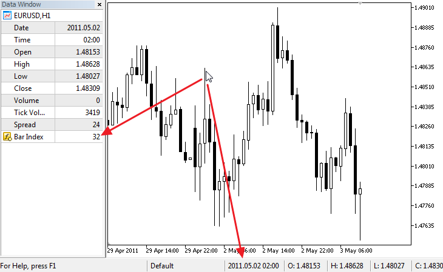

# DRAW_NONE

The DRAW_NONE style is designed for use in cases where it is necessary to calculate the values of a buffer and show them in the Data Window, but plotting on the chart is not required. To set up the accuracy use the expression IndicatorSetInteger(INDICATOR_DIGITS,num_chars) in the [OnInit()](/en/docs/event_handlers/oninit) function:

```
int OnInit()
  {
//--- indicator buffers mapping
   SetIndexBuffer(0,InvisibleBuffer,INDICATOR_DATA);
//--- Set the accuracy of values to be displayed in the Data Window
   IndicatorSetInteger(INDICATOR_DIGITS,0);
//---
   return(INIT_SUCCEEDED);
  }

```

The number of buffers required for plotting DRAW_NONE is 1.

An example of the indicator that shows the number of the bar on which the mouse currently hovers in the Data Window. The numbering corresponds to the timeseries, meaning the current unfinished bar has the zero index, and the oldest bar has the largest index.



Note that despite the fact that, for red color is set plotting #1, the indicator does not draw anything on the chart.

```
//+------------------------------------------------------------------+
//|                                                    DRAW_NONE.mq5 |
//|                        Copyright 2011, MetaQuotes Software Corp. |
//|                                              https://www.mql5.com |
//+------------------------------------------------------------------+
#property copyright "Copyright 2000-2024, MetaQuotes Ltd."
#property link      "https://www.mql5.com"
#property version   "1.00"
#property indicator_chart_window
#property indicator_buffers 1
#property indicator_plots   1
//--- plot Invisible
#property indicator_label1  "Bar Index"
#property indicator_type1   DRAW_NONE
#property indicator_style1  STYLE_SOLID
#property indicator_color1  clrRed
#property indicator_width1  1
//--- indicator buffers
double         InvisibleBuffer[];
//+------------------------------------------------------------------+
//| Custom indicator initialization function                         |
//+------------------------------------------------------------------+
int OnInit()
  {
//--- Binding an array and an indicator buffer
   SetIndexBuffer(0,InvisibleBuffer,INDICATOR_DATA);
//--- Set the accuracy of values to be displayed in the Data Window
   IndicatorSetInteger(INDICATOR_DIGITS,0);
//---
   return(INIT_SUCCEEDED);
  }
//+------------------------------------------------------------------+
//| Custom indicator iteration function                              |
//+------------------------------------------------------------------+
int OnCalculate(const int rates_total,
                const int prev_calculated,
                const datetime &time[],
                const double &open[],
                const double &high[],
                const double &low[],
                const double &close[],
                const long &tick_volume[],
                const long &volume[],
                const int &spread[])
  {
   static datetime lastbar=0;
//--- If this is the first calculation of the indicator
   if(prev_calculated==0)
     {
      //--- Renumber the bars for the first time
      CalcValues(rates_total,close);
      //--- Remember the opening time of the current bar in lastbar
      lastbar=(datetime)SeriesInfoInteger(_Symbol,_Period,SERIES_LASTBAR_DATE);
     }
   else
     {
      //--- If a new bar has appeared, its open time differs from lastbar
      if(lastbar!=SeriesInfoInteger(_Symbol,_Period,SERIES_LASTBAR_DATE))
        {
         //--- Renumber the bars once again
         CalcValues(rates_total,close);
         //--- Update the opening time of the current bar in lastbar
         lastbar=(datetime)SeriesInfoInteger(_Symbol,_Period,SERIES_LASTBAR_DATE);
        }
     }
//--- return value of prev_calculated for next call
   return(rates_total);
  }
//+------------------------------------------------------------------+
//| Number the bars like in a timeseries                             |
//+------------------------------------------------------------------+
void CalcValues(int total,double const  &array[])
  {
//--- Set indexing of the indicator buffer like in a timeseries
   ArraySetAsSeries(InvisibleBuffer,true);
//--- Fill in each bar with its number
   for(int i=0;i<total;i++) InvisibleBuffer[i]=i;
  }

```
