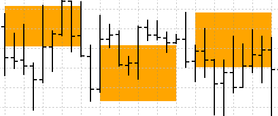
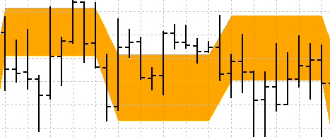
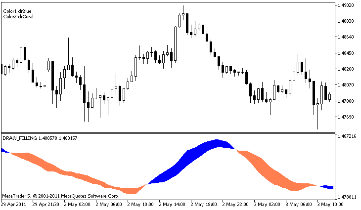

# DRAW_FILLING

The DRAW_FILLING style plots a colored area between the values of two indicator buffers. In fact, this style draws two lines and fills the space between them with one of two specified colors. It is used for creating indicators that draw channels. None of the buffers can contain only empty values, since in this case nothing is plotted.

You can set two fill colors:

- the first color is used for the areas where values in the first buffer are greater than the values in the second indicator buffer;
- the second color is used for the areas where values in the second buffer are greater than the values in the first indicator buffer.

The fill color can be set using the [compiler directives](/en/docs/basis/preprosessor/compilation) or dynamically using the [PlotIndexSetInteger()](/en/docs/customind/plotindexsetinteger) function. Dynamic changes of the plotting properties allows "to enliven" indicators, so that their appearance changes depending on the current situation.

The indicator is calculated for all bars, for which the values of the both indicator buffers are equal neither to 0 nor to the empty value. To specify what value should be considered as "empty", set this value in [PLOT_EMPTY_VALUE](/en/docs/constants/indicatorconstants/drawstyles#enum_plot_property_double) property:

```
   #define INDICATOR_EMPTY_VALUE -1.0
   ...
//--- INDICATOR_EMPTY_VALUE (empty value) will not participate in calculation of
   PlotIndexSetDouble (DRAW_FILLING_creation_index,PLOT_EMPTY_VALUE,INDICATOR_EMPTY_VALUE);

```

Drawing on the bars that do not participate in the indicator calculation will depend on the values ​​in the indicator buffers:

- Bars, for which the values ​​of both indicator buffers are equal to 0, do not participate in drawing the indicator. It means that the area with zero values is not filled out.



- Bars, for which the values ​​of the indicator buffers are equal to the "empty value", participate in drawing the indicator. The area with empty values will be filled out so that to connect the areas with significant values.



It should be noted that if the "empty value" is equal to zero, the bars that do not participate in the indicator calculation are also filled out.

The number of buffers required for plotting DRAW_FILLING is 2.

An example of the indicator that draws a channel between two MAs with different averaging periods in a separate window. The change of the colors at the crossing of moving averages visually shows the change of the upward and downward trends. The colors change randomly every N ticks. The N parameter is set in [external parameters](/en/docs/basis/variables/inputvariables) of the indicator for the possibility of manual configuration (the Parameters tab in the indicator's Properties window).



Note that initially for plot1 with DRAW_FILLING the properties are set using the compiler directive [#property](/en/docs/basis/preprosessor/compilation), and then in the [OnCalculate()](/en/docs/event_handlers/oncalculate) function new colors are set randomly.

```
//+------------------------------------------------------------------+
//|                                                 DRAW_FILLING.mq5 |
//|                        Copyright 2011, MetaQuotes Software Corp. |
//|                                              https://www.mql5.com |
//+------------------------------------------------------------------+
#property copyright "Copyright 2000-2024, MetaQuotes Ltd."
#property link      "https://www.mql5.com"
#property version   "1.00"
 
#property description "An indicator to demonstrate DRAW_FILLING"
#property description "It draws a channel between two MAs in a separate window"
#property description "The fill color is changed randomly"
#property description "after every N ticks"
 
#property indicator_separate_window
#property indicator_buffers 2
#property indicator_plots   1
//--- plot Intersection
#property indicator_label1  "Intersection"
#property indicator_type1   DRAW_FILLING
#property indicator_color1  clrRed,clrBlue
#property indicator_width1  1
//--- input parameters
input int      Fast=13;          // The period of a fast MA
input int      Slow=21;          // The period of a slow MA
input int      shift=1;          // A shift of MAs towards the future (positive)
input int      N=5;              // Number of ticks to change 
//--- Indicator buffers
double         IntersectionBuffer1[];
double         IntersectionBuffer2[];
int fast_handle;
int slow_handle;
//--- An array to store colors
color colors[]={clrRed,clrBlue,clrGreen,clrAquamarine,clrBlanchedAlmond,clrBrown,clrCoral,clrDarkSlateGray};
//+------------------------------------------------------------------+
//| Custom indicator initialization function                         |
//+------------------------------------------------------------------+
int OnInit()
  {
//--- indicator buffers mapping
   SetIndexBuffer(0,IntersectionBuffer1,INDICATOR_DATA);
   SetIndexBuffer(1,IntersectionBuffer2,INDICATOR_DATA);
//---
   PlotIndexSetInteger(0,PLOT_SHIFT,shift);
//---
   fast_handle=iMA(_Symbol,_Period,Fast,0,MODE_SMA,PRICE_CLOSE);
   slow_handle=iMA(_Symbol,_Period,Slow,0,MODE_SMA,PRICE_CLOSE);
//---
   return(INIT_SUCCEEDED);
  }
//+------------------------------------------------------------------+
//| Custom indicator iteration function                              |
//+------------------------------------------------------------------+
int OnCalculate(const int rates_total,
                const int prev_calculated,
                const datetime &time[],
                const double &open[],
                const double &high[],
                const double &low[],
                const double &close[],
                const long &tick_volume[],
                const long &volume[],
                const int &spread[])
  {
   static int ticks=0;
//--- Calculate ticks to change the style, color and width of the line
   ticks++;
//--- If a sufficient number of ticks has been accumulated
   if(ticks>=N)
     {
      //--- Change the line properties
      ChangeLineAppearance();
      //--- Reset the counter of ticks to zero
      ticks=0;
     }
 
//--- Make the first calculation of the indicator, or data has changed and requires a complete recalculation
   if(prev_calculated==0)
     {
      //--- Copy all the values of the indicators to the appropriate buffers
      int copied1=CopyBuffer(fast_handle,0,0,rates_total,IntersectionBuffer1);
      int copied2=CopyBuffer(slow_handle,0,0,rates_total,IntersectionBuffer2);
     }
   else // Fill only those data that are updated
     {
      //--- Get the difference in bars between the current and previous start of OnCalculate()
      int to_copy=rates_total-prev_calculated;
      //--- If there is no difference, we still copy one value - on the zero bar
      if(to_copy==0) to_copy=1;
      //--- copy to_copy values to the very end of indicator buffers
      int copied1=CopyBuffer(fast_handle,0,0,to_copy,IntersectionBuffer1);
      int copied2=CopyBuffer(slow_handle,0,0,to_copy,IntersectionBuffer2);
     }
//--- return value of prev_calculated for next call
   return(rates_total);
  }
//+------------------------------------------------------------------+
//| Changes the colors of the channel filling                        |
//+------------------------------------------------------------------+
void ChangeLineAppearance()
  {
//--- A string for the formation of information about the line properties
   string comm="";
//--- A block for changing the color of the line
   int number=MathRand(); // Get a random number
//--- The divisor is equal to the size of the colors[] array
   int size=ArraySize(colors);
 
//--- Get the index to select a new color as the remainder of integer division
   int color_index1=number%size;
//--- Set the first color as the PLOT_LINE_COLOR property
   PlotIndexSetInteger(0,PLOT_LINE_COLOR,0,colors[color_index1]);
//--- Write the first color
   comm=comm+"\r\nColor1 "+(string)colors[color_index1];
 
//--- Get the index to select a new color as the remainder of integer division
   number=MathRand(); // Get a random number
   int color_index2=number%size;
//--- Set the second color as the PLOT_LINE_COLOR property
   PlotIndexSetInteger(0,PLOT_LINE_COLOR,1,colors[color_index2]);
//--- Write the second color
   comm=comm+"\r\nColor2 "+(string)colors[color_index2];
//--- Show the information on the chart using a comment
   Comment(comm);
  }

```
