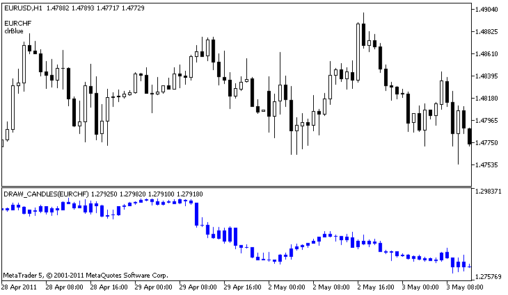

# DRAW_CANDLES

The DRAW_CANDLES style draws candlesticks on the values of four indicator buffers, which contain the Open, High, Low and Close prices. It is used for creating custom indicators as a sequence of candlesticks, including those in a separate subwindow of a chart and on other financial instruments.

The color of candlesticks can be set using the [compiler directives](/en/docs/basis/preprosessor/compilation) or dynamically using the [PlotIndexSetInteger()](/en/docs/customind/plotindexsetinteger) function. Dynamic changes of the plotting properties allows "to enliven" indicators, so that their appearance changes depending on the current situation.

The indicator is drawn only to those bars, for which non-empty values of all four indicator buffers are set. To specify what value should be considered as "empty", set this value in the [PLOT_EMPTY_VALUE](/en/docs/constants/indicatorconstants/customindicatorproperties#enum_customind_property_double) property:

```
//--- The 0 (empty) value will mot participate in drawing
   PlotIndexSetDouble(index_of_plot_DRAW_CANDLES,PLOT_EMPTY_VALUE,0);

```

Always explicitly fill in the values ​​of the indicator buffers, set an empty value in a buffer to skip bars.

The number of required buffers for plotting DRAW_CANDLES is 4. All buffers for the plotting should go one after the other in the given order: Open, High, Low and Close. None of the buffers can contain only empty values, since in this case nothing is plotted.

You can set up to three colors for the DRAW_CANDLES style affecting the candle look. If only one color is set, it is applied to all candles on a chart.

```
//--- identical candles with a single color applied to them
#property indicator_label1  "One color candles"
#property indicator_type1   DRAW_CANDLES
//--- only one color is specified, therefore all candles are of the same color
#property indicator_color1  clrGreen  

```

If two comma-separated colors are specified, the first one is applied to candle outlines, while the second one is applied to the body.

```
//--- different colors for candles and wicks
#property indicator_label1  "Two color candles"
#property indicator_type1   DRAW_CANDLES
//--- green is applied to wicks and outlines, while white is applied to the body
#property indicator_color1  clrGreen,clrWhite 

```

Specify three comma-separated colors so that rising and falling candles are displayed differently. In that case, the first color is applied to the candle outlines, while the second and third ones – to bullish and bearish candles.

```
//--- different colors for candles and wicks
#property indicator_label1  "One color candles"
#property indicator_type1   DRAW_CANDLES
//--- wicks and outlines are green, bullish candle body is white, while bearish candle body is red
#property indicator_color1  clrGreen,clrWhite,clrRed

```

Thus, the DRAW_CANDLES style allows you to create custom candle coloring options. Besides, all colors can be changed dynamically during the indicator operation using the PlotIndexSetInteger function (composition_index_DRAW_CANDLES, PLOT_LINE_COLOR, modifier_index, color), where modifier_index may have the following values:

- 0 – colors of outlines and wicks
- 1– bullish candle body color
- 2 – bearish candle body color

```
//--- set the color of outlines and wicks
PlotIndexSetInteger(0,PLOT_LINE_COLOR,0,clrBlue);
//--- set the bullish body color
PlotIndexSetInteger(0,PLOT_LINE_COLOR,1,clrGreen);
//--- set the bearish body color
PlotIndexSetInteger(0,PLOT_LINE_COLOR,2,clrRed);

```

An example of the indicator that draws candlesticks for a selected financial instrument in a separate window. The color of candlesticks changes randomly every N ticks. The N parameter is set in [external parameters](/en/docs/basis/variables/inputvariables) of the indicator for the possibility of manual configuration (the Parameters tab in the indicator's Properties window).



Please note that for plot1, the color is set using the compiler directive [#property](/en/docs/basis/preprosessor/compilation), and then in the [OnCalculate()](/en/docs/event_handlers/oncalculate) function the color is set randomly from an earlier prepared list.

```
//+------------------------------------------------------------------+
//|                                                 DRAW_CANDLES.mq5 |
//|                         Copyright 2000-2024, MetaQuotes Ltd. |
//|                                              https://www.mql5.com |
//+------------------------------------------------------------------+
#property copyright "Copyright 2000-2024, MetaQuotes Ltd."
#property link      "https://www.mql5.com"
#property version   "1.00"
 
#property description "An indicator to demonstrate DRAW_CANDLES."
#property description "It draws candlesticks of a selected symbol in a separate window"
#property description " "
#property description "The color and width of candlesticks, as well as the symbol are changed"
#property description "randomly every N ticks"
 
#property indicator_separate_window
#property indicator_buffers 4
#property indicator_plots   1
//--- plot Bars
#property indicator_label1  "DRAW_CANDLES1"
#property indicator_type1   DRAW_CANDLES
#property indicator_color1  clrGreen
#property indicator_style1  STYLE_SOLID
#property indicator_width1  1
 
//--- input parameters
input int      N=5;              // The number of ticks to change the type
input int      bars=500;         // The number of bars to show
input bool     messages=false;   // Show messages in the "Expert Advisors" log
//--- Indicator buffers
double         Candle1Buffer1[];
double         Candle1Buffer2[];
double         Candle1Buffer3[];
double         Candle1Buffer4[];
//--- Symbol name
string symbol;
//--- An array to store colors
color colors[]={clrRed,clrBlue,clrGreen,clrPurple,clrBrown,clrIndianRed};
//+------------------------------------------------------------------+
//| Custom indicator initialization function                         |
//+------------------------------------------------------------------+
int OnInit()
  {
//--- If bars is very small - complete the work ahead of time
   if(bars<50)
     {
      Comment("Please specify a larger number of bars! The operation of the indicator has been terminated");
      return(INIT_PARAMETERS_INCORRECT);
     }
//--- indicator buffers mapping
   SetIndexBuffer(0,Candle1Buffer1,INDICATOR_DATA);
   SetIndexBuffer(1,Candle1Buffer2,INDICATOR_DATA);
   SetIndexBuffer(2,Candle1Buffer3,INDICATOR_DATA);
   SetIndexBuffer(3,Candle1Buffer4,INDICATOR_DATA);
//--- An empty value
   PlotIndexSetDouble(0,PLOT_EMPTY_VALUE,0);
//--- The name of the symbol, for which the bars are drawn
   symbol=_Symbol;
//--- Set the display of the symbol
   PlotIndexSetString(0,PLOT_LABEL,symbol+" Open;"+symbol+" High;"+symbol+" Low;"+symbol+" Close");
   IndicatorSetString(INDICATOR_SHORTNAME,"DRAW_CANDLES("+symbol+")");
//---
   return(INIT_SUCCEEDED);
  }
//+------------------------------------------------------------------+
//| Custom indicator iteration function                              |
//+------------------------------------------------------------------+
int OnCalculate(const int rates_total,
                const int prev_calculated,
                const datetime &time[],
                const double &open[],
                const double &high[],
                const double &low[],
                const double &close[],
                const long &tick_volume[],
                const long &volume[],
                const int &spread[])
  {
   static int ticks=INT_MAX-100;
//--- Calculate ticks to change the style, color and width of the line
   ticks++;
//--- If a sufficient number of ticks has been accumulated
   if(ticks>=N)
     {
      //--- Select a new symbol from the Market watch window
      symbol=GetRandomSymbolName();
      //--- Change the form
      ChangeLineAppearance();
      //--- Select a new symbol from the Market watch window
      int tries=0;
      //--- Make 5 attempts to fill in the buffers of plot1 with the prices from symbol
      while(!CopyFromSymbolToBuffers(symbol,rates_total,0,
            Candle1Buffer1,Candle1Buffer2,Candle1Buffer3,Candle1Buffer4)
            && tries<5)
        {
         //--- A counter of calls of the CopyFromSymbolToBuffers() function
         tries++;
        }
      //--- Reset the counter of ticks to zero
      ticks=0;
     }
//--- return value of prev_calculated for next call
   return(rates_total);
  }
//+------------------------------------------------------------------+
//| Fills in the specified candlestick                               |
//+------------------------------------------------------------------+
bool CopyFromSymbolToBuffers(string name,
                             int total,
                             int plot_index,
                             double &buff1[],
                             double &buff2[],
                             double &buff3[],
                             double &buff4[]
                             )
  {
//--- In the rates[] array, we will copy Open, High, Low and Close
   MqlRates rates[];
//--- The counter of attempts
   int attempts=0;
//--- How much has been copied
   int copied=0;
//--- Make 25 attempts to get a timeseries on the desired symbol
   while(attempts<25 && (copied=CopyRates(name,_Period,0,bars,rates))<0)
     {
      Sleep(100);
      attempts++;
      if(messages) PrintFormat("%s CopyRates(%s) attempts=%d",__FUNCTION__,name,attempts);
     }
//--- If failed to copy a sufficient number of bars
   if(copied!=bars)
     {
      //--- Form a message string
      string comm=StringFormat("For the symbol %s, managed to receive only %d bars of %d requested ones",
                               name,
                               copied,
                               bars
                               );
      //--- Show a message in a comment in the main chart window
      Comment(comm);
      //--- Show the message
      if(messages) Print(comm);
      return(false);
     }
   else
     {
      //--- Set the display of the symbol 
      PlotIndexSetString(plot_index,PLOT_LABEL,name+" Open;"+name+" High;"+name+" Low;"+name+" Close");
     }
//--- Initialize buffers with empty values
   ArrayInitialize(buff1,0.0);
   ArrayInitialize(buff2,0.0);
   ArrayInitialize(buff3,0.0);
   ArrayInitialize(buff4,0.0);
//--- On each tick copy prices to buffers
   for(int i=0;i<copied;i++)
     {
      //--- Calculate the appropriate index for the buffers
      int buffer_index=total-copied+i;
      //--- Write the prices to the buffers
      buff1[buffer_index]=rates[i].open;
      buff2[buffer_index]=rates[i].high;
      buff3[buffer_index]=rates[i].low;
      buff4[buffer_index]=rates[i].close;
     }
   return(true);
  }
//+------------------------------------------------------------------+
//| Randomly returns a symbol from the Market Watch                  |
//+------------------------------------------------------------------+
string GetRandomSymbolName()
  {
//--- The number of symbols shown in the Market watch window
   int symbols=SymbolsTotal(true);
//--- The position of a symbol in the list - a random number from 0 to symbols
   int number=MathRand()%symbols;
//--- Return the name of a symbol at the specified position
   return SymbolName(number,true);
  }
//+------------------------------------------------------------------+
//| Changes the appearance of bars                                   |
//+------------------------------------------------------------------+
void ChangeLineAppearance()
  {
//--- A string for the formation of information about the bar properties
   string comm="";
//--- A block for changing the color of bars
   int number=MathRand(); // Get a random number
//--- The divisor is equal to the size of the colors[] array
   int size=ArraySize(colors);
//--- Get the index to select a new color as the remainder of integer division
   int color_index=number%size;
//--- Set the color as the PLOT_LINE_COLOR property
   PlotIndexSetInteger(0,PLOT_LINE_COLOR,colors[color_index]);
//--- Write the color
   comm=comm+"\r\n"+(string)colors[color_index];
//--- Write the symbol name
   comm="\r\n"+symbol+comm;
//--- Show the information on the chart using a comment
   Comment(comm);
  }

```
