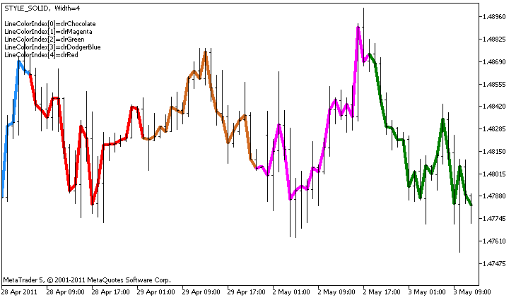

# DRAW_COLOR_LINE

The DRAW_COLOR_LINE value is a colored variant of the [DRAW_LINE](/en/docs/customind/indicators_examples/draw_line) style; it also draws a line using the values of the indicator buffer. But this style, like all color styles with the word COLOR in their title has an additional special indicator buffer that stores the color index (number) from a specially set array of colors. Thus, the color of each line segment can be defined by specifying the color index of the index to draw the line at this bar.

The width, style and colors of lines can be set using the [compiler directives](/en/docs/basis/preprosessor/compilation) and dynamically using the [PlotIndexSetInteger()](/en/docs/customind/plotindexsetinteger) function. Dynamic changes of the plotting properties allows "to enliven" indicators, so that their appearance changes depending on the current situation.

The number of buffers required for plotting DRAW_COLOR_LINE is 2.

- one buffer to store the indicator values used for drawing a line;
- one buffer to store the index of the color of the line on each bar.

Colors can be specified by the compiler directive #property indicator_color1 separated by a comma. The number of colors cannot exceed 64.

```
//--- Define 5 colors for coloring each bar (they are stored in the special array)
#property indicator_color1  clrRed,clrBlue,clrGreen,clrOrange,clrDeepPink // (Up to 64 colors can be specified)

```

An example of the indicator that draws a line using Close prices of bars. The line width and style change randomly every N=5 ticks.



The colors of the line segments also change randomly in the custom function ChangeColors().

```
//+------------------------------------------------------------------+
//| Changes the color of line segments                               |
//+------------------------------------------------------------------+
void  ChangeColors(color  &cols[],int plot_colors)
  {
//--- The number of colors
   int size=ArraySize(cols);
//--- 
   string comm=ChartGetString(0,CHART_COMMENT)+"\r\n\r\n";
 
//--- For each color index define a new color randomly
   for(int plot_color_ind=0;plot_color_ind<plot_colors;plot_color_ind++)
     {
      //--- Get a random value
      int number=MathRand();
      //--- Get an index in the col[] array as a remainder of the integer devision
      int i=number%size;
      //--- Set the color for each index as the property PLOT_LINE_COLOR
      PlotIndexSetInteger(0,                    //  The number of a graphical style
                          PLOT_LINE_COLOR,      //  Property identifier
                          plot_color_ind,       //  The index of the color, where we write the color
                          cols[i]);             //  A new color
      //--- Write the colors
      comm=comm+StringFormat("LineColorIndex[%d]=%s \r\n",plot_color_ind,ColorToString(cols[i],true));
      ChartSetString(0,CHART_COMMENT,comm);
     }
//---
  }

```

The example shows the feature of the "color" versions of indicators - to change the color of a line segment, you do not need to change values in the ColorLineColors[] buffer (which contains the color indexes). All you need to do is set new colors in a special array. This allows you to quickly change the color once for the entire plotting, changing only a small array of colors using the [PlotIndexSetInteger()](/en/docs/customind/indicatorsetinteger) function.

Note that initially for plot1 with DRAW_COLOR_LINE the properties are set using the compiler directive [#property](/en/docs/basis/preprosessor/compilation), and then in the [OnCalculate()](/en/docs/event_handlers/oncalculate) function these three properties are set randomly.

The N and Length (the length of color segments in bars) parameters are set in [external parameters](/en/docs/basis/variables/inputvariables) of the indicator for the possibility of manual configuration (the Parameters tab in the indicator's Properties window).

```
//+------------------------------------------------------------------+
//|                                              DRAW_COLOR_LINE.mq5 |
//|                        Copyright 2011, MetaQuotes Software Corp. |
//|                                              https://www.mql5.com |
//+------------------------------------------------------------------+
#property copyright "Copyright 2000-2024, MetaQuotes Ltd."
#property link      "https://www.mql5.com"
#property version   "1.00"
 
#property description "An indicator to demonstrate DRAW_COLOR_LINE"
#property description "It draws a line on Close price in colored pieces of 20 bars each"
#property description "The width, style and color of the line parts are changed randomly"
#property description "every N ticks"
 
#property indicator_chart_window
#property indicator_buffers 2
#property indicator_plots   1
//--- plot ColorLine
#property indicator_label1  "ColorLine"
#property indicator_type1   DRAW_COLOR_LINE
//--- Define 5 colors for coloring each bar (they are stored in the special array)
#property indicator_color1  clrRed,clrBlue,clrGreen,clrOrange,clrDeepPink // (Up to 64 colors can be specified)
#property indicator_style1  STYLE_SOLID
#property indicator_width1  1
//--- input parameters
input int      N=5;           //Number of ticks to change 
input int      Length=20;     // The length of each color part in bars
int            line_colors=5; // The number of set colors is 5 - see #property indicator_color1
//--- A buffer for plotting
double         ColorLineBuffer[];
//--- A buffer for storing the line color on each bar
double         ColorLineColors[];
 
//--- The array for storing colors contains 7 elements
color colors[]={clrRed,clrBlue,clrGreen,clrChocolate,clrMagenta,clrDodgerBlue,clrGoldenrod};
//--- An array to store the line styles
ENUM_LINE_STYLE styles[]={STYLE_SOLID,STYLE_DASH,STYLE_DOT,STYLE_DASHDOT,STYLE_DASHDOTDOT};
//+------------------------------------------------------------------+
//| Custom indicator initialization function                         |
//+------------------------------------------------------------------+
int OnInit()
  {
//--- Binding an array and an indicator buffer
   SetIndexBuffer(0,ColorLineBuffer,INDICATOR_DATA);
   SetIndexBuffer(1,ColorLineColors,INDICATOR_COLOR_INDEX);
//--- Initializing the generator of pseudo-random numbers
   MathSrand(GetTickCount());
//---
   return(INIT_SUCCEEDED);
  }
//+------------------------------------------------------------------+
//| Custom indicator iteration function                              |
//+------------------------------------------------------------------+
int OnCalculate(const int rates_total,
                const int prev_calculated,
                const datetime &time[],
                const double &open[],
                const double &high[],
                const double &low[],
                const double &close[],
                const long &tick_volume[],
                const long &volume[],
                const int &spread[])
  {
   static int ticks=0;
//--- Calculate ticks to change the style, color and width of the line
   ticks++;
//--- If a critical number of ticks has been accumulated
   if(ticks>=N)
     {
      //--- Change the line properties
      ChangeLineAppearance();
      //--- Change the colors of line sections
      ChangeColors(colors,5);
      //--- Reset the counter of ticks to zero
      ticks=0;
     }
 
//--- Block for calculating indicator values
   for(int i=0;i<rates_total;i++)
     {
      //--- Write the indicator value into the buffer
      ColorLineBuffer[i]=close[i];
      //--- Now, randomly set a color index for this bar
      int color_index=i%(5*Length);
      color_index=color_index/Length;
      //--- For this bar, the line will have the color with the index color_index
      ColorLineColors[i]=color_index;
     }
 
//--- Return the prev_calculated value for the next call of the function
   return(rates_total);
  }
//+------------------------------------------------------------------+
//| Changes the color of line segments                               |
//+------------------------------------------------------------------+
void  ChangeColors(color  &cols[],int plot_colors)
  {
//--- The number of colors
   int size=ArraySize(cols);
//--- 
   string comm=ChartGetString(0,CHART_COMMENT)+"\r\n\r\n";
 
//--- For each color index define a new color randomly
   for(int plot_color_ind=0;plot_color_ind<plot_colors;plot_color_ind++)
     {
      //--- Get a random value
      int number=MathRand();
      //--- Get an index in the col[] array as a remainder of the integer devision
      int i=number%size;
      //--- Set the color for each index as the property PLOT_LINE_COLOR
      PlotIndexSetInteger(0,                    //  The number of a graphical style
                          PLOT_LINE_COLOR,      //  Property identifier
                          plot_color_ind,       //  The index of the color, where we write the color
                          cols[i]);             //  A new color
      //--- Write the colors
      comm=comm+StringFormat("LineColorIndex[%d]=%s \r\n",plot_color_ind,ColorToString(cols[i],true));
      ChartSetString(0,CHART_COMMENT,comm);
     }
//---
  }
//+------------------------------------------------------------------+
//| Changes the appearance of a displayed line in the indicator      |
//+------------------------------------------------------------------+
void ChangeLineAppearance()
  {
//--- A string for the formation of information about the line properties
   string comm="";
//--- A block for changing the width of the line
   int number=MathRand();
//--- Get the width of the remainder of integer division
   int width=number%5; // The width is set from 0 to 4
//--- Set the color as the PLOT_LINE_WIDTH property
   PlotIndexSetInteger(0,PLOT_LINE_WIDTH,width);
//--- Write the line width
   comm=comm+" Width="+IntegerToString(width);
 
//--- A block for changing the style of the line
   number=MathRand();
//--- The divisor is equal to the size of the styles array
   int size=ArraySize(styles);
//--- Get the index to select a new style as the remainder of integer division
   int style_index=number%size;
//--- Set the color as the PLOT_LINE_COLOR property
   PlotIndexSetInteger(0,PLOT_LINE_STYLE,styles[style_index]);
//--- Write the line style
   comm=EnumToString(styles[style_index])+", "+comm;
//--- Show the information on the chart using a comment
   Comment(comm);
  }

```
