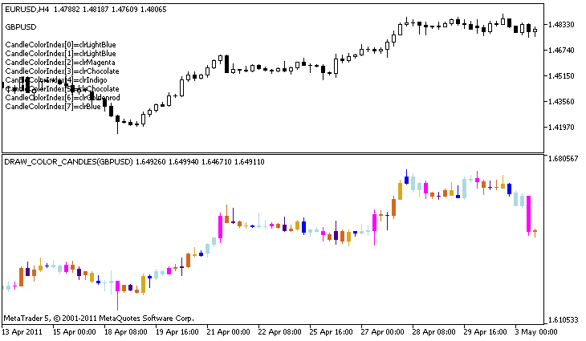

# DRAW_COLOR_CANDLES

The DRAW_COLOR_CANDLES style, like [DRAW_CANDLES](/en/docs/customind/indicators_examples/draw_candles), draws candlesticks using the values of four indicator buffers, which contain Open, High, Low and Close prices. In addition, it allows specifying a color for each candlestick from a given set. For this purpose, the style has a special color buffer that stores color indexes for each bar. It used for creating custom indicators as a sequence of candlesticks, including those in a separate subwindow of a chart and on other financial instruments.

The number of colors of candlesticks can be set using the [compiler directives](/en/docs/basis/preprosessor/compilation) or dynamically using the [PlotIndexSetInteger()](/en/docs/customind/plotindexsetinteger) function. Dynamic changes of the plotting properties allows "to enliven" indicators, so that their appearance changes depending on the current situation.

The indicator is drawn only to those bars, for which non-empty values of four price buffers of the indicator are set. To specify what value should be considered as "empty", set this value in the [PLOT_EMPTY_VALUE](/en/docs/constants/indicatorconstants/customindicatorproperties#enum_customind_property_double) property:

```
//--- The 0 (empty) value will mot participate in drawing
   PlotIndexSetDouble(index_of_plot_DRAW_COLOR_CANDLES,PLOT_EMPTY_VALUE,0);

```

Always explicitly fill in the values of the indicator buffers, set an empty value in a buffer to skip bars.

The number of required buffers for plotting DRAW_COLOR_CANDLES is 5:

- four buffer to store the values of Open, High, Low and Close;
- one buffer to store the color index, which is used to draw a candlestick (it makes sense to set it only for the candlesticks that will be drawn).

All buffers for the plotting should go one after the other in the given order: Open, High, Low, Close and the color buffer. None of the price buffers can contain only empty values, since in this case nothing is plotted.

An example of the indicator that draws candlesticks for a selected financial instrument in a separate window. The color of candlesticks changes randomly every N ticks. The N parameter is set in [external parameters](/en/docs/basis/variables/inputvariables) of the indicator for the possibility of manual configuration (the Parameters tab in the indicator's Properties window).



Please note that for plot1, the color is set using the compiler directive [#property](/en/docs/basis/preprosessor/compilation), and then in the [OnCalculate()](/en/docs/event_handlers/oncalculate) function the color is set randomly from an earlier prepared list.

```
//+------------------------------------------------------------------+
//|                                           DRAW_COLOR_CANDLES.mq5 |
//|                        Copyright 2011, MetaQuotes Software Corp. |
//|                                              https://www.mql5.com |
//+------------------------------------------------------------------+
#property copyright "Copyright 2000-2024, MetaQuotes Ltd."
#property link      "https://www.mql5.com"
#property version   "1.00"
 
#property description "An indicator to demonstrate DRAW_COLOR_CANDLES."
#property description "It draws candlesticks of a selected symbol in a separate window"
#property description " "
#property description "The color and width of candlesticks, as well as the symbol are changed"
#property description "randomly every N ticks"
 
#property indicator_separate_window
#property indicator_buffers 5
#property indicator_plots   1
//--- plot ColorCandles
#property indicator_label1  "ColorCandles"
#property indicator_type1   DRAW_COLOR_CANDLES
//--- Define 8 colors for coloring candlesticks (they are stored in the special array)
#property indicator_color1  clrRed,clrBlue,clrGreen,clrYellow,clrMagenta,clrCyan,clrLime,clrOrange
#property indicator_style1  STYLE_SOLID
#property indicator_width1  1
 
//--- input parameters
input int      N=5;              // The number of ticks to change the type
input int      bars=500;         // The number of candlesticks to show
input bool     messages=false;   // Show messages in the "Expert Advisors" log
//--- Indicator buffers
double         ColorCandlesBuffer1[];
double         ColorCandlesBuffer2[];
double         ColorCandlesBuffer3[];
double         ColorCandlesBuffer4[];
double         ColorCandlesColors[];
int            candles_colors;
//--- Symbol name
string symbol;
//--- An array for storing colors contains 14 elements
color colors[]=
  {
   clrRed,clrBlue,clrGreen,clrChocolate,clrMagenta,clrDodgerBlue,clrGoldenrod,
   clrIndigo,clrLightBlue,clrAliceBlue,clrMoccasin,clrMagenta,clrCyan,clrMediumPurple
  };
//+------------------------------------------------------------------+
//| Custom indicator initialization function                         |
//+------------------------------------------------------------------+
int OnInit()
  {
//--- If bars is very small - complete the work ahead of time
   if(bars<50)
     {
      Comment("Please specify a larger number of bars! The operation of the indicator has been terminated");
      return(INIT_PARAMETERS_INCORRECT);
     }
//--- indicator buffers mapping
   SetIndexBuffer(0,ColorCandlesBuffer1,INDICATOR_DATA);
   SetIndexBuffer(1,ColorCandlesBuffer2,INDICATOR_DATA);
   SetIndexBuffer(2,ColorCandlesBuffer3,INDICATOR_DATA);
   SetIndexBuffer(3,ColorCandlesBuffer4,INDICATOR_DATA);
   SetIndexBuffer(4,ColorCandlesColors,INDICATOR_COLOR_INDEX);
//--- An empty value
   PlotIndexSetDouble(0,PLOT_EMPTY_VALUE,0);
//--- The name of the symbol, for which the bars are drawn
   symbol=_Symbol;
//--- Set the display of the symbol
   PlotIndexSetString(0,PLOT_LABEL,symbol+" Open;"+symbol+" High;"+symbol+" Low;"+symbol+" Close");
   IndicatorSetString(INDICATOR_SHORTNAME,"DRAW_COLOR_CANDLES("+symbol+")");
//---- The number of colors to color candlesticks
   candles_colors=8;     //  see. a comment to the #property indicator_color1 property
//--- 
   return(INIT_SUCCEEDED);
  }
//+------------------------------------------------------------------+
//| Custom indicator iteration function                              |
//+------------------------------------------------------------------+
int OnCalculate(const int rates_total,
                const int prev_calculated,
                const datetime &time[],
                const double &open[],
                const double &high[],
                const double &low[],
                const double &close[],
                const long &tick_volume[],
                const long &volume[],
                const int &spread[])
  {
   static int ticks=INT_MAX-100;
//--- Count ticks to change the style and color
   ticks++;
//--- If a sufficient number of ticks has been accumulated
   if(ticks>=N)
     {
      //--- Select a new symbol from the Market watch window
      symbol=GetRandomSymbolName();
      //--- Change the form
      ChangeLineAppearance();
      //--- Change the colors used to draw the candlesticks
      ChangeColors(colors,candles_colors);
 
      int tries=0;
      //--- Make 5 attempts to fill in the buffers of plot1 with the prices from symbol
      while(!CopyFromSymbolToBuffers(symbol,rates_total,0,
            ColorCandlesBuffer1,ColorCandlesBuffer2,ColorCandlesBuffer3,
            ColorCandlesBuffer4,ColorCandlesColors,candles_colors)
            && tries<5)
        {
         //--- A counter of calls of the CopyFromSymbolToBuffers() function
         tries++;
        }
      //--- Reset the counter of ticks to zero
      ticks=0;
     }
//--- return value of prev_calculated for next call
   return(rates_total);
  }
//+------------------------------------------------------------------+
//| Fills in the specified candlestick                               |
//+------------------------------------------------------------------+
bool CopyFromSymbolToBuffers(string name,
                             int total,
                             int plot_index,
                             double &buff1[],
                             double &buff2[],
                             double &buff3[],
                             double &buff4[],
                             double &col_buffer[],
                             int    cndl_colors
                             )
  {
//--- In the rates[] array, we will copy Open, High, Low and Close
   MqlRates rates[];
//--- The counter of attempts
   int attempts=0;
//--- How much has been copied
   int copied=0;
//--- Make 25 attempts to get a timeseries on the desired symbol
   while(attempts<25 && (copied=CopyRates(name,_Period,0,bars,rates))<0)
     {
      Sleep(100);
      attempts++;
      if(messages) PrintFormat("%s CopyRates(%s) attempts=%d",__FUNCTION__,name,attempts);
     }
//--- If failed to copy a sufficient number of bars
   if(copied!=bars)
     {
      //--- Form a message string
      string comm=StringFormat("For the symbol %s, managed to receive only %d bars of %d requested ones",
                               name,
                               copied,
                               bars
                               );
      //--- Show a message in a comment in the main chart window
      Comment(comm);
      //--- Show the message
      if(messages) Print(comm);
      return(false);
     }
   else
     {
      //--- Set the display of the symbol 
      PlotIndexSetString(plot_index,PLOT_LABEL,name+" Open;"+name+" High;"+name+" Low;"+name+" Close");
      IndicatorSetString(INDICATOR_SHORTNAME,"DRAW_COLOR_CANDLES("+symbol+")");
     }
//--- Initialize buffers with empty values
   ArrayInitialize(buff1,0.0);
   ArrayInitialize(buff2,0.0);
   ArrayInitialize(buff3,0.0);
   ArrayInitialize(buff4,0.0);
//--- On each tick copy prices to buffers
   for(int i=0;i<copied;i++)
     {
      //--- Calculate the appropriate index for the buffers
      int buffer_index=total-copied+i;
      //--- Write the prices to the buffers
      buff1[buffer_index]=rates[i].open;
      buff2[buffer_index]=rates[i].high;
      buff3[buffer_index]=rates[i].low;
      buff4[buffer_index]=rates[i].close;
      //--- Set the candlestick color
      int color_index=i%cndl_colors;
      col_buffer[buffer_index]=color_index;
     }
   return(true);
  }
//+------------------------------------------------------------------+
//| Randomly returns a symbol from the Market Watch                  |
//+------------------------------------------------------------------+
string GetRandomSymbolName()
  {
//--- The number of symbols shown in the Market watch window
   int symbols=SymbolsTotal(true);
//--- The position of a symbol in the list - a random number from 0 to symbols
   int number=MathRand()%symbols;
//--- Return the name of a symbol at the specified position
   return SymbolName(number,true);
  }
//+------------------------------------------------------------------+
//| Changes the color of the candlestick segments                    |
//+------------------------------------------------------------------+
void  ChangeColors(color  &cols[],int plot_colors)
  {
//--- The number of colors
   int size=ArraySize(cols);
//--- 
   string comm=ChartGetString(0,CHART_COMMENT)+"\r\n\r\n";
 
//--- For each color index define a new color randomly
   for(int plot_color_ind=0;plot_color_ind<plot_colors;plot_color_ind++)
     {
      //--- Get a random value
      int number=MathRand();
      //--- Get an index in the col[] array as a remainder of the integer division
      int i=number%size;
      //--- Set the color for each index as the property PLOT_LINE_COLOR
      PlotIndexSetInteger(0,                    //  The number of a graphical style
                          PLOT_LINE_COLOR,      //  Property identifier
                          plot_color_ind,       //  The index of the color, where we write the color
                          cols[i]);             //  A new color
      //--- Write the colors
      comm=comm+StringFormat("CandleColorIndex[%d]=%s \r\n",plot_color_ind,ColorToString(cols[i],true));
      ChartSetString(0,CHART_COMMENT,comm);
     }
//---
  }
//+------------------------------------------------------------------+
//| Changes the appearance of candlesticks                           |
//+------------------------------------------------------------------+
void ChangeLineAppearance()
  {
//--- A string for the formation of information about the candlestick properties
   string comm="";
//--- Write the symbol name
   comm="\r\n"+symbol+comm;
//--- Show the information on the chart using a comment
   Comment(comm);
  }

```
