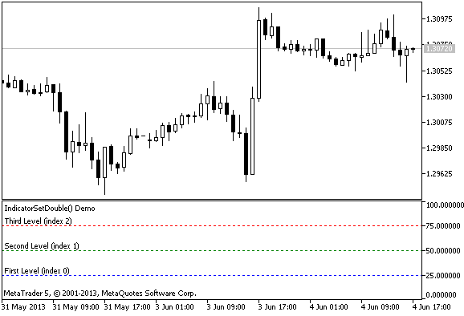

# IndicatorSetDouble

The function sets the value of the corresponding indicator property. Indicator property must be of the double type. There are two variants of the function.

Call with specifying the property identifier.

```
bool  IndicatorSetDouble(
   int     prop_id,           // identifier
   double  prop_value         // value to be set
   );

```

Call with specifying the property identifier and modifier.

```
bool  IndicatorSetDouble(
   int     prop_id,           // identifier
   int     prop_modifier,     // modifier
   double  prop_value         // value to be set
   )

```

Parameters

prop_id

[in]  Identifier of the indicator property. The value can be one of the values of the [ENUM_CUSTOMIND_PROPERTY_DOUBLE](/en/docs/constants/indicatorconstants/customindicatorproperties#enum_customind_property_double) enumeration.

prop_modifier

[in]  Modifier of the specified property. Only level properties require a modifier. Numbering of levels starts from 0. It means that in order to set property for the second level you need to specify 1 (1 less than when using [compiler directive](/en/docs/basis/preprosessor/compilation)).

prop_value

[in]  Value of property.

Return Value

In case of successful execution, returns true, otherwise - false.

Note

Numbering of properties (modifiers) starts from 1 (one) when using the #property directive, while the function uses numbering from 0 (zero). In case the level number is set incorrectly, [indicator display](/en/docs/constants/indicatorconstants/drawstyles) can differ from the intended one.

For example, the first level value for the indicator in a separate subwindow can be set in two ways:

- property indicator_level1  50 - the value of 1 is used for specifying the level number,
- IndicatorSetDouble(INDICATOR_LEVELVALUE, 0, 50) - 0 is used for specifying the first level.

Example: indicator that turns upside down the maximum and minimum values ​​of the indicator window and values ​​of levels on which the horizontal lines are placed.



```
#property indicator_separate_window
//--- set the maximum and minimum values ​​for the indicator window
#property indicator_minimum  0
#property indicator_maximum  100
//--- display three horizontal levels in a separate indicator window
#property indicator_level1 25
#property indicator_level2 50
#property indicator_level3 75
//--- set thickness of horizontal levels
#property indicator_levelwidth 1
//--- set style of horizontal levels
#property indicator_levelstyle STYLE_DOT
//+------------------------------------------------------------------+
//| Custom indicator initialization function                         |
//+------------------------------------------------------------------+
int OnInit()
  {
//--- set descriptions of horizontal levels
   IndicatorSetString(INDICATOR_LEVELTEXT,0,"First Level (index 0)");
   IndicatorSetString(INDICATOR_LEVELTEXT,1,"Second Level (index 1)");
   IndicatorSetString(INDICATOR_LEVELTEXT,2,"Third Level (index 2)");
//--- set the short name for indicator
   IndicatorSetString(INDICATOR_SHORTNAME,"IndicatorSetDouble() Demo");
//--- set color for each level
   IndicatorSetInteger(INDICATOR_LEVELCOLOR,0,clrBlue);
   IndicatorSetInteger(INDICATOR_LEVELCOLOR,1,clrGreen);
   IndicatorSetInteger(INDICATOR_LEVELCOLOR,2,clrRed);
//---
   return(INIT_SUCCEEDED);
  }
//+------------------------------------------------------------------+
//| Custom indicator iteration function                              |
//+------------------------------------------------------------------+
int OnCalculate(const int rates_total,
                const int prev_calculated,
                const datetime &time[],
                const double &open[],
                const double &high[],
                const double &low[],
                const double &close[],
                const long &tick_volume[],
                const long &volume[],
                const int &spread[])
  {
   static int tick_counter=0;
   static double level1=25,level2=50,level3=75;
   static double max=100,min=0, shift=100;
//--- calculate ticks
   tick_counter++;
//--- turn levels upside down on every 10th tick
   if(tick_counter%10==0)
     {
      //--- invert sign for the level values
      level1=-level1;
      level2=-level2;
      level3=-level3;
      //--- invert sign for the maximum and minimum values
      max-=shift;
      min-=shift;
      //--- invert the shift value
      shift=-shift;
      //--- set new level values
      IndicatorSetDouble(INDICATOR_LEVELVALUE,0,level1);
      IndicatorSetDouble(INDICATOR_LEVELVALUE,1,level2);
      IndicatorSetDouble(INDICATOR_LEVELVALUE,2,level3);
      //--- set new values of maximum and minimum in the indicator window
      Print("Set up max = ",max,",   min = ",min);
      IndicatorSetDouble(INDICATOR_MAXIMUM,max);
      IndicatorSetDouble(INDICATOR_MINIMUM,min);
     }
//--- return value of prev_calculated for next call
   return(rates_total);
  }

```

See also

[Indicator Styles in Examples](/en/docs/customind/indicators_examples), [Connection between Indicator Properties and Functions](/en/docs/customind/propertiesandfunctions), [Drawing Styles](/en/docs/constants/indicatorconstants/drawstyles)
