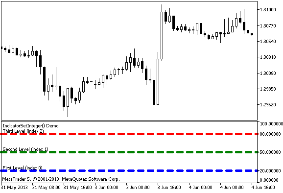

# IndicatorSetInteger

The function sets the value of the corresponding indicator property. Indicator property must be of the int or color type. There are two variants of the function.

Call with specifying the property identifier.

```
bool  IndicatorSetInteger(
   int  prop_id,           // identifier
   int  prop_value         // value to be set
   );

```

Call with specifying the property identifier and modifier.

```
bool  IndicatorSetInteger(
   int  prop_id,           // identifier
   int  prop_modifier,     // modifier
   int  prop_value         // value to be set
   )

```

Parameters

prop_id

[in]  Identifier of the indicator property. The value can be one of the values of the [ENUM_CUSTOMIND_PROPERTY_INTEGER](/en/docs/constants/indicatorconstants/customindicatorproperties#enum_customind_property_integer) enumeration.

prop_modifier

[in]  Modifier of the specified property. Only level properties require a modifier.

prop_value

[in]  Value of property.

Return Value

In case of successful execution, returns true, otherwise - false.

Note

Numbering of properties (modifiers) starts from 1 (one) when using the #property directive, while the function uses numbering from 0 (zero). In case the level number is set incorrectly, [indicator display](/en/docs/constants/indicatorconstants/drawstyles) can differ from the intended one.

For example, in order to set thickness of the first horizontal line use zeroth index:

- IndicatorSetInteger(INDICATOR_LEVELWIDTH, 0, 5) - index 0 is used to set thickness of the first level.

Example: indicator that sets color, style and thickness of the indicator horizontal lines.



```
#property indicator_separate_window
#property indicator_minimum 0
#property indicator_maximum 100
//--- display three horizontal levels in a separate indicator window
#property indicator_level1 20
#property indicator_level2 50
#property indicator_level3 80
//--- set thickness of horizontal levels
#property indicator_levelwidth 5
//--- set color of horizontal levels
#property indicator_levelcolor clrAliceBlue
//--- set style of horizontal levels
#property indicator_levelstyle STYLE_DOT
//+------------------------------------------------------------------+
//| Custom indicator initialization function                         |
//+------------------------------------------------------------------+
int OnInit()
  {
//--- set descriptions of horizontal levels
   IndicatorSetString(INDICATOR_LEVELTEXT,0,"First Level (index 0)");
   IndicatorSetString(INDICATOR_LEVELTEXT,1,"Second Level (index 1)");
   IndicatorSetString(INDICATOR_LEVELTEXT,2,"Third Level (index 2)");
//--- set the short name for indicator
   IndicatorSetString(INDICATOR_SHORTNAME,"IndicatorSetInteger() Demo");
   return(INIT_SUCCEEDED);
  }
//+------------------------------------------------------------------+
//| Custom indicator iteration function                              |
//+------------------------------------------------------------------+
int OnCalculate(const int rates_total,
                const int prev_calculated,
                const datetime &time[],
                const double &open[],
                const double &high[],
                const double &low[],
                const double &close[],
                const long &tick_volume[],
                const long &volume[],
                const int &spread[])
  {
   static int tick_counter=0;
//--- calculate ticks
   tick_counter++;
//--- and calculate colors of horizontal levels depending on the tick counter
   ChangeLevelColor(0,tick_counter,3,6,10); // three last parameters are switching the color
   ChangeLevelColor(1,tick_counter,3,6,8);
   ChangeLevelColor(2,tick_counter,4,7,9);
//--- modify style of horizontal levels
   ChangeLevelStyle(0,tick_counter);
   ChangeLevelStyle(1,tick_counter+5);
   ChangeLevelStyle(2,tick_counter+15);
//--- get width as the remainder of integer division of the ticks number by 5
   int width=tick_counter%5;
//--- iterate over all horizontal levels and set thickness
   for(int l=0;l<3;l++)
      IndicatorSetInteger(INDICATOR_LEVELWIDTH,l,width+1);
//--- return value of prev_calculated for next call
   return(rates_total);
  }
//+------------------------------------------------------------------+
//| Set color of horizontal line in the separate indicator window    |
//+------------------------------------------------------------------+
void ChangeLevelColor(int level,      // number of horizontal line
                      int tick_number,// dividend, number to get the remainder of division
                      int f_trigger,  // first divisor of color switching
                      int s_trigger,  // second divisor of color switching
                      int t_trigger)  // third divisor of color switching
  {
   static color colors[3]={clrRed,clrBlue,clrGreen};
//--- index of color from the colors[] array
   int index=-1;
//--- calculate the number of color from the colors[] array to paint horizontal line
   if(tick_number%f_trigger==0)
      index=0;   // if tick_number is divided by f_trigger without the remainder
   if(tick_number%s_trigger==0)
      index=1;   // if tick_number is divided by s_trigger without the remainder
   if(tick_number%t_trigger==0)
      index=2;   // if tick_number is divided by t_trigger without the remainder
//--- if color is defined, set it      
   if(index!=-1)
      IndicatorSetInteger(INDICATOR_LEVELCOLOR,level,colors[index]);
//---
  }
//+------------------------------------------------------------------+
//| Set style of horizontal line in the separate indicator window    |
//+------------------------------------------------------------------+
void ChangeLevelStyle(int level,     // number of horizontal line
                      int tick_number// number to get the remainder of division
                      )
  {
//--- array to store styles
   static ENUM_LINE_STYLE styles[5]=
     {STYLE_SOLID,STYLE_DASH,STYLE_DOT,STYLE_DASHDOT,STYLE_DASHDOTDOT};
//--- index of style from the styles[] array
   int index=-1;
//--- calculate the number from the styles[] array to set style of horizontal line
   if(tick_number%50==0)
      index=5;   // if tick_number is divided by 50 without the remainder, then style is STYLE_DASHDOTDOT
   if(tick_number%40==0)
      index=4;   // ... style is STYLE_DASHDOT
   if(tick_number%30==0)
      index=3;   // ... STYLE_DOT
   if(tick_number%20==0)
      index=2;   // ... STYLE_DASH
   if(tick_number%10==0)
      index=1;   // ... STYLE_SOLID
//--- if style is defined, set it      
   if(index!=-1)
      IndicatorSetInteger(INDICATOR_LEVELSTYLE,level,styles[index]);
  }

```

See also

[Custom Indicator Properties](/en/docs/constants/indicatorconstants/customindicatorproperties), [Program Properties (#property)](/en/docs/basis/preprosessor/compilation),  [Drawing Styles](/en/docs/constants/indicatorconstants/drawstyles)
