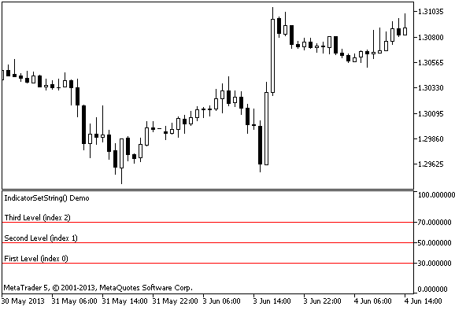

# IndicatorSetString

The function sets the value of the corresponding indicator property. Indicator property must be of the string type. There are two variants of the function.

Call with specifying the property identifier.

```
bool  IndicatorSetString(
   int     prop_id,           // identifier
   string  prop_value         // value to be set
   );

```

Call with specifying the property identifier and modifier.

```
bool  IndicatorSetString(
   int     prop_id,           // identifier
   int     prop_modifier,     // modifier
   string  prop_value         // value to be set
   )

```

Parameters

prop_id

[in]  Identifier of the indicator property. The value can be one of the values of the [ENUM_CUSTOMIND_PROPERTY_STRING](/en/docs/constants/indicatorconstants/customindicatorproperties#enum_customind_property_string) enumeration.

prop_modifier

[in]  Modifier of the specified property. Only level properties require a modifier.

prop_value

[in]  Value of property.

Return Value

In case of successful execution, returns true, otherwise - false.

Note

Numbering of properties (modifiers) starts from 1 (one) when using the #property directive, while the function uses numbering from 0 (zero). In case the level number is set incorrectly, [indicator display](/en/docs/constants/indicatorconstants/drawstyles) can differ from the intended one.

For example, in order to set description of the first horizontal line use zeroth index:

- IndicatorSetString(INDICATOR_LEVELTEXT, 0, "First Level") - index 0 is used to set text description of the first level.

Example: indicator that sets text labels to the indicator horizontal lines.



```
#property indicator_separate_window
#property indicator_minimum 0
#property indicator_maximum 100
//--- display three horizontal levels in a separate indicator window
#property indicator_level1 30
#property indicator_level2 50
#property indicator_level3 70
//--- set color of horizontal levels
#property indicator_levelcolor clrRed
//--- set style of horizontal levels
#property indicator_levelstyle STYLE_SOLID
//+------------------------------------------------------------------+
//| Custom indicator initialization function                         |
//+------------------------------------------------------------------+
int OnInit()
  {
//--- set descriptions of horizontal levels
   IndicatorSetString(INDICATOR_LEVELTEXT,0,"First Level (index 0)");
   IndicatorSetString(INDICATOR_LEVELTEXT,1,"Second Level (index 1)");
   IndicatorSetString(INDICATOR_LEVELTEXT,2,"Third Level (index 2)");
//--- set the short name for indicator
   IndicatorSetString(INDICATOR_SHORTNAME,"IndicatorSetString() Demo");
//---
   return(INIT_SUCCEEDED);
  }
//+------------------------------------------------------------------+
//| Custom indicator iteration function                              |
//+------------------------------------------------------------------+
int OnCalculate(const int rates_total,
                const int prev_calculated,
                const datetime &time[],
                const double &open[],
                const double &high[],
                const double &low[],
                const double &close[],
                const long &tick_volume[],
                const long &volume[],
                const int &spread[])
  {
//---
   
//--- return value of prev_calculated for next call
   return(rates_total);
  }

```

See also

[Custom Indicator Properties](/en/docs/constants/indicatorconstants/customindicatorproperties), [Program Properties (#property)](/en/docs/basis/preprosessor/compilation)
