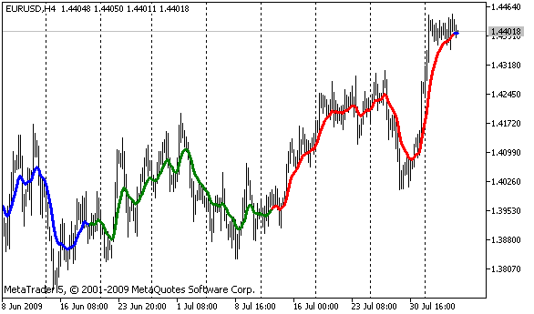

# PlotIndexSetInteger

The function sets the value of the corresponding property of the corresponding indicator line. The indicator property must be of the int, char, bool or color type. There are 2 variants of the function.

Call indicating identifier of the property.

```
bool  PlotIndexSetInteger(
   int  plot_index,        // plotting style index
   int  prop_id,           // property identifier
   int  prop_value         // value to be set
   );

```

Call indicating the identifier and modifier of the property.

```
bool  PlotIndexSetInteger(
   int  plot_index,        // plotting style index
   int  prop_id,           // property identifier
   int  prop_modifier,     // property modifier
   int  prop_value         // value to be set
   )

```

Parameters

plot_index

[in]  Index of the [graphical plotting](/en/docs/constants/indicatorconstants/drawstyles#enum_draw_type)

prop_id

[in] The value can be one of the values of the [ENUM_PLOT_PROPERTY_INTEGER](/en/docs/constants/indicatorconstants/drawstyles#enum_plot_property_integer) enumeration.

prop_modifier

[in]  Modifier of the specified property. Only color index properties require a modifier.

prop_value

[in]  The value of the property.

Return Value

If successful, returns [true](/en/docs/basis/types/integer/boolconst), otherwise [false](/en/docs/basis/types/integer/boolconst).

Example: an indicator that draws a three-color line. The color scheme changes every 5 ticks.



```
#property indicator_chart_window
#property indicator_buffers 2
#property indicator_plots   1
//---- plot ColorLine
#property indicator_label1  "ColorLine"
#property indicator_type1   DRAW_COLOR_LINE
#property indicator_color1  clrRed,clrGreen,clrBlue
#property indicator_style1  STYLE_SOLID
#property indicator_width1  3
//--- indicator buffers
double         ColorLineBuffer[];
double         ColorBuffer[];
int            MA_handle;
//+------------------------------------------------------------------+
//| Custom indicator initialization function                         |
//+------------------------------------------------------------------+
void OnInit()
  {
//--- indicator buffers mapping
   SetIndexBuffer(0,ColorLineBuffer,INDICATOR_DATA);
   SetIndexBuffer(1,ColorBuffer,INDICATOR_COLOR_INDEX);
//--- get MA handle
   MA_handle=iMA(Symbol(),0,10,0,MODE_EMA,PRICE_CLOSE);
//---
  }
//+------------------------------------------------------------------+
//| get color index                                               |
//+------------------------------------------------------------------+
int getIndexOfColor(int i)
  {
   int j=i%300;
   if(j<100) return(0);// first index
   if(j<200) return(1);// second index
   return(2); // third index
  }
//+------------------------------------------------------------------+
//| Custom indicator iteration function                              |
//+------------------------------------------------------------------+
int OnCalculate(const int rates_total,
                const int prev_calculated,
                const datetime &time[],
                const double &open[],
                const double &high[],
                const double &low[],
                const double &close[],
                const long &tick_volume[],
                const long &volume[],
                const int &spread[])
  {
//---
   static int ticks=0,modified=0;
   int limit;
//--- first calculation or number of bars was changed
   if(prev_calculated==0)
     {
      //--- copy values of MA into indicator buffer ColorLineBuffer
      int copied=CopyBuffer(MA_handle,0,0,rates_total,ColorLineBuffer);
      if(copied<=0) return(0);// copying failed - throw away
      //--- now set line color for every bar
      for(int i=0;i<rates_total;i++)
         ColorBuffer[i]=getIndexOfColor(i);
     }
   else
     {
      //--- copy values of MA into indicator buffer ColorLineBuffer
      int copied=CopyBuffer(MA_handle,0,0,rates_total,ColorLineBuffer);
      if(copied<=0) return(0);
 
      ticks++;// ticks counting
      if(ticks>=5)//it's time to change color scheme
        {
         ticks=0; // reset counter
         modified++; // counter of color changes
         if(modified>=3)modified=0;// reset counter 
         ResetLastError();
         switch(modified)
           {
            case 0:// first color scheme
               PlotIndexSetInteger(0,PLOT_LINE_COLOR,0,clrRed);
               PlotIndexSetInteger(0,PLOT_LINE_COLOR,1,clrBlue);
               PlotIndexSetInteger(0,PLOT_LINE_COLOR,2,clrGreen);
               Print("Color scheme "+modified);
               break;
            case 1:// second color scheme
               PlotIndexSetInteger(0,PLOT_LINE_COLOR,0,clrYellow);
               PlotIndexSetInteger(0,PLOT_LINE_COLOR,1,clrPink);
               PlotIndexSetInteger(0,PLOT_LINE_COLOR,2,clrLightSlateGray);
               Print("Color scheme "+modified);
               break;
            default:// third color scheme
               PlotIndexSetInteger(0,PLOT_LINE_COLOR,0,clrLightGoldenrod);
               PlotIndexSetInteger(0,PLOT_LINE_COLOR,1,clrOrchid);
               PlotIndexSetInteger(0,PLOT_LINE_COLOR,2,clrLimeGreen);
               Print("Color scheme "+modified);
           }
        }
      else
        {
         //--- set start position
         limit=prev_calculated-1;
         //--- now we set line color for every bar
         for(int i=limit;i<rates_total;i++)
            ColorBuffer[i]=getIndexOfColor(i);
        }
     }
//--- return value of prev_calculated for next call
   return(rates_total);
  }
//+------------------------------------------------------------------+

```
