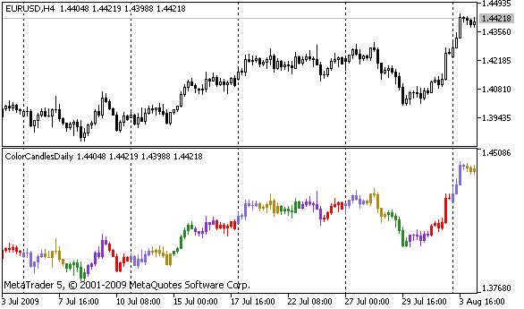

# PlotIndexGetInteger

The function sets the value of the corresponding property of the corresponding indicator line. The indicator property must be of the int, color, bool or char type. There are 2 variants of the function.

Call indicating identifier of the property.

```
int  PlotIndexGetInteger(
   int  plot_index,        // plotting style index
   int  prop_id,           // property identifier
   );

```

Call indicating the identifier and modifier of the property.

```
int  PlotIndexGetInteger(
   int  plot_index,        // plotting index
   int  prop_id,           // property identifier
   int  prop_modifier      // property modifier
   )

```

Parameters

plot_index

[in]  Index of the [graphical plotting](/en/docs/constants/indicatorconstants/drawstyles#enum_draw_type)

prop_id

[in] The value can be one of the values of the [ENUM_PLOT_PROPERTY_INTEGER](/en/docs/constants/indicatorconstants/drawstyles#enum_plot_property_integer) enumeration.

prop_modifier

[in]  Modifier of the specified property. Only color index properties require a modifier.

Note

Function is designed to extract the settings of drawing of the appropriate indicator line. The function works in tandem with the function [PlotIndexSetInteger](/en/docs/customind/plotindexsetinteger) to copy the drawing properties of one line to another.

Example: an indicator that colors candles depending on the day of the week. Colors for each day are set in a programmatically.



```
#property indicator_separate_window
#property indicator_buffers 5
#property indicator_plots   1
//---- plot ColorCandles
#property indicator_label1  "ColorCandles"
#property indicator_type1   DRAW_COLOR_CANDLES
#property indicator_style1  STYLE_SOLID
#property indicator_width1  1
//--- indicator buffers
double         OpenBuffer[];
double         HighBuffer[];
double         LowBuffer[];
double         CloseBuffer[];
double         ColorCandlesColors[];
color          ColorOfDay[6]={CLR_NONE,clrMediumSlateBlue,
                              clrDarkGoldenrod,clrForestGreen,clrBlueViolet,clrRed};
//+------------------------------------------------------------------+
//| Custom indicator initialization function                         |
//+------------------------------------------------------------------+
void OnInit()
  {
//--- indicator buffers mapping
   SetIndexBuffer(0,OpenBuffer,INDICATOR_DATA);
   SetIndexBuffer(1,HighBuffer,INDICATOR_DATA);
   SetIndexBuffer(2,LowBuffer,INDICATOR_DATA);
   SetIndexBuffer(3,CloseBuffer,INDICATOR_DATA);
   SetIndexBuffer(4,ColorCandlesColors,INDICATOR_COLOR_INDEX);
//--- set number of colors in color buffer
   PlotIndexSetInteger(0,PLOT_COLOR_INDEXES,6);
//--- set colors for color buffer
   for(int i=1;i<6;i++)
      PlotIndexSetInteger(0,PLOT_LINE_COLOR,i,ColorOfDay[i]);
//--- set accuracy
   IndicatorSetInteger(INDICATOR_DIGITS,_Digits);
   printf("We have %u colors of days",PlotIndexGetInteger(0,PLOT_COLOR_INDEXES));
//---
  }
//+------------------------------------------------------------------+
//| Custom indicator iteration function                              |
//+------------------------------------------------------------------+
int OnCalculate(const int rates_total,
                const int prev_calculated,
                const datetime &time[],
                const double &open[],
                const double &high[],
                const double &low[],
                const double &close[],
                const long &tick_volume[],
                const long &volume[],
                const int &spread[])
  {
//---
   int i;
   MqlDateTime t;
//----
   if(prev_calculated==0) i=0;
   else i=prev_calculated-1;
//----
   while(i<rates_total)
     {
      OpenBuffer[i]=open[i];
      HighBuffer[i]=high[i];
      LowBuffer[i]=low[i];
      CloseBuffer[i]=close[i];
      //--- set color for every candle
      TimeToStruct(time[i],t);
      ColorCandlesColors[i]=t.day_of_week;
      //---
      i++;
     }
//--- return value of prev_calculated for next call
   return(rates_total);
  }
//+------------------------------------------------------------------+

```
