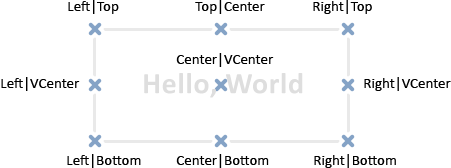

# TextOut

The function displays a text in a custom array (buffer) and returns the result of that operation. The array is designed to create the graphical [resource](/en/docs/common/resourcecreate).

```
bool  TextOut(
   const string       text,          // displayed text
   int                x,             // X coordinate 
   int                y,             // Y coordinate 
   uint               anchor,        // anchor type
   uint               &data[],       // output buffer
   uint               width,         // buffer width in pixels
   uint               height,        // buffer height in pixels
   uint               color,         // text color
   ENUM_COLOR_FORMAT  color_format   // color format for output
   );

```

Parameters

text

[in]  Displayed text that will be written to the buffer. Only one-lined text is displayed.

x

[in]  X coordinate of the anchor point of the displayed text.

y

[in]  Y coordinate of the anchor point of the displayed text.

anchor

[in]  The value out of the 9 pre-defined methods of the displayed text's anchor point location. The value is set by a combination of two flags – flags of horizontal and vertical text align. Flag names are listed in the Note below.

data[]

[in]  Buffer, in which text is displayed. The buffer is used to create the graphical [resource](/en/docs/runtime/resources).

width

[in]  Buffer width in pixels.

height

[in]  Buffer height in pixels.

color

[in]  Text color.

color_format

[in]  Color format is set by [ENUM_COLOR_FORMAT](/en/docs/common/resourcecreate#enum_color_format) enumeration value.

Return Value

Returns true if successful, otherwise false.

Note

Anchor point specified by anchor is a combination of two flags of horizontal and vertical text align. Horizontal text align flags:

- TA_LEFT – anchor point on the left side of the bounding box
- TA_CENTER – horizontal anchor point is located at the center of the bounding box
- TA_RIGHT – anchor point on the right side of the bounding box

Vertical text align flags:

- TA_TOP – anchor point at the upper side of the bounding box
- TA_VCENTER – vertical anchor point is located at the center of the bounding box
- TA_BOTTOM – anchor point at the lower side of the bounding box

Possible combinations of flags and specified anchor points are shown in the image.



Example:

```
//--- width and height of the canvas (the one the drawing takes place on)
#define IMG_WIDTH  200
#define IMG_HEIGHT 200
//--- before running the script, show a window with parameters
#property script_show_inputs
//--- provide the ability to set the color format
input ENUM_COLOR_FORMAT clr_format=COLOR_FORMAT_XRGB_NOALPHA;
//--- array (buffer) for rendering
uint ExtImg[IMG_WIDTH*IMG_HEIGHT];
//+------------------------------------------------------------------+
//| Script program start function                                    |
//+------------------------------------------------------------------+
void OnStart()
  {
//--- create the OBJ_BITMAP_LABEL object for drawing    
   ObjectCreate(0,"CLOCK",OBJ_BITMAP_LABEL,0,0,0);
//--- set the name of the graphical resource for rendering in the CLOCK object
   ObjectSetString(0,"CLOCK",OBJPROP_BMPFILE,"::IMG");
 
//--- auxiliary variables
   double a;            // arrow angle
   uint   nm=2700;      // minute counter
   uint   nh=2700*12;   // hour counter
   uint   w,h;          // variables for getting the sizes of text strings 
   int    x,y;          // variables for calculating the current coordinates of the anchor point of text strings 
 
//--- spin the clock hands in an infinite loop until the script is stopped
   while(!IsStopped())
     {
      //--- clear the clock drawing buffer array
      ArrayFill(ExtImg,0,IMG_WIDTH*IMG_HEIGHT,0);
      //--- set the font for drawing numbers on the dial
      TextSetFont("Arial",-200,FW_EXTRABOLD,0);
      //--- draw the dial
      for(int i=1;i<=12;i++)
        {
         //--- get the size of the current hour on the dial
         TextGetSize(string(i),w,h);
         //--- calculate the coordinates of the current hour on the dial
         a=-((i*300)%3600*M_PI)/1800.0;
         x=IMG_WIDTH/2-int(sin(a)*80+0.5+w/2);
         y=IMG_HEIGHT/2-int(cos(a)*80+0.5+h/2);
         //--- output this hour to the dial in the ExtImg[] buffer
         TextOut(string(i),x,y,TA_LEFT|TA_TOP,ExtImg,IMG_WIDTH,IMG_HEIGHT,0xFFFFFFFF,clr_format);
        }
      //--- set the font for drawing the minute hand      
      TextSetFont("Arial",-200,FW_EXTRABOLD,-int(nm%3600));
      //--- get the size of the minute hand
      TextGetSize("----->",w,h);
      //--- calculate the coordinates of the minute hand on the dial
      a=-(nm%3600*M_PI)/1800.0;
      x=IMG_WIDTH/2-int(sin(a)*h/2+0.5);
      y=IMG_HEIGHT/2-int(cos(a)*h/2+0.5);
      //--- output the minute hand to the dial in the ExtImg[] buffer 
      TextOut("----->",x,y,TA_LEFT|TA_TOP,ExtImg,IMG_WIDTH,IMG_HEIGHT,0xFFFFFFFF,clr_format);
 
      //--- set the font for drawing the hour hand      
      TextSetFont("Arial",-200,FW_EXTRABOLD,-int(nh/12%3600));
      TextGetSize("==>",w,h);
      //--- calculate the coordinates of the hour hand on the dial
      a=-(nh/12%3600*M_PI)/1800.0;
      x=IMG_WIDTH/2-int(sin(a)*h/2+0.5);
      y=IMG_HEIGHT/2-int(cos(a)*h/2+0.5);
      //--- output the hour hand to the dial in the ExtImg[] buffer 
      TextOut("==>",x,y,TA_LEFT|TA_TOP,ExtImg,IMG_WIDTH,IMG_HEIGHT,0xFFFFFFFF,clr_format);
 
      //--- update the graphical resource
      ResourceCreate("::IMG",ExtImg,IMG_WIDTH,IMG_HEIGHT,0,0,IMG_WIDTH,clr_format);
      //--- forced chart update
      ChartRedraw();
 
      //--- increase the hour and minute counters
      nm+=60;
      nh+=60;
      //--- take a short pause between frames
      Sleep(10);
     }
//--- delete the CLOCK object when the script finishes
   ObjectDelete(0,"CLOCK");
//---
  }

```

See also

[Resources](/en/docs/runtime/resources), [ResourceCreate()](/en/docs/common/resourcecreate), [ResourceSave()](/en/docs/common/resourcesave), [TextGetSize()](/en/docs/objects/textgetsize), [TextSetFont()](/en/docs/objects/textsetfont)
