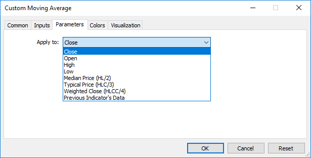

# iCustom

The function returns the handle of a specified custom indicator.

```
int  iCustom(
   string           symbol,     // symbol name
   ENUM_TIMEFRAMES  period,     // period
   string           name        // folder/custom_indicator_name
   ...                          // list of indicator input parameters
   );

```

Parameters

symbol

[in] The symbol name of the security, the data of which should be used to calculate the indicator. The [NULL](/en/docs/basis/types/void) value means the current symbol.

period

[in] The value of the period can be one of the [ENUM_TIMEFRAMES](/en/docs/constants/chartconstants/enum_timeframes) values, 0 means the current timeframe.

name

[in]  Custom indicator name. If the name starts with the reverse slash '\', the EX5 indicator file is searched for relative to the MQL5 root directory. So, for a call of iCustom(Symbol(), Period(), "\FirstIndicator"...), the indicator will be loaded as MQL5\FirstIndicator.ex5. If the file is not found at this path, error 4802 (ERR_INDICATOR_CANNOT_CREATE) is returned.

If the path does not start with '\', the indicator is searched and downloaded as follows:

- First, the indicator EX5 file is searched for in the folder where the EX5 file of the calling program is located. For example, the CrossMA.EX5 EA is located in MQL5\Experts\MyExperts and contains the iCustom call (Symbol(), Period(), "SecondIndicator"...). In this case, the indicator is searched for in MQL5\Experts\MyExperts\SecondIndicator.ex5.
- If the indicator is not found in the same directory, the search is performed relative to the MQL5\Indicators indicator root directory. In other words, the search for the MQL5\Indicators\SecondIndicator.ex5 file is performed. If the indicator is still not found, the function returns [INVALID_HANDLE](/en/docs/constants/namedconstants/otherconstants) and the error 4802 (ERR_INDICATOR_CANNOT_CREATE) is triggered.

If the path to the indicator is set in the subdirectory (for example, MyIndicators\ThirdIndicator), the search is first performed in the calling program folder (the EA is located in MQL5\Experts\MyExperts) in MQL5\Experts\MyExperts\MyIndicators\ThirdIndicator.ex5. If unsuccessful, the search for the MQL5\Indicators\MyIndicators\ThirdIndicator.ex5 file is performed. Make sure to use the double reverse slash '\\' as a separator in the path, for example iCustom(Symbol(), Period(), "MyIndicators\\ThirdIndicator"...)

...

[in]  [input-parameters](/en/docs/basis/variables/inputvariables) of a custom indicator, separated by commas. Type and order of parameters must match. If there is no parameters specified, then [default values](/en/docs/basis/function#default_value) will be used.

Return Value

Returns the handle of a specified technical indicator,  in case of failure returns [INVALID_HANDLE](/en/docs/constants/namedconstants/otherconstants). The computer memory can be freed from an indicator that is no more utilized, using the [IndicatorRelease()](/en/docs/series/indicatorrelease) function, to which the indicator handle is passed.

Note

A custom indicator must be compiled (with extension EX5) and located in the directory MQL5/Indicators of the client terminal or its subdirectory.

Indicators that require testing are defined automatically from the call of the iCustom() function, if the corresponding parameter is set through a [constant string](/en/docs/basis/types/stringconst). For all other cases (use of the [IndicatorCreate()](/en/docs/series/indicatorcreate) function or use of a non-constant string in the parameter that sets the indicator name) the property [#property tester_indicator](/en/docs/basis/preprosessor/compilation) is required:

```
#property tester_indicator "indicator_name.ex5"

```

If [the first call form](/en/docs/event_handlers/oncalculate) is used in the indicator, then at the custom indicator start you can additionally indicate data for calculation in its "Parameters" tab. If the "Apply to" parameter is not selected explicitly, the default calculation is based on the values of "Close" prices.



When you call a custom indicator from mql5-program, the Applied_Price parameter or a handle of another indicator should be passed last, after all input variables of the custom indicator.

See also

[Program Properties](/en/docs/basis/preprosessor/compilation), [Timeseries and Indicators Access](/en/docs/series),[IndicatorCreate()](/en/docs/series/indicatorcreate), [IndicatorRelease()](/en/docs/series/indicatorrelease)

Example:

```
#property indicator_separate_window
#property indicator_buffers 1
#property indicator_plots   1
//---- plot Label1
#property indicator_label1  "Label1"
#property indicator_type1   DRAW_LINE
#property indicator_color1  clrRed
#property indicator_style1  STYLE_SOLID
#property indicator_width1  1
//--- input parameters
input int MA_Period=21;
input int MA_Shift=0;
input ENUM_MA_METHOD MA_Method=MODE_SMA;
//--- indicator buffers
double         Label1Buffer[];
//--- Handle of the Custom Moving Average.mq5 custom indicator
int MA_handle;
//+------------------------------------------------------------------+
//| Custom indicator initialization function                         |
//+------------------------------------------------------------------+
int OnInit()
  {
//--- indicator buffers mapping
   SetIndexBuffer(0,Label1Buffer,INDICATOR_DATA);
   ResetLastError();
   MA_handle=iCustom(NULL,0,"Examples\\Custom Moving Average",
                     MA_Period,
                     MA_Shift,
                     MA_Method,
                     PRICE_CLOSE // using the close prices
                     );
   Print("MA_handle = ",MA_handle,"  error = ",GetLastError());
//---
   return(INIT_SUCCEEDED);
  }
//+------------------------------------------------------------------+
//| Custom indicator iteration function                              |
//+------------------------------------------------------------------+
int OnCalculate(const int rates_total,
                const int prev_calculated,
                const datetime &time[],
                const double &open[],
                const double &high[],
                const double &low[],
                const double &close[],
                const long &tick_volume[],
                const long &volume[],
                const int &spread[])
  {
//--- Copy the values of the indicator Custom Moving Average to our indicator buffer
   int copy=CopyBuffer(MA_handle,0,0,rates_total,Label1Buffer);
   Print("copy = ",copy,"    rates_total = ",rates_total);
//--- If our attempt has failed - Report this
   if(copy<=0)
      Print("An attempt to get the values if Custom Moving Average has failed");
//--- return value of prev_calculated for next call
   return(rates_total);
  }
//+------------------------------------------------------------------+

```
