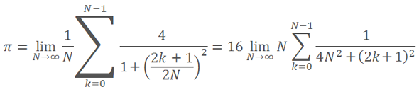

# CLBufferRead

Reads an OpenCL buffer into an array and returns the number of read elements.

```
uint  CLBufferRead(
   int          buffer,                    // A handle to the OpenCL buffer
   const void&  data[],                    // An array of values
   uint         buffer_offset=0,           // An offset in the OpenCL buffer in bytes, 0 by default
   uint         data_offset=0,             // An offset in the array in elements, 0 by default
   uint         data_count=WHOLE_ARRAY     // The number of values from the buffer for reading, the whole buffer by default
   );

```

There are also versions for handling [matrices and vectors](/en/docs/matrix).

Reads the OpenCL buffer to the matrix and returns true if successful.

```
uint  CLBufferRead(
   int           buffer,                    // a handle to the OpenCL buffer
   uint          buffer_offset,             // an offset in the OpenCL buffer in bytes
   const matrix& mat,                       // the matrix for receiving the values from the buffer
   ulong         rows=-1,                   // the number of rows in the matrix
   ulong         cols=-1                    // the number of columns in the matrix
   );

```

Reads the OpenCL buffer to the vector and returns true if successful.

```
uint  CLBufferRead(
   int           buffer,                    // a handle to the OpenCL buffer
   uint          buffer_offset,             // an offset in the OpenCL buffer in bytes
   const vector& vec,                       // the vector for receiving the values from the buffer
   ulong         size-1,                    // vector length 
   );

```

Parameters

buffer

[in]   A handle of the OpenCL buffer.

data[]

[in]  An array for receiving values from the OpenCL buffer. Passed by reference.

buffer_offset

[in]  An offset in the OpenCL buffer in bytes, from which reading begins. By default, reading start with the very beginning of the buffer.

data_offset

[in]  The index of the first array element for writing the values of the OpenCL buffer. By default, writing of the read values into an array starts from the zero index.

data_count

[in]  The number of values that should be read. The whole OpenCL buffer is read by default.

mat

[out]  The matrix for reading data from the buffer can be any of the three types — matrix, matrixf or matrixc.

vec

[out]  The vector for reading data from the buffer can be of any of the three types — vector, vectorf or vectorc.

rows=-1

[in]  If the parameter is specified, the cols parameter should be specified as well. If the new matrix dimensions are not specified, the current ones are used. If the value is -1, then the number of rows does not change.

cols=-1

[in]  If the parameter is not specified, the rows parameter should be skipped as well. The matrix adheres to the rule: either both parameters are specified, or none, otherwise an error will occur. If both parameters (rows and cols) are specified, the matrix size is changed.  In case of -1, the number of columns does not change.

size=-1

[in]  If the parameter is not specified or its value is -1, the vector length does not change.

Return Value

The number of read elements. 0 is returned in case of an error. For information about the error, use the [GetLastError()](/en/docs/check/getlasterror) function.

true if a matrix or a vector is handled successfully, otherwise false.

Note

For one-dimensional arrays, the number of the element, into which writing of data into an OpenCL buffer begins, is calculated taking into account the [AS_SERIES](/en/docs/array/arraygetasseries) flags.

An array of two or more dimensions is presented as one-dimensional. In this case, data_offset is the number of elements that should be skipped in the presentation, not the number of elements in the first dimension.

Example of calculating Pi using the equation:



```
#define  _num_steps        1000000000
#define  _divisor          40000
#define  _step             1.0 / _num_steps
#define  _intrnCnt         _num_steps / _divisor
 
//+------------------------------------------------------------------+
//|                                                                  |
//+------------------------------------------------------------------+
string D2S(double arg, int digits) { return DoubleToString(arg, digits); }
string I2S(int arg)                { return IntegerToString(arg); }
 
//--- OpenCL programm code
const string clSource=
  "#define _step "+D2S(_step, 12)+"                   \r\n"
  "#define _intrnCnt "+I2S(_intrnCnt)+"               \r\n"
  "                                                   \r\n"
  "__kernel void Pi( __global double *out )           \r\n"
  "{                                                  \r\n"
  "  int i = get_global_id( 0 );                      \r\n"
  "  double partsum = 0.0;                            \r\n"
  "  double x = 0.0;                                  \r\n"
  "  long from = i * _intrnCnt;                       \r\n"
  "  long to = from + _intrnCnt;                      \r\n"
  "  for( long j = from; j < to; j ++ )               \r\n"
  "  {                                                \r\n"
  "     x = ( j + 0.5 ) * _step;                      \r\n"
  "     partsum += 4.0 / ( 1. + x * x );              \r\n"
  "  }                                                \r\n"
  "  out[ i ] = partsum;                              \r\n"
  "}                                                  \r\n";
 
//+------------------------------------------------------------------+
//| Script program start function                                    |
//+------------------------------------------------------------------+
int OnStart()
 {
  Print("Pi Calculation: step = "+D2S(_step, 12)+"; _intrnCnt = "+I2S(_intrnCnt));
//--- prepare OpenCL contexts
  int clCtx;
  if((clCtx=CLContextCreate(CL_USE_GPU_ONLY))==INVALID_HANDLE)
   {
    Print("OpenCL not found");
    return(-1);
   }
  int clPrg = CLProgramCreate(clCtx, clSource);
  int clKrn = CLKernelCreate(clPrg, "Pi");
  int clMem=CLBufferCreate(clCtx, _divisor*sizeof(double), CL_MEM_READ_WRITE);
  CLSetKernelArgMem(clKrn, 0, clMem);
 
  const uint offs[1]  = {0};
  const uint works[1] = {_divisor};
//--- launch OpenCL program
  ulong start=GetMicrosecondCount();
  if(!CLExecute(clKrn, 1, offs, works))
   {
    Print("CLExecute(clKrn, 1, offs, works) failed! Error ", GetLastError());
    CLFreeAll(clMem, clKrn, clPrg, clCtx);
    return(-1);
   }
//--- get results from OpenCL device
  vector buffer(_divisor);
  if(!CLBufferRead(clMem, 0, buffer))
   {
    Print("CLBufferRead(clMem, 0, buffer) failed! Error ", GetLastError());
    CLFreeAll(clMem, clKrn, clPrg, clCtx);
    return(-1);
   }
//--- sum all values to calculate Pi
  double Pi=buffer.Sum()*_step;
 
  double time=(GetMicrosecondCount()-start)/1000.;
  Print("OpenCL: Pi calculated for "+D2S(time, 2)+" ms");
  Print("Pi = "+DoubleToString(Pi, 12));
//--- free memory
  CLFreeAll(clMem, clKrn, clPrg, clCtx);
//--- success
  return(0);
 }
  /*
  Pi Calculation: step = 0.000000001000; _intrnCnt = 25000
  OpenCL: GPU device 'Ellesmere' selected
  OpenCL: Pi calculated for 99.98 ms
  Pi = 3.141592653590
  */ 
//+------------------------------------------------------------------+
//| Auxiliary routine to free memory                                 |
//+------------------------------------------------------------------+
void CLFreeAll(const int clMem, const int clKrn, const int clPrg, const int clCtx)
 {
  CLBufferFree(clMem);
  CLKernelFree(clKrn);
  CLProgramFree(clPrg);
  CLContextFree(clCtx);
 }

```
