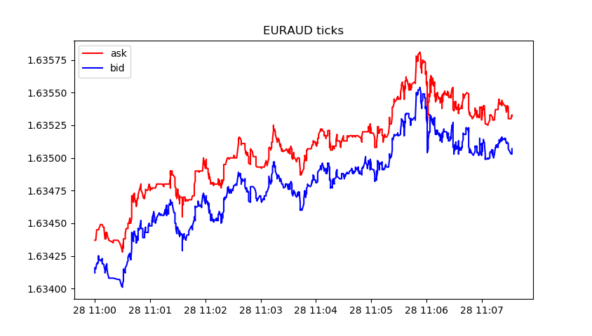

# MetaTrader module for integration with Python

MQL5 is designed for the development of high-performance trading applications in the financial markets and is unparalleled among other specialized languages used in the algorithmic trading. The syntax and speed of MQL5 programs are very close to C++, there is support for [OpenCL](/en/docs/opencl) and [integration with MS Visual Studio](https://www.metatrader5.com/en/metaeditor/help/development/c_dll). [Statistics](/en/docs/standardlibrary/mathematics/stat), [fuzzy logic](/en/docs/standardlibrary/mathematics/fuzzy_logic) and [ALGLIB](https://www.mql5.com/en/code/1146) libraries are available as well. MetaEditor development environment features native [support for .NET libraries](https://www.metatrader5.com/en/releasenotes/terminal/1898) with "smart" functions import eliminating the need to develop special wrappers. Third-party C++ DLLs can also be used.  C++ source code files (CPP and H) can be edited and compiled into DLL directly from the editor. Microsoft Visual Studio installed on user's PC can be used for that.

Python is a modern high-level programming language for developing scripts and applications. It contains multiple libraries for machine learning, process automation, as well as data analysis and visualization.

MetaTrader package for Python is designed for convenient and fast obtaining of exchange data via interprocessor communication directly from the MetaTrader 5 terminal. The data received this way can be further used for statistical calculations and machine learning.

Installing the package from the command line:

```
  pip install MetaTrader5

```

Updating the package from the command line:

```
  pip install --upgrade MetaTrader5

```

Functions for integrating MetaTrader 5 and Python

| Function | Action |
| --- | --- |
| initialize | Establish a connection with the MetaTrader 5 terminal |
| login | Connect to a trading account using specified parameters |
| shutdown | Close the previously established connection to the MetaTrader 5 terminal |
| version | Return the MetaTrader 5 terminal version |
| last_error | Return data on the last error |
| account_info | Get info on the current trading account |
| terminal_Info | Get status and parameters of the connected MetaTrader 5 terminal |
| symbols_total | Get the number of all financial instruments in the MetaTrader 5 terminal |
| symbols_get | Get all financial instruments from the MetaTrader 5 terminal |
| symbol_info | Get data on the specified financial instrument |
| symbol_info_tick | Get the last tick for the specified financial instrument |
| symbol_select | Select a symbol in the  MarketWatch  window or remove a symbol from the window |
| market_book_add | Subscribes the MetaTrader 5 terminal to the Market Depth change events for a specified symbol |
| market_book_get | Returns a tuple from BookInfo featuring Market Depth entries for the specified symbol |
| market_book_release | Cancels subscription of the MetaTrader 5 terminal to the Market Depth change events for a specified symbol |
| copy_rates_from | Get bars from the MetaTrader 5 terminal starting from the specified date |
| copy_rates_from_pos | Get bars from the MetaTrader 5 terminal starting from the specified index |
| copyrates_range | Get bars in the specified date range from the MetaTrader 5 terminal |
| copy_ticks_from | Get ticks from the MetaTrader 5 terminal starting from the specified date |
| copy_ticks_range | Get ticks for the specified date range from the MetaTrader 5 terminal |
| orders_total | Get the number of active orders. |
| orders_get | Get active orders with the ability to filter by symbol or ticket |
| order_calc_margin | Return margin in the account currency to perform a specified trading operation |
| order_calc_profit | Return profit in the account currency for a specified trading operation |
| order_check | Check funds sufficiency for performing a required  trading operation |
| order_send | Send a  request  to perform a trading operation. |
| positions_total | Get the number of open positions |
| positions_get | Get open positions with the ability to filter by symbol or ticket |
| history_orders_total | Get the number of orders in trading history within the specified interval |
| history_orders_get | Get orders from trading history with the ability to filter by ticket or position |
| history_deals_total | Get the number of deals in trading history within the specified interval |
| history_deals_get | Get deals from trading history with the ability to filter by ticket or position |

### Example of connecting Python to MetaTrader 5

1. Download the latest version of Python 3.8 from [https://www.python.org/downloads/windows](https://www.python.org/downloads/windows)
2. When installing Python, check "Add Python 3.8 to PATH%" to be able to run Python scripts from the command line.
3. Install the MetaTrader 5 module from the command line

```
  pip install MetaTrader5

```

1. Add matplotlib and pandas packages

```
  pip install matplotlib
  pip install pandas

```

1. Launch the test script

```
from datetime import datetime
import matplotlib.pyplot as plt
import pandas as pd
from pandas.plotting import register_matplotlib_converters
register_matplotlib_converters()
import MetaTrader5 as mt5
 
# connect to MetaTrader 5
if not mt5.initialize():
    print("initialize() failed")
    mt5.shutdown()
 
# request connection status and parameters
print(mt5.terminal_info())
# get data on MetaTrader 5 version
print(mt5.version())
 
# request 1000 ticks from EURAUD
euraud_ticks = mt5.copy_ticks_from("EURAUD", datetime(2020,1,28,13), 1000, mt5.COPY_TICKS_ALL)
# request ticks from AUDUSD within 2019.04.01 13:00 - 2019.04.02 13:00
audusd_ticks = mt5.copy_ticks_range("AUDUSD", datetime(2020,1,27,13), datetime(2020,1,28,13), mt5.COPY_TICKS_ALL)
 
# get bars from different symbols in a number of ways
eurusd_rates = mt5.copy_rates_from("EURUSD", mt5.TIMEFRAME_M1, datetime(2020,1,28,13), 1000)
eurgbp_rates = mt5.copy_rates_from_pos("EURGBP", mt5.TIMEFRAME_M1, 0, 1000)
eurcad_rates = mt5.copy_rates_range("EURCAD", mt5.TIMEFRAME_M1, datetime(2020,1,27,13), datetime(2020,1,28,13))
 
# shut down connection to MetaTrader 5
mt5.shutdown()
 
#DATA
print('euraud_ticks(', len(euraud_ticks), ')')
for val in euraud_ticks[:10]: print(val)
 
print('audusd_ticks(', len(audusd_ticks), ')')
for val in audusd_ticks[:10]: print(val)
 
print('eurusd_rates(', len(eurusd_rates), ')')
for val in eurusd_rates[:10]: print(val)
 
print('eurgbp_rates(', len(eurgbp_rates), ')')
for val in eurgbp_rates[:10]: print(val)
 
print('eurcad_rates(', len(eurcad_rates), ')')
for val in eurcad_rates[:10]: print(val)
 
#PLOT
# create DataFrame out of the obtained data
ticks_frame = pd.DataFrame(euraud_ticks)
# convert time in seconds into the datetime format
ticks_frame['time']=pd.to_datetime(ticks_frame['time'], unit='s')
# display ticks on the chart
plt.plot(ticks_frame['time'], ticks_frame['ask'], 'r-', label='ask')
plt.plot(ticks_frame['time'], ticks_frame['bid'], 'b-', label='bid')
 
# display the legends
plt.legend(loc='upper left')
 
# add the header
plt.title('EURAUD ticks')
 
# display the chart
plt.show()

```

1.  Get data and chart

```
[2, 'MetaQuotes-Demo', '16167573']
[500, 2325, '19 Feb 2020']
 
euraud_ticks( 1000 )
(1580209200, 1.63412, 1.63437, 0., 0, 1580209200067, 130, 0.)
(1580209200, 1.63416, 1.63437, 0., 0, 1580209200785, 130, 0.)
(1580209201, 1.63415, 1.63437, 0., 0, 1580209201980, 130, 0.)
(1580209202, 1.63419, 1.63445, 0., 0, 1580209202192, 134, 0.)
(1580209203, 1.6342, 1.63445, 0., 0, 1580209203004, 130, 0.)
(1580209203, 1.63419, 1.63445, 0., 0, 1580209203487, 130, 0.)
(1580209203, 1.6342, 1.63445, 0., 0, 1580209203694, 130, 0.)
(1580209203, 1.63419, 1.63445, 0., 0, 1580209203990, 130, 0.)
(1580209204, 1.63421, 1.63445, 0., 0, 1580209204194, 130, 0.)
(1580209204, 1.63425, 1.63445, 0., 0, 1580209204392, 130, 0.)
audusd_ticks( 40449 )
(1580122800, 0.67858, 0.67868, 0., 0, 1580122800244, 130, 0.)
(1580122800, 0.67858, 0.67867, 0., 0, 1580122800429, 4, 0.)
(1580122800, 0.67858, 0.67865, 0., 0, 1580122800817, 4, 0.)
(1580122801, 0.67858, 0.67866, 0., 0, 1580122801618, 4, 0.)
(1580122802, 0.67858, 0.67865, 0., 0, 1580122802928, 4, 0.)
(1580122809, 0.67855, 0.67865, 0., 0, 1580122809526, 130, 0.)
(1580122809, 0.67855, 0.67864, 0., 0, 1580122809699, 4, 0.)
(1580122813, 0.67855, 0.67863, 0., 0, 1580122813576, 4, 0.)
(1580122815, 0.67856, 0.67863, 0., 0, 1580122815190, 130, 0.)
(1580122815, 0.67855, 0.67863, 0., 0, 1580122815479, 130, 0.)
eurusd_rates( 1000 )
(1580149260, 1.10132, 1.10151, 1.10131, 1.10149, 44, 1, 0)
(1580149320, 1.10149, 1.10161, 1.10143, 1.10154, 42, 1, 0)
(1580149380, 1.10154, 1.10176, 1.10154, 1.10174, 40, 2, 0)
(1580149440, 1.10174, 1.10189, 1.10168, 1.10187, 47, 1, 0)
(1580149500, 1.10185, 1.10191, 1.1018, 1.10182, 53, 1, 0)
(1580149560, 1.10182, 1.10184, 1.10176, 1.10183, 25, 3, 0)
(1580149620, 1.10183, 1.10187, 1.10177, 1.10187, 49, 2, 0)
(1580149680, 1.10187, 1.1019, 1.1018, 1.10187, 53, 1, 0)
(1580149740, 1.10187, 1.10202, 1.10187, 1.10198, 28, 2, 0)
(1580149800, 1.10198, 1.10198, 1.10183, 1.10188, 39, 2, 0)
eurgbp_rates( 1000 )
(1582236360, 0.83767, 0.83767, 0.83764, 0.83765, 23, 9, 0)
(1582236420, 0.83765, 0.83765, 0.83764, 0.83765, 15, 8, 0)
(1582236480, 0.83765, 0.83766, 0.83762, 0.83765, 19, 7, 0)
(1582236540, 0.83765, 0.83768, 0.83758, 0.83763, 39, 6, 0)
(1582236600, 0.83763, 0.83768, 0.83763, 0.83767, 21, 6, 0)
(1582236660, 0.83767, 0.83775, 0.83765, 0.83769, 63, 5, 0)
(1582236720, 0.83769, 0.8377, 0.83758, 0.83764, 40, 7, 0)
(1582236780, 0.83766, 0.83769, 0.8376, 0.83766, 37, 6, 0)
(1582236840, 0.83766, 0.83772, 0.83763, 0.83772, 22, 6, 0)
(1582236900, 0.83772, 0.83773, 0.83768, 0.8377, 36, 5, 0)
eurcad_rates( 1441 )
(1580122800, 1.45321, 1.45329, 1.4526, 1.4528, 146, 15, 0)
(1580122860, 1.4528, 1.45315, 1.45274, 1.45301, 93, 15, 0)
(1580122920, 1.453, 1.45304, 1.45264, 1.45264, 82, 15, 0)
(1580122980, 1.45263, 1.45279, 1.45231, 1.45277, 109, 15, 0)
(1580123040, 1.45275, 1.4528, 1.45259, 1.45271, 53, 14, 0)
(1580123100, 1.45273, 1.45285, 1.45269, 1.4528, 62, 16, 0)
(1580123160, 1.4528, 1.45284, 1.45267, 1.45282, 64, 14, 0)
(1580123220, 1.45282, 1.45299, 1.45261, 1.45272, 48, 14, 0)
(1580123280, 1.45272, 1.45275, 1.45255, 1.45275, 74, 14, 0)
(1580123340, 1.45275, 1.4528, 1.4526, 1.4528, 94, 13, 0)

```
