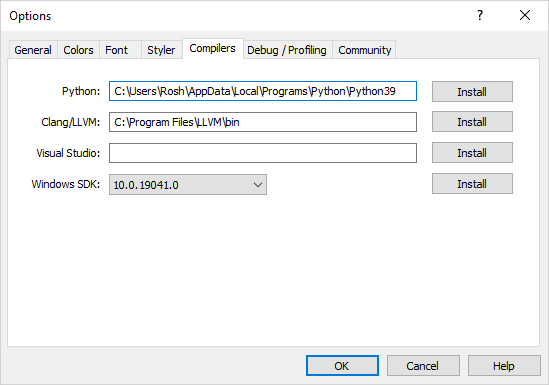
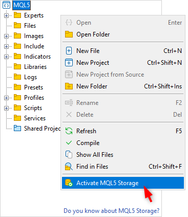
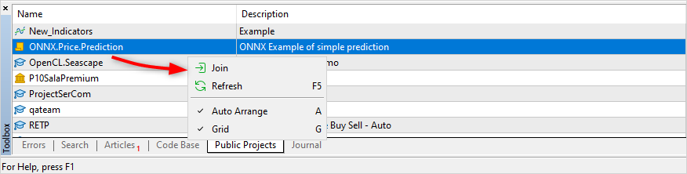
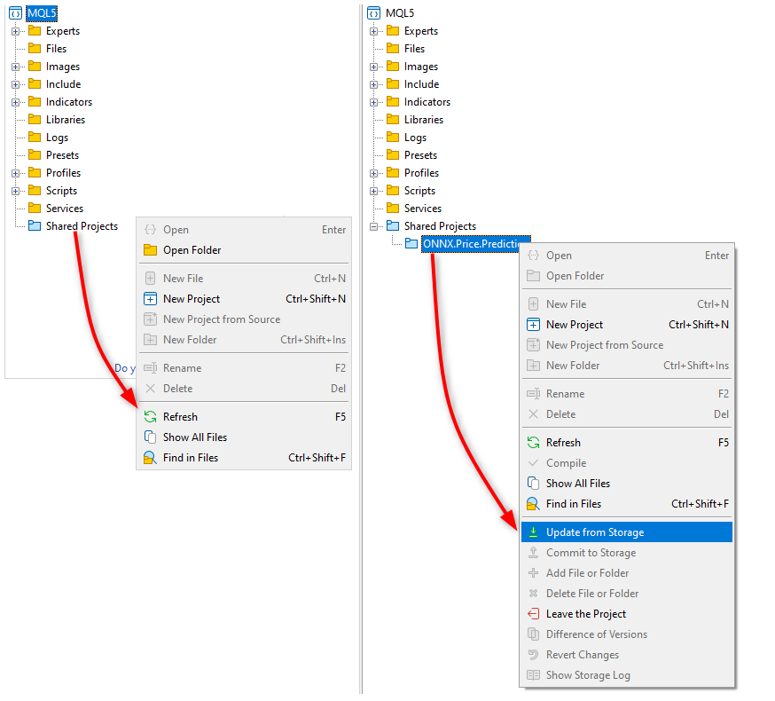
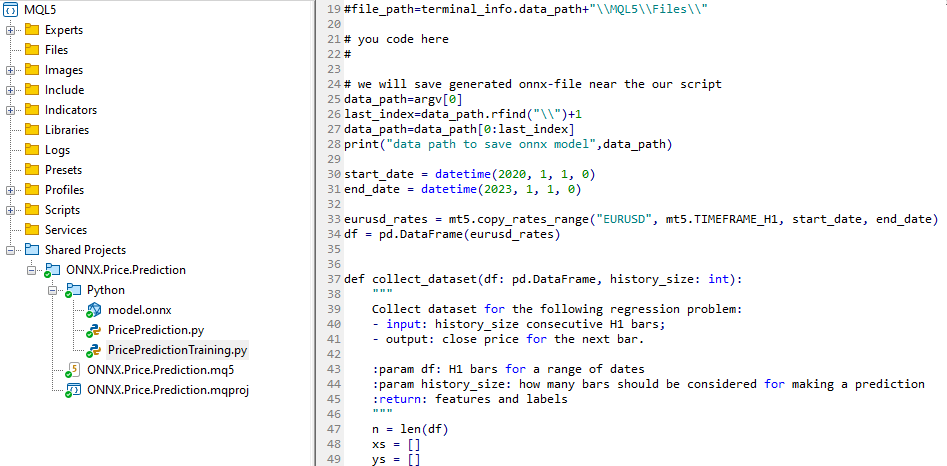
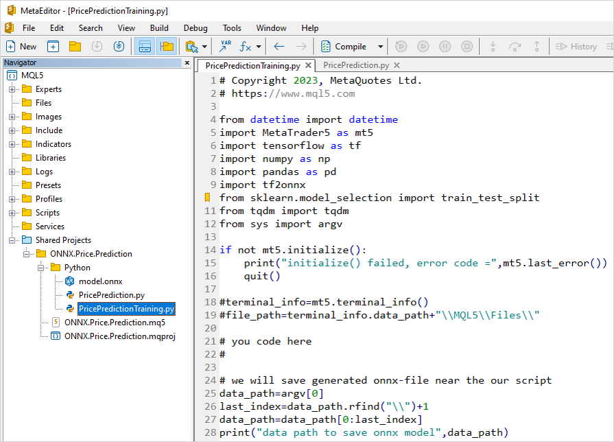
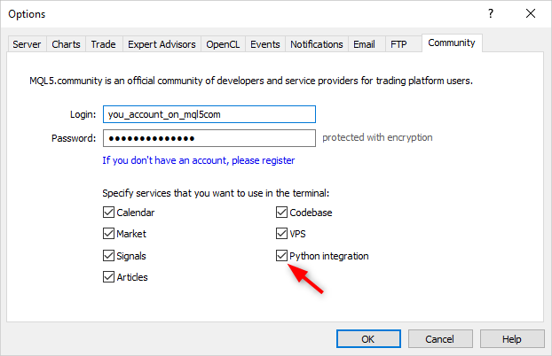
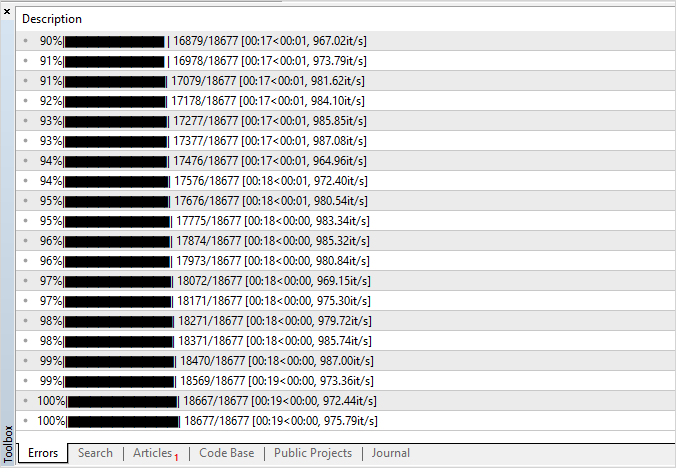
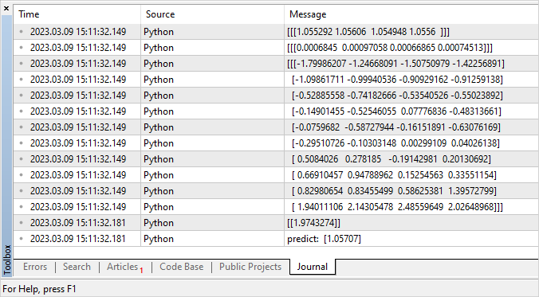

# Creating a Model

Multiple methods are available to obtain a ready model in the ONNX format. The popular [ONNX Model Zoo](https://github.com/onnx/models) library contains several pre-trained ONNX models for different types of tasks. The advantage of this collection is that each model's notebook contains links to the training dataset and references to the original paper that describes the model architecture.

Most machine learning frameworks use Python. To install the ONNX runtime for Python, use one of the following commands:

```
pip install onnxruntime       # CPU build
pip install onnxruntime-gpu   # GPU build

```

To invoke the ONNX runtime in Python, use the following command

```
import onnxruntime
session = onnxruntime.InferenceSession("path to model")

```

For model [inputs](/en/docs/onnx/onnxsetinputshape) and [outputs](/en/docs/onnx/onnxsetoutputshape), check out the relevant model's documentation. You can also use visualization tools to view the model, such as [Netron](https://github.com/lutzroeder/Netron) or [WinML Dashboard](https://learn.microsoft.com/en-us/windows/ai/windows-ml/dashboard). In the ONNX runtime, you can also query a model's metadata and its inputs and outputs:

```
results = session.run(["output1", "output2"], {
                      "input1": indata1, "input2": indata2})
results = session.run([], {"input1": indata1, "input2": indata2})

```

You can create ONNX models directly in the MetaTrader 5 terminal or in MetaEditor using Python.

### Python in MetaTrader 5

The MetaTrader 5 provides out-of-the-box support for Python scripts. To enable these operations, the terminal developers provide MetaTrader5 module for Python: [https://pypi.org/project/MetaTrader5](https://pypi.org/project/MetaTrader5).

In the MetaEditor integrated development environment, in addition to creating applications in MQL5, you can also run Python scripts directly from the editor. To do this, specify the path to the executable in [MetaEditor settings](https://www.metatrader5.com/ru/metaeditor/help/development/python):



If Python is not installed on your computer, click Install to download the installation file.

You can create a Python script in MetaEdtior or upload it to the terminal's data folder and immediately run it using the F7 (Compile) key. This will open the MetaTrader 5 terminal with the script running on the current chart. Messages from the Python console (stdout, stderr) will be displayed under the [Errors](https://www.metatrader5.com/ru/metaeditor/help/workspace/toolbox#errors) section.

### Operations with models in MetaTrader 5

The MQL5 language allows you to run ONNX models directly in the MetaTrader 5 terminal. This is done in three steps:

1. Train the model in a third-party platform, such as Python.
2. Convert the model to ONNX.
3. Include the ONNX model into an Expert Advisor using [ONNX function](/en/docs/onnx) and run in the MetaTrader 5 terminal.

[Python integration](/en/docs/python_metatrader5) in MQL5 allows running a python script and saving an ONNX model in the MetaEditor or run it directly on a chart in MetaTrader 5. You can train the model using a pre-written Python script as often as you need right in the terminal. The library includes ready-made functions for obtaining price data, which can be input into an ONNX model:

- [copy_rates_from](/en/docs/python_metatrader5/mt5copyratesfrom_py) - get bars starting from the specified date
- [copy_rates_from_pos](/en/docs/python_metatrader5/mt5copyratesfrompos_py) - get bars starting from the specified index
- [copy_rates_range](/en/docs/python_metatrader5/mt5copyratesrange_py) - get bars for the specified date range
- [copy_ticks_from](/en/docs/python_metatrader5/mt5copyticksfrom_py) - get ticks starting from the specified date
- [copy_ticks_range](/en/docs/python_metatrader5/mt5copyticksrange_py) - get ticks for the specified date range

### Model example  #

En example of a finished ONNX model is available in [public projects](https://www.metatrader5.com/ru/metaeditor/help/mql5storage/projects#public). You should first activate [MQL5 Storage](https://www.metatrader5.com/ru/metaeditor/help/mql5storage/mql5storage_connect) in the Navigator by specifying you MQL5 login in MetaEditor settings (case sensitive).



After activation, find the ONNX.Price.Prediction project and join it via the context menu command.



Next, update the project from MQL5 Storage.



The project contains an ONNX model, two python scripts, an MQL5 script for project operation, and an MQL5 project file (ONNX.Price.Prediction.mqproj).



You can create the ONNX model yourself using the PricePredictionTraining.py script included in the project. To do this, you should first install the required modules from the command line.

```
python.exe -m pip install --upgrade pip
python -m pip install --upgrade tensorflow
python -m pip install --upgrade pandas
python -m pip install --upgrade scikit-learn
python -m pip install --upgrade matplotlib
python -m pip install --upgrade tqdm
python -m pip install --upgrade metatrader5
python -m pip install --upgrade onnx==1.12
python -m pip install --upgrade tf2onnx
python -m pip install --upgrade numpy
python -m pip install onnxruntime

```

After installing the modules, open the PricePredictionTraining.py script in MetaEditor and run it with the Compile button or with the F7 key.



Before running the Python script, make sure that the MetaTrader 5 terminal is connected to a server with the EURUSD symbol available. For example, connect to the MetaQuotes-Demo server and check "Integration with Python" in terminal [settings](https://www.metatrader5.com/ru/terminal/help/startworking/settings#community).



While training the network, MetaEditor will print messages from the Python script until the training is complete.



When the result is 100%, the ONNX model is ready and it is saved to the project folder at <terminal data directory>\MQL5\Shared Projects\ONNX.Price.Prediction\Python.

You can check the resulting model by running the second script PricePrediction.py, pressing  F7.


