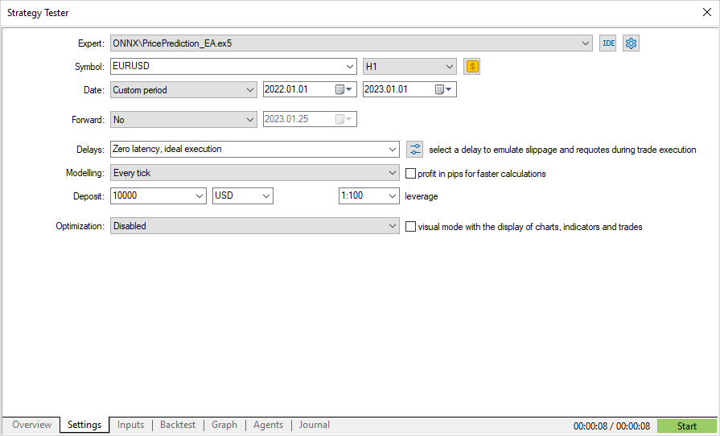
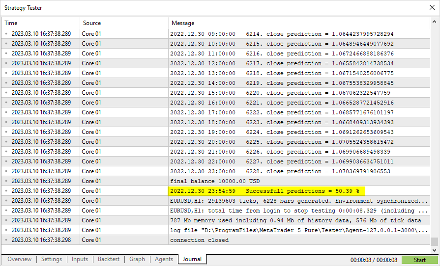

# Model validation in the Strategy Tester

Models created for operations in the financial markets can be validated in the MetaTrader 5 terminal [Strategy Tester](https://www.metatrader5.com/ru/terminal/help/algotrading/testing). This is the fastest and most convenient option, which eliminates the need to additionally emulate the market environment and trading conditions.

To test the model, let us create an Expert Advisor based on the code from the public project [ONNX.Price.Prediction](/en/docs/onnx/onnx_prepare#model_sample). This will require some edits.

Move the model creation to the [OnInit](/en/docs/event_handlers/oninit) function. The onnx session will be closed in [OnDeinit](/en/docs/event_handlers/ondeinit). Locate the main model operations block to the [OnTick](/en/docs/event_handlers/ontick) handler.

Also, add obtaining of the Close price of the previous two bars, which is needed to compare the actual Close price and the prediction.

The Expert Advisor code is small and easy to read.

```
 
const long   ExtInputShape [] = {1,10,4}; // model's input shape
const long   ExtOutputShape[] = {1,1};    // model's output shape
#resource "Python/model.onnx" as uchar ExtModel[];// model as a resource
 
long handle;         // model handle
ulong predictions=0; // predictions counter
ulong confirmed=0;   // successful predictions counter
//+------------------------------------------------------------------+
//| Expert initialization function                                   |
//+------------------------------------------------------------------+
int OnInit()
  {
//--- basic checks
   if(_Symbol!="EURUSD")
     {
      Print("Symbol must be EURUSD, testing aborted");
      return(-1);
     }
   if(_Period!=PERIOD_H1)
     {
      Print("Timeframe must be H1, testing aborted");
      return(-1);
     }
//--- create the model
   handle=OnnxCreateFromBuffer(ExtModel,ONNX_DEBUG_LOGS);
//--- specify the shape of the input data
   if(!OnnxSetInputShape(handle,0,ExtInputShape))
     {
      Print("OnnxSetInputShape failed, error ",GetLastError());
      OnnxRelease(handle);
      return(-1);
     }
//--- specify the shape of the output data
   if(!OnnxSetOutputShape(handle,0,ExtOutputShape))
     {
      Print("OnnxSetOutputShape failed, error ",GetLastError());
      OnnxRelease(handle);
      return(-1);
     }
//---
   return(INIT_SUCCEEDED);
  }
//+------------------------------------------------------------------+
//| Expert deinitialization function                                 |
//+------------------------------------------------------------------+
void OnDeinit(const int reason)
  {
//--- complete model operation
   OnnxRelease(handle);
//--- calculate and output prediction statistics
   PrintFormat("Successfull predictions = %.2f %%",confirmed*100./double(predictions));
  }
//+------------------------------------------------------------------+
//| Expert tick function                                             |
//+------------------------------------------------------------------+
void OnTick()
  {
   static datetime open_time=0;
   static double predict;
//--- check the current bar opening time
   datetime time=iTime(_Symbol,_Period,0);
   if(time==0)
     {
      PrintFormat("Failed to get Time(0), error %d", GetLastError());
      return;
     }
//--- if the opening time has not changed, exit until the next OnTick call
   if(time==open_time)
      return;
//--- get the Close prices of the last two completed bars
   double close[];
   int recieved=CopyClose(_Symbol,_Period,1,2,close);
   if(recieved!=2)
     {
      PrintFormat("CopyClose(2 bars) failed, error %d",GetLastError());
      return;
     }
   double delta_predict=predict-close[0]; // predicted price change
   double delta_actual=close[1]-close[0]; // actual price change
   if((delta_predict>0 && delta_actual>0) || (delta_predict<0 && delta_actual<0))
      confirmed++;
 
//--- calculate the Close price on the new bar to validate the price on the next bar
   matrix rates;
//--- get 10 bars
   if(!rates.CopyRates("EURUSD",PERIOD_H1,COPY_RATES_OHLC,1,10))
      return;
//--- input a set of OHLC vectors
   matrix x_norm=rates.Transpose();
   vector m=x_norm.Mean(0);
   vector s=x_norm.Std(0);
   matrix mm(10,4);
   matrix ms(10,4);
//--- fill in the normalization matrices
   for(int i=0; i<10; i++)
     {
      mm.Row(m,i);
      ms.Row(s,i);
     }
//--- normalize the input data
   x_norm-=mm;
   x_norm/=ms;
//--- convert normalized input data to float type
   matrixf x_normf;
   x_normf.Assign(x_norm);
//--- get the output data of the model here, i.e. the price prediction
   vectorf y_norm(1);
//--- run the model
   if(!OnnxRun(handle,ONNX_DEBUG_LOGS | ONNX_NO_CONVERSION,x_normf,y_norm))
     {
      Print("OnnxRun failed, error ",GetLastError());
     }
//--- do reverse transformation to get the predicted price and to validate it on a new bar
   predict=y_norm[0]*s[3]+m[3];
   predictions++;  // increase predictions counter
   Print(predictions,". close prediction = ",predict);
//--- save the bar opening time to check on the next tick
   open_time=time;
  }

```

Compile the Expert Advisor and run testing in the period of year 2022. Specify EURUSD with the H1 timeframe, which is the data on which the model was trained. The tick modeling mode can be ignores, since the code checks the [emergence of a new bar](https://www.mql5.com/ru/articles/159).



Run and check the result in the [testing journal](https://www.metatrader5.com/ru/terminal/help/algotrading/testing#result). It shows that a little more than 50% of ppredictions were correct in 2022.



If the preliminary model testing has generated satisfactory results, you can start writing a full-fledged trading strategy based on this model.
