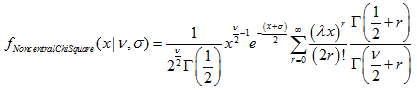
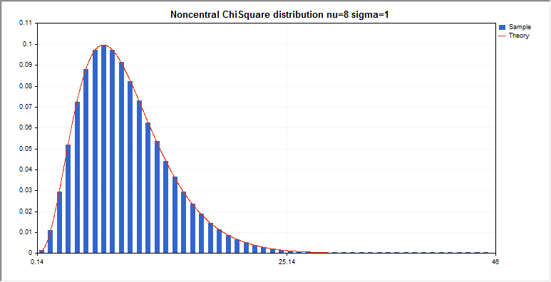

# Noncentral chi-squared distribution

This section contains functions for working with noncentral chi-squared distribution. They allow to calculate density, probability, quantiles and to generate pseudo-random numbers distributed according to the corresponding law. The noncentral chi-squared distribution is defined by the following formula:



where:

- x — value of the random variable

- ν — number of degrees of freedom
- σ — noncentrality parameter



In addition to the calculation of the individual random variables, the library also implements the ability to work with arrays of random variables.

| Function | Description |
| --- | --- |
| MathProbabilityDensityNoncentralChiSquare | Calculates the probability density function of the noncentral chi-squared distribution |
| MathCumulativeDistributionNoncentralChiSquare | Calculates the value of the noncentral chi-squared probability distribution function |
| MathQuantileNoncentralChiSquare | Calculates the value of the inverse noncentral chi-squared distribution function for the specified probability |
| MathRandomNoncentralChiSquare | Generates a pseudorandom variable/array of pseudorandom variables distributed according to the noncentral chi-squared distribution law |
| MathMomentsNoncentralChiSquare | Calculates the theoretical numerical values of the first 4 moments of the noncentral chi-squared distribution |

Example:

```
#include <Graphics\Graphic.mqh>
#include <Math\Stat\NoncentralChiSquare.mqh>
#include <Math\Stat\Math.mqh>
#property script_show_inputs
//--- input parameters
input double nu_par=8;    // the number of degrees of freedom
input double si_par=1;    // noncentrality parameter
//+------------------------------------------------------------------+
//| Script program start function                                    |
//+------------------------------------------------------------------+
void OnStart()
  {
//--- hide the price chart
   ChartSetInteger(0,CHART_SHOW,false);
//--- initialize the random number generator  
   MathSrand(GetTickCount());
//--- generate a sample of the random variable
   long chart=0;
   string name="GraphicNormal";
   int n=1000000;       // the number of values in the sample
   int ncells=51;       // the number of intervals in the histogram
   double x[];          // centers of the histogram intervals
   double y[];          // the number of values from the sample falling within the interval
   double data[];       // sample of random values
   double max,min;      // the maximum and minimum values in the sample
//--- obtain a sample from the noncentral chi-squared distribution
   MathRandomNoncentralChiSquare(nu_par,si_par,n,data);
//--- calculate the data to plot the histogram
   CalculateHistogramArray(data,x,y,max,min,ncells);
//--- obtain the sequence boundaries and the step for plotting the theoretical curve
   double step;
   GetMaxMinStepValues(max,min,step);
   step=MathMin(step,(max-min)/ncells);
//--- obtain the theoretically calculated data at the interval of [min,max]
   double x2[];
   double y2[];
   MathSequence(min,max,step,x2);
   MathProbabilityDensityNoncentralChiSquare(x2,nu_par,si_par,false,y2);
//--- set the scale
   double theor_max=y2[ArrayMaximum(y2)];
   double sample_max=y[ArrayMaximum(y)];
   double k=sample_max/theor_max;
   for(int i=0; i<ncells; i++)
      y[i]/=k;
//--- output charts
   CGraphic graphic;
   if(ObjectFind(chart,name)<0)
      graphic.Create(chart,name,0,0,0,780,380);
   else
      graphic.Attach(chart,name);
   graphic.BackgroundMain(StringFormat("Noncentral ChiSquare distribution nu=%G sigma=%G",nu_par,si_par));
   graphic.BackgroundMainSize(16);
//--- disable automatic scaling of the X axis
   graphic.XAxis().AutoScale(false);
   graphic.XAxis().Max(NormalizeDouble(max,0));
   graphic.XAxis().Min(min);
//--- plot all curves
   graphic.CurveAdd(x,y,CURVE_HISTOGRAM,"Sample").HistogramWidth(6);
//--- and now plot the theoretical curve of the distribution density
   graphic.CurveAdd(x2,y2,CURVE_LINES,"Theory");
   graphic.CurvePlotAll();
//--- plot all curves
   graphic.Update();
  }
//+------------------------------------------------------------------+
//|  Calculate frequencies for data set                              |
//+------------------------------------------------------------------+
bool CalculateHistogramArray(const double &data[],double &intervals[],double &frequency[],
                             double &maxv,double &minv,const int cells=10)
  {
   if(cells<=1) return (false);
   int size=ArraySize(data);
   if(size<cells*10) return (false);
   minv=data[ArrayMinimum(data)];
   maxv=data[ArrayMaximum(data)];
   double range=maxv-minv;
   double width=range/cells;
   if(width==0) return false;
   ArrayResize(intervals,cells);
   ArrayResize(frequency,cells);
//--- define the interval centers
   for(int i=0; i<cells; i++)
     {
      intervals[i]=minv+(i+0.5)*width;
      frequency[i]=0;
     }
//--- fill the frequencies of falling within the interval
   for(int i=0; i<size; i++)
     {
      int ind=int((data[i]-minv)/width);
      if(ind>=cells) ind=cells-1;
      frequency[ind]++;
     }
   return (true);
  }
//+------------------------------------------------------------------+
//|  Calculates values for sequence generation                       |
//+------------------------------------------------------------------+
void GetMaxMinStepValues(double &maxv,double &minv,double &stepv)
  {
//--- calculate the absolute range of the sequence to obtain the precision of normalization
   double range=MathAbs(maxv-minv);
   int degree=(int)MathRound(MathLog10(range));
//--- normalize the maximum and minimum values to the specified precision
   maxv=NormalizeDouble(maxv,degree);
   minv=NormalizeDouble(minv,degree);
//--- sequence generation step is also set based on the specified precision
   stepv=NormalizeDouble(MathPow(10,-degree),degree);
   if((maxv-minv)/stepv<10)
      stepv/=10.;
  }

```
