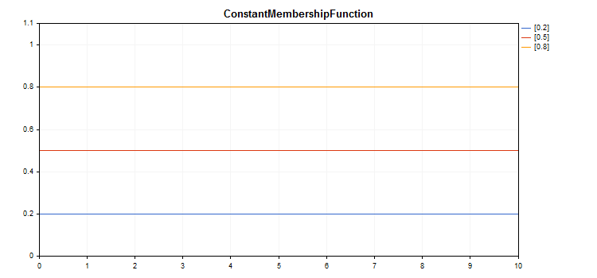

# CConstantMembershipFunction

Class for implementing a membership function as a straight line in parallel with the coordinate axis.

### Description

The function is described by the equation:

y(x)=c

Therefore, the membership degree for the function is the same along the entire numerical axis and is equal to the parameter specified in the constructor.



[A sample code](/en/docs/standardlibrary/mathematics/fuzzy_logic/fuzzy_membership/cconstantmembershipfunction#sample) for plotting a chart is displayed below.

### Declaration

```
   class CConstantMembershipFuncion : public IMembershipFunction

```

### Title

```
   #include <Math\Fuzzy\membershipfunction.mqh>

```

```
Inheritance hierarchy
   CObject
       IMembershipFunction
           CConstantMembershipFunction

```

### Class methods

| Class method | Description |
| --- | --- |
| GetValue | Calculates the value of the membership function by a specified argument. |

```
Methods inherited from class CObject
Prev, Prev, Next, Next, Save, Load, Type, Compare

```

Example

```
//+------------------------------------------------------------------+
//|                                   ConstantMembershipFunction.mq5 |
//|                         Copyright 2000-2024, MetaQuotes Ltd. |
//|                                             https://www.mql5.com |
//+------------------------------------------------------------------+
#include <Math\Fuzzy\membershipfunction.mqh>
#include <Graphics\Graphic.mqh>
//--- Create membership functions
CConstantMembershipFunction func1(0.2);
CConstantMembershipFunction func2(0.5);
CConstantMembershipFunction func3(0.8);
//--- Create wrappers for membership functions
double ConstantMembershipFunction1(double x) { return(func1.GetValue(x)); }
double ConstantMembershipFunction2(double x) { return(func2.GetValue(x)); }
double ConstantMembershipFunction3(double x) { return(func3.GetValue(x)); }
//+------------------------------------------------------------------+
//| Script program start function                                    |
//+------------------------------------------------------------------+
void OnStart()
  {
//--- create graphic
   CGraphic graphic;
   if(!graphic.Create(0,"ConstantMembershipFunction",0,30,30,780,380))
     {
      graphic.Attach(0,"ConstantMembershipFunction");
     }
   graphic.HistoryNameWidth(70);
   graphic.BackgroundMain("ConstantMembershipFunction");
   graphic.BackgroundMainSize(16);
//--- create curve
   graphic.CurveAdd(ConstantMembershipFunction1,0.0,10.0,1.0,CURVE_LINES,"[0.2]");
   graphic.CurveAdd(ConstantMembershipFunction2,0.0,10.0,1.0,CURVE_LINES,"[0.5]");
   graphic.CurveAdd(ConstantMembershipFunction3,0.0,10.0,1.0,CURVE_LINES,"[0.8]");
//--- sets the X-axis properties
   graphic.XAxis().AutoScale(false);
   graphic.XAxis().Min(0.0);
   graphic.XAxis().Max(10.0);
   graphic.XAxis().DefaultStep(1.0);
//--- sets the Y-axis properties
   graphic.YAxis().AutoScale(false);
   graphic.YAxis().Min(0.0);
   graphic.YAxis().Max(1.1);
   graphic.YAxis().DefaultStep(0.2);
//--- plot
   graphic.CurvePlotAll();
   graphic.Update();
  }

```
