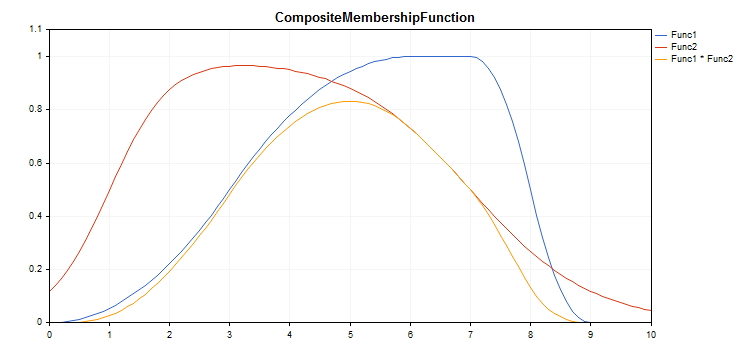

# CCompositeMembershipFunction

Class for implementing a composition of membership functions.

### Description

Composition of membership functions is a combination of two or more membership functions using a specified operator.



[A sample code](/en/docs/standardlibrary/mathematics/fuzzy_logic/fuzzy_membership/ccompositemembershipfunction#sample) for plotting a chart is displayed below.

### Declaration

```
   class CCompositeMembershipFuncion : public IMembershipFunction

```

### Title

```
   #include <Math\Fuzzy\membershipfunction.mqh>

```

```
Inheritance hierarchy
   CObject
       IMembershipFunction
           CCompositeMembershipFunction

```

### Class methods

| Class method | Description |
| --- | --- |
| CompositionType | Sets the composition operator. |
| MembershipFunctions | Gets the list of membership functions. |
| GetValue | Calculates the value of the membership function by a specified argument. |

```
Methods inherited from class CObject
Prev, Prev, Next, Next, Save, Load, Type, Compare

```

Example

```
//+------------------------------------------------------------------+
//|                                  CompositeMembershipFunction.mq5 |
//|                         Copyright 2000-2024, MetaQuotes Ltd. |
//|                                             https://www.mql5.com |
//+------------------------------------------------------------------+
#include <Math\Fuzzy\membershipfunction.mqh>
#include <Graphics\Graphic.mqh>
//--- Create membership functions
CProductTwoSigmoidalMembershipFunctions func1(2,1,-1,7);
CP_ShapedMembershipFunction func2(0,6,7,9);
CCompositeMembershipFunction composite(ProdMF,GetPointer(func1),GetPointer(func2));
//--- Create wrappers for membership functions
double ProductTwoSigmoidalMembershipFunctions(double x) { return(func1.GetValue(x)); }
double P_ShapedMembershipFunction(double x) { return(func2.GetValue(x)); }
double CompositeMembershipFunction(double x) { return(composite.GetValue(x)); }
//+------------------------------------------------------------------+
//| Script program start function                                    |
//+------------------------------------------------------------------+
void OnStart()
  {
//--- create graphic
   CGraphic graphic;
   if(!graphic.Create(0,"CompositeMembershipFunction",0,30,30,780,380))
     {
      graphic.Attach(0,"CompositeMembershipFunction");
     }
   graphic.HistoryNameWidth(70);
   graphic.BackgroundMain("CompositeMembershipFunction");
   graphic.BackgroundMainSize(16);
//--- create curve
   graphic.CurveAdd(P_ShapedMembershipFunction,0.0,10.0,0.1,CURVE_LINES,"Func1");
   graphic.CurveAdd(ProductTwoSigmoidalMembershipFunctions,0.0,10.0,0.1,CURVE_LINES,"Func2");
   graphic.CurveAdd(CompositeMembershipFunction,0.0,10.0,0.1,CURVE_LINES,"Func1 * Func2");
//--- sets the X-axis properties
   graphic.XAxis().AutoScale(false);
   graphic.XAxis().Min(0.0);
   graphic.XAxis().Max(10.0);
   graphic.XAxis().DefaultStep(1.0);
//--- sets the Y-axis properties
   graphic.YAxis().AutoScale(false);
   graphic.YAxis().Min(0.0);
   graphic.YAxis().Max(1.1);
   graphic.YAxis().DefaultStep(0.2);
//--- plot
   graphic.CurvePlotAll();
   graphic.Update();
  }

```
