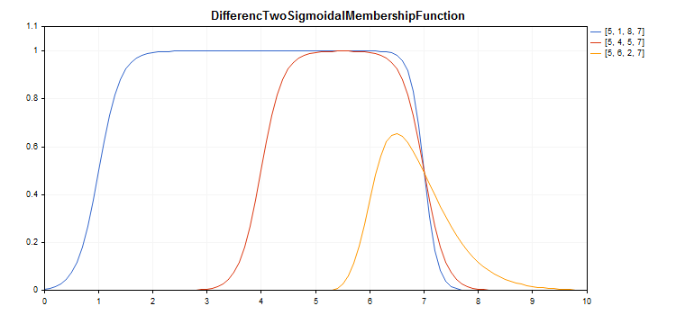

# CDifferencTwoSigmoidalMembershipFunction

Class for implementing the membership function in the form of a difference between two sigmoid functions with the A1, A2, C1 and C2 parameters.

### Description

The function is based on a sigmoid curve. It allows creating membership functions with the values equal to 1 beginning with an argument value. Such functions are suitable if you need to set such linguistic terms as "short" or "long".



[A sample code](/en/docs/standardlibrary/mathematics/fuzzy_logic/fuzzy_membership/cdifferenctwosigmoidalmembershipfunction#sample) for plotting a chart is displayed below.

### Declaration

```
   class CDifferencTwoSigmoidalMembershipFuncion : public IMembershipFunction

```

### Title

```
   #include <Math\Fuzzy\membershipfunction.mqh>

```

```
Inheritance hierarchy
   CObject
       IMembershipFunction
           CDifferencTwoSigmoidalMembershipFunction

```

### Class methods

| Class method | Description |
| --- | --- |
| A1 | Gets and sets the first membership function slope ratio. |
| A2 | Gets and sets the second membership function slope ratio. |
| C1 | Gets and sets the first membership function inflection coordinate parameter. |
| C2 | Gets and sets the second membership function inflection coordinate parameter. |
| GetValue | Calculates the value of the membership function by a specified argument. |

```
Methods inherited from class CObject
Prev, Prev, Next, Next, Save, Load, Type, Compare

```

Example

```
//+------------------------------------------------------------------+
//|                      DifferencTwoSigmoidalMembershipFunction.mq5 |
//|                        Copyright 2016, MetaQuotes Software Corp. |
//|                                             https://www.mql5.com |
//+------------------------------------------------------------------+
#include <Math\Fuzzy\membershipfunction.mqh>
#include <Graphics\Graphic.mqh>
//--- Create membership functions
CDifferencTwoSigmoidalMembershipFunction func1(5,1,8,7);
CDifferencTwoSigmoidalMembershipFunction func2(5,4,5,7);
CDifferencTwoSigmoidalMembershipFunction func3(5,6,2,7);
//--- Create wrappers for membership functions
double DifferencTwoSigmoidalMembershipFunction1(double x) { return(func1.GetValue(x)); }
double DifferencTwoSigmoidalMembershipFunction2(double x) { return(func2.GetValue(x)); }
double DifferencTwoSigmoidalMembershipFunction3(double x) { return(func3.GetValue(x)); }
//+------------------------------------------------------------------+
//| Script program start function                                    |
//+------------------------------------------------------------------+
void OnStart()
  {
//--- create graphic
   CGraphic graphic;
   if(!graphic.Create(0,"DifferencTwoSigmoidalMembershipFunction",0,30,30,780,380))
     {
      graphic.Attach(0,"DifferencTwoSigmoidalMembershipFunction");
     }
   graphic.HistoryNameWidth(70);
   graphic.BackgroundMain("DifferencTwoSigmoidalMembershipFunction");
   graphic.BackgroundMainSize(16);
//--- create curve
   graphic.CurveAdd(DifferencTwoSigmoidalMembershipFunction1,0.0,10.0,0.1,CURVE_LINES,"[5, 1, 8, 7]");
   graphic.CurveAdd(DifferencTwoSigmoidalMembershipFunction2,0.0,10.0,0.1,CURVE_LINES,"[5, 4, 5, 7]");
   graphic.CurveAdd(DifferencTwoSigmoidalMembershipFunction3,0.0,10.0,0.1,CURVE_LINES,"[5, 6, 2, 7]");
//--- sets the X-axis properties
   graphic.XAxis().AutoScale(false);
   graphic.XAxis().Min(0.0);
   graphic.XAxis().Max(10.0);
   graphic.XAxis().DefaultStep(1.0);
//--- sets the Y-axis properties
   graphic.YAxis().AutoScale(false);
   graphic.YAxis().Min(0.0);
   graphic.YAxis().Max(1.1);
   graphic.YAxis().DefaultStep(0.2);
//--- plot
   graphic.CurvePlotAll();
   graphic.Update();
  }

```
