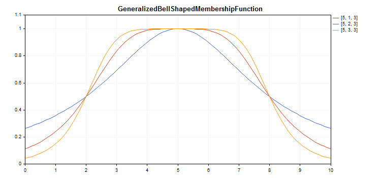

# CGeneralizedBellShapedMembershipFunction

Class for implementing a generalized bell-shaped membership function with A, B and C parameters.

### Description

Generalized bell-shaped membership function shape is similar to Gaussian functions. The function is smooth and takes non-zero values along the entire definition area.



[A sample code](/en/docs/standardlibrary/mathematics/fuzzy_logic/fuzzy_membership/cgeneralizedbellshapedmembershipfunction#sample) for plotting a chart is displayed below.

### Declaration

```
   class CGeneralizedBellShapedMembershipFuncion : public IMembershipFunction

```

### Title

```
   #include <Math\Fuzzy\membershipfunction.mqh>

```

```
Inheritance hierarchy
   CObject
       IMembershipFunction
           CGeneralizedBellShapedMembershipFunction

```

### Class methods

| Class method | Description |
| --- | --- |
| A | Gets and sets the membership function concentration ratio. |
| B | Gets and sets the membership function slope ratio. |
| C | Gets and sets the membership function maximum coordinate. |
| GetValue | Calculates the value of the membership function by a specified argument. |

```
Methods inherited from class CObject
Prev, Prev, Next, Next, Save, Load, Type, Compare

```

Example

```
//+------------------------------------------------------------------+
//|                      GeneralizedBellShapedMembershipFunction.mq5 |
//|                        Copyright 2016, MetaQuotes Software Corp. |
//|                                             https://www.mql5.com |
//+------------------------------------------------------------------+
#include <Math\Fuzzy\membershipfunction.mqh>
#include <Graphics\Graphic.mqh>
//--- Create membership functions
CGeneralizedBellShapedMembershipFunction func1(5, 1, 3);
CGeneralizedBellShapedMembershipFunction func2(5, 2, 3);
CGeneralizedBellShapedMembershipFunction func3(5, 3, 3);
//--- Create wrappers for membership functions
double GeneralizedBellShapedMembershipFunction1(double x) { return(func1.GetValue(x)); }
double GeneralizedBellShapedMembershipFunction2(double x) { return(func2.GetValue(x)); }
double GeneralizedBellShapedMembershipFunction3(double x) { return(func3.GetValue(x)); }
//+------------------------------------------------------------------+
//| Script program start function                                    |
//+------------------------------------------------------------------+
void OnStart()
  {
//--- create graphic
   CGraphic graphic;
   if(!graphic.Create(0,"GeneralizedBellShapedMembershipFunction",0,30,30,780,380))
     {
      graphic.Attach(0,"GeneralizedBellShapedMembershipFunction");
     }
   graphic.HistoryNameWidth(70);
   graphic.BackgroundMain("GeneralizedBellShapedMembershipFunction");
   graphic.BackgroundMainSize(16);
//--- create curve
   graphic.CurveAdd(GeneralizedBellShapedMembershipFunction1,0.0,10.0,0.1,CURVE_LINES,"[5, 1, 3]");
   graphic.CurveAdd(GeneralizedBellShapedMembershipFunction2,0.0,10.0,0.1,CURVE_LINES,"[5, 2, 3]");
   graphic.CurveAdd(GeneralizedBellShapedMembershipFunction3,0.0,10.0,0.1,CURVE_LINES,"[5, 3, 3]");
//--- sets the X-axis properties
   graphic.XAxis().AutoScale(false);
   graphic.XAxis().Min(0.0);
   graphic.XAxis().Max(10.0);
   graphic.XAxis().DefaultStep(1.0);
//--- sets the Y-axis properties
   graphic.YAxis().AutoScale(false);
   graphic.YAxis().Min(0.0);
   graphic.YAxis().Max(1.1);
   graphic.YAxis().DefaultStep(0.2);
//--- plot
   graphic.CurvePlotAll();
   graphic.Update();
  }

```
