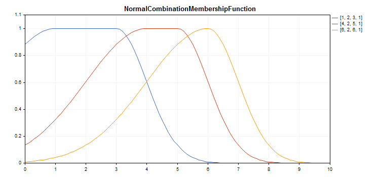

# CNormalCombinationMembershipFunction

Class for implementing a two-sided Gaussian membership function with the B1, B2, Sigma1 and Sigma2 parameters.

### Description

The two-sided Gaussian membership function is formed using Gaussian distribution. It allows setting asymmetrical membership functions. The function is smooth and takes non-zero values along the entire definition area.



[A sample code](/en/docs/standardlibrary/mathematics/fuzzy_logic/fuzzy_membership/cnormalcombinationmembershipfunction#sample) for plotting a chart is displayed below.

### Declaration

```
   class CNormalCombinationMembershipFuncion : public IMembershipFunction

```

### Title

```
   #include <Math\Fuzzy\membershipfunction.mqh>

```

```
Inheritance hierarchy
   CObject
       IMembershipFunction
           CNormalCombinationMembershipFunction

```

### Class methods

| Class method | Description |
| --- | --- |
| B1 | Gets and sets the value of the first membership function center. |
| B2 | Gets and sets the value of the second membership function center. |
| Sigma1 | Gets and sets the first parameter of the membership function curvature. |
| Sigma2 | Gets and sets the second parameter of the membership function curvature. |
| GetValue | Calculates the value of the membership function by a specified argument. |

```
Methods inherited from class CObject
Prev, Prev, Next, Next, Save, Load, Type, Compare

```

Example

```
//+------------------------------------------------------------------+
//|                          NormalCombinationMembershipFunction.mq5 |
//|                         Copyright 2000-2024, MetaQuotes Ltd. |
//|                                             https://www.mql5.com |
//+------------------------------------------------------------------+
#include <Math\Fuzzy\membershipfunction.mqh>
#include <Graphics\Graphic.mqh>
//--- Create membership functions
CNormalCombinationMembershipFunction func1(1,2,3,1);
CNormalCombinationMembershipFunction func2(4,2,5,1);
CNormalCombinationMembershipFunction func3(6,2,6,1);
//--- Create wrappers for membership functions
double NormalCombinationMembershipFunction1(double x) { return(func1.GetValue(x)); }
double NormalCombinationMembershipFunction2(double x) { return(func2.GetValue(x)); }
double NormalCombinationMembershipFunction3(double x) { return(func3.GetValue(x)); }
//+------------------------------------------------------------------+
//| Script program start function                                    |
//+------------------------------------------------------------------+
void OnStart()
  {
//--- create graphic
   CGraphic graphic;
   if(!graphic.Create(0,"NormalCombinationMembershipFunction",0,30,30,780,380))
     {
      graphic.Attach(0,"NormalCombinationMembershipFunction");
     }
   graphic.HistoryNameWidth(70);
   graphic.BackgroundMain("NormalCombinationMembershipFunction");
   graphic.BackgroundMainSize(16);
//--- create curve
   graphic.CurveAdd(NormalCombinationMembershipFunction1,0.0,10.0,0.1,CURVE_LINES,"[1, 2, 3, 1]");
   graphic.CurveAdd(NormalCombinationMembershipFunction2,0.0,10.0,0.1,CURVE_LINES,"[4, 2, 5, 1]");
   graphic.CurveAdd(NormalCombinationMembershipFunction3,0.0,10.0,0.1,CURVE_LINES,"[6, 2, 6, 1]");
//--- sets the X-axis properties
   graphic.XAxis().AutoScale(false);
   graphic.XAxis().Min(0.0);
   graphic.XAxis().Max(10.0);
   graphic.XAxis().DefaultStep(1.0);
//--- sets the Y-axis properties
   graphic.YAxis().AutoScale(false);
   graphic.YAxis().Min(0.0);
   graphic.YAxis().Max(1.1);
   graphic.YAxis().DefaultStep(0.2);
//--- plot
   graphic.CurvePlotAll();
   graphic.Update();
  }

```
