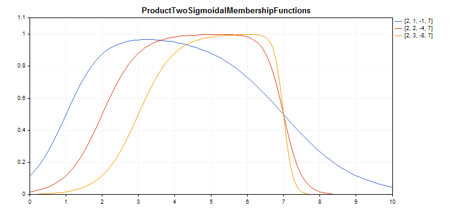

# CProductTwoSigmoidalMembershipFunction

Class for implementing the membership function in the form of a product of two sigmoid functions with the A1, A2, C1 and C2 parameters.

### Description

A product of two sigmoid membership functions is applied for setting smooth asymmetric functions.  It allows creating membership functions with the values equal to 1 beginning with an argument value. Such functions are suitable if you need to set such linguistic terms as "short" or "long".



[A sample code](/en/docs/standardlibrary/mathematics/fuzzy_logic/fuzzy_membership/cproducttwosigmoidalmembershipfunctions#sample) for plotting a chart is displayed below.

### Declaration

```
   class CProductTwoSigmoidalMembershipFuncion : public IMembershipFunction

```

### Title

```
   #include <Math\Fuzzy\membershipfunction.mqh>

```

```
Inheritance hierarchy
   CObject
       IMembershipFunction
           CProductTwoSigmoidalMembershipFunctions

```

### Class methods

| Class method | Description |
| --- | --- |
| A1 | Gets and sets the first membership function slope ratio. |
| A2 | Gets and sets the second membership function slope ratio. |
| C1 | Gets the first membership function inflection coordinate parameter. |
| C2 | Gets the second membership function inflection coordinate parameter. |
| GetValue | Calculates the value of the membership function by a specified argument. |

```
Methods inherited from class CObject
Prev, Prev, Next, Next, Save, Load, Type, Compare

```

Example

```
//+------------------------------------------------------------------+
//|                       ProductTwoSigmoidalMembershipFunctions.mq5 |
//|                        Copyright 2016, MetaQuotes Software Corp. |
//|                                             https://www.mql5.com |
//+------------------------------------------------------------------+
#property copyright "Copyright 2000-2024, MetaQuotes Ltd."
#property link      "https://www.mql5.com"
#property version   "1.00"
#include <Math\Fuzzy\membershipfunction.mqh>
#include <Graphics\Graphic.mqh>
//--- Create membership functions
CProductTwoSigmoidalMembershipFunctions func1(2,1,-1,7);
CProductTwoSigmoidalMembershipFunctions func2(2,2,-4,7);
CProductTwoSigmoidalMembershipFunctions func3(2,3,-8,7);
//--- Create wrappers for membership functions
double ProductTwoSigmoidalMembershipFunctions1(double x) { return(func1.GetValue(x)); }
double ProductTwoSigmoidalMembershipFunctions2(double x) { return(func2.GetValue(x)); }
double ProductTwoSigmoidalMembershipFunctions3(double x) { return(func3.GetValue(x)); }
//+------------------------------------------------------------------+
//| Script program start function                                    |
//+------------------------------------------------------------------+
void OnStart()
  {
//--- create graphic
   CGraphic graphic;
   if(!graphic.Create(0,"ProductTwoSigmoidalMembershipFunctions",0,30,30,780,380))
     {
      graphic.Attach(0,"ProductTwoSigmoidalMembershipFunctions");
     }
   graphic.HistoryNameWidth(70);
   graphic.BackgroundMain("ProductTwoSigmoidalMembershipFunctions");
   graphic.BackgroundMainSize(16);
//--- create curve
   graphic.CurveAdd(ProductTwoSigmoidalMembershipFunctions1,0.0,10.0,0.1,CURVE_LINES,"[2, 1, -1, 7]");
   graphic.CurveAdd(ProductTwoSigmoidalMembershipFunctions2,0.0,10.0,0.1,CURVE_LINES,"[2, 2, -4, 7]");
   graphic.CurveAdd(ProductTwoSigmoidalMembershipFunctions3,0.0,10.0,0.1,CURVE_LINES,"[2, 3, -8, 7]");
//--- sets the X-axis properties
   graphic.XAxis().AutoScale(false);
   graphic.XAxis().Min(0.0);
   graphic.XAxis().Max(10.0);
   graphic.XAxis().DefaultStep(1.0);
//--- sets the Y-axis properties
   graphic.YAxis().AutoScale(false);
   graphic.YAxis().Min(0.0);
   graphic.YAxis().Max(1.1);
   graphic.YAxis().DefaultStep(0.2);
//--- plot
   graphic.CurvePlotAll();
   graphic.Update();
  }

```
