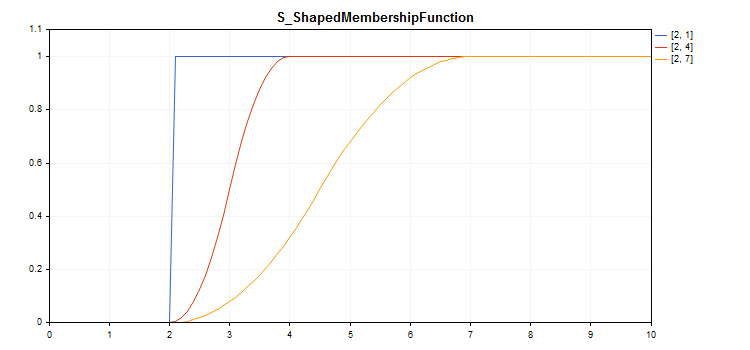

# CS_ShapedMembershipFunction

Class for implementing an S-like membership function with the A and B parameters.

### Description

The function sets an S-like two-parameter membership function. This is a non-decreasing function that takes values from 0 to 1. The A and B parameters define the interval, within which the function increases in non-linear trajectory from 0 to 1.

The function represents fuzzy sets of "very high" type (i.e. non-decreasing membership functions with saturation are set).



[A sample code](/en/docs/standardlibrary/mathematics/fuzzy_logic/fuzzy_membership/cs_shapedmembershipfunction#sample) for plotting a chart is displayed below.

### Declaration

```
   class CS_ShapedMembershipFuncion : public IMembershipFunction

```

### Title

```
   #include <Math\Fuzzy\membershipfunction.mqh>

```

```
Inheritance hierarchy
   CObject
       IMembershipFunction
           CS_ShapedMembershipFunction

```

### Class methods

| Class method | Description |
| --- | --- |
| A | Gets and sets the parameter of the increasing interval start. |
| B | Gets and sets the first parameter of the fuzzy set core. |
| GetValue | Calculates the value of the membership function by a specified argument. |

```
Methods inherited from class CObject
Prev, Prev, Next, Next, Save, Load, Type, Compare

```

Example

```
//+------------------------------------------------------------------+
//|                                   S_ShapedMembershipFunction.mq5 |
//|                        Copyright 2016, MetaQuotes Software Corp. |
//|                                             https://www.mql5.com |
//+------------------------------------------------------------------+
#include <Math\Fuzzy\membershipfunction.mqh>
#include <Graphics\Graphic.mqh>
//--- Create membership functions
CS_ShapedMembershipFunction func1(2,1);
CS_ShapedMembershipFunction func2(2,4);
CS_ShapedMembershipFunction func3(2,7);
//--- Create wrappers for membership functions
double S_ShapedMembershipFunction1(double x) { return(func1.GetValue(x)); }
double S_ShapedMembershipFunction2(double x) { return(func2.GetValue(x)); }
double S_ShapedMembershipFunction3(double x) { return(func3.GetValue(x)); }
//+------------------------------------------------------------------+
//| Script program start function                                    |
//+------------------------------------------------------------------+
void OnStart()
  {
//--- create graphic
   CGraphic graphic;
   if(!graphic.Create(0,"S_ShapedMembershipFunction",0,30,30,780,380))
     {
      graphic.Attach(0,"S_ShapedMembershipFunction");
     }
   graphic.HistoryNameWidth(70);
   graphic.BackgroundMain("S_ShapedMembershipFunction");
   graphic.BackgroundMainSize(16);
//--- create curve
   graphic.CurveAdd(S_ShapedMembershipFunction1,0.0,10.0,0.1,CURVE_LINES,"[2, 1]");
   graphic.CurveAdd(S_ShapedMembershipFunction2,0.0,10.0,0.1,CURVE_LINES,"[2, 4]");
   graphic.CurveAdd(S_ShapedMembershipFunction3,0.0,10.0,0.1,CURVE_LINES,"[2, 7]");
//--- sets the X-axis properties
   graphic.XAxis().AutoScale(false);
   graphic.XAxis().Min(0.0);
   graphic.XAxis().Max(10.0);
   graphic.XAxis().DefaultStep(1.0);
//--- sets the Y-axis properties
   graphic.YAxis().AutoScale(false);
   graphic.YAxis().Min(0.0);
   graphic.YAxis().Max(1.1);
   graphic.YAxis().DefaultStep(0.2);
//--- plot
   graphic.CurvePlotAll();
   graphic.Update();
  }

```
