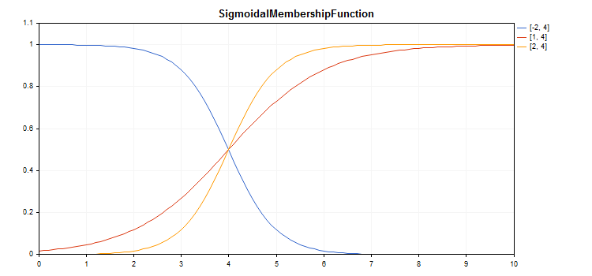

# CSigmoidalMembershipFunction

Class for implementing a sigmoid membership function with the A and C parameters.

### Description

The sigmoid function is applied when setting monotonous membership functions. It allows creating membership functions with the values equal to 1 beginning with an argument value. Such functions are suitable if you need to set such linguistic terms as "short" or "long".



[A sample code](/en/docs/standardlibrary/mathematics/fuzzy_logic/fuzzy_membership/csigmoidalmembershipfunction#sample) for plotting a chart is displayed below.

### Declaration

```
   class CSigmoidalMembershipFuncion : public IMembershipFunction

```

### Title

```
   #include <Math\Fuzzy\membershipfunction.mqh>

```

```
Inheritance hierarchy
   CObject
       IMembershipFunction
           CSigmoidalMembershipFunction

```

### Class methods

| Class method | Description |
| --- | --- |
| A | Gets and sets the membership function slope ratio. |
| C | Gets and sets the membership function inflection coordinate parameter. |
| GetValue | Calculates the value of the membership function by a specified argument. |

```
Methods inherited from class CObject
Prev, Prev, Next, Next, Save, Load, Type, Compare

```

Example

```
//+------------------------------------------------------------------+
//|                                  SigmoidalMembershipFunction.mq5 |
//|                        Copyright 2016, MetaQuotes Software Corp. |
//|                                             https://www.mql5.com |
//+------------------------------------------------------------------+
#include <Math\Fuzzy\membershipfunction.mqh>
#include <Graphics\Graphic.mqh>
//--- Create membership functions
CSigmoidalMembershipFunction func1(-2, 4);
CSigmoidalMembershipFunction func2(1, 4);
CSigmoidalMembershipFunction func3(2, 4);
//--- Create wrappers for membership functions
double SigmoidalMembershipFunction1(double x) { return(func1.GetValue(x)); }
double SigmoidalMembershipFunction2(double x) { return(func2.GetValue(x)); }
double SigmoidalMembershipFunction3(double x) { return(func3.GetValue(x)); }
//+------------------------------------------------------------------+
//| Script program start function                                    |
//+------------------------------------------------------------------+
void OnStart()
  {
//--- create graphic
   CGraphic graphic;
   if(!graphic.Create(0,"SigmoidalMembershipFunction",0,30,30,780,380))
     {
      graphic.Attach(0,"SigmoidalMembershipFunction");
     }
   graphic.HistoryNameWidth(70);
   graphic.BackgroundMain("SigmoidalMembershipFunction");
   graphic.BackgroundMainSize(16);
//--- create curve
   graphic.CurveAdd(SigmoidalMembershipFunction1,0.0,10.0,0.1,CURVE_LINES,"[-2, 4]");
   graphic.CurveAdd(SigmoidalMembershipFunction2,0.0,10.0,0.1,CURVE_LINES,"[1, 4]");
   graphic.CurveAdd(SigmoidalMembershipFunction3,0.0,10.0,0.1,CURVE_LINES,"[2, 4]");
//--- sets the X-axis properties
   graphic.XAxis().AutoScale(false);
   graphic.XAxis().Min(0.0);
   graphic.XAxis().Max(10.0);
   graphic.XAxis().DefaultStep(1.0);
//--- sets the Y-axis properties
   graphic.YAxis().AutoScale(false);
   graphic.YAxis().Min(0.0);
   graphic.YAxis().Max(1.1);
   graphic.YAxis().DefaultStep(0.2);
//--- plot
   graphic.CurvePlotAll();
   graphic.Update();
  }

```
