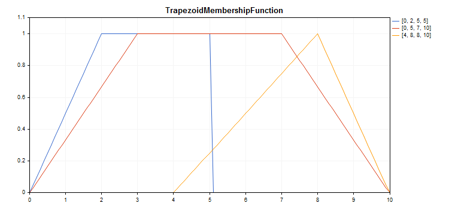

# CTrapezoidMembershipFunction

Class for implementing a trapezoidal membership function with the X1, X2, X3 and X4 parameters.

### Description

The function is formed using piecewise linear approximation. This is a generalization of the triangular function allowing you to assign a fuzzy set core as an interval. Such a membership function makes it possible to conveniently interpret optimistic/pessimistic assessments.

The function is used to set asymmetric membership functions of the variables with their most critical values defined within a certain interval.



[A sample code](/en/docs/standardlibrary/mathematics/fuzzy_logic/fuzzy_membership/ctrapezoidmembershipfunction#sample) for plotting a chart is displayed below.

### Declaration

```
   class CTrapezoidMembershipFuncion : public IMembershipFunction

```

### Title

```
   #include <Math\Fuzzy\membershipfunction.mqh>

```

```
Inheritance hierarchy
   CObject
       IMembershipFunction
           CTrapezoidMembershipFunction

```

### Class methods

| Class method | Description |
| --- | --- |
| X1 | Gets and sets the value of the first point on the X axis. |
| X2 | Gets and sets the value of the second point on the X axis. |
| X3 | Gets and sets the value of the third point on the X axis. |
| X4 | Gets and sets the value of the fourth point on the X axis. |
| GetValue | Calculates the value of the membership function by a specified argument. |

```
Methods inherited from class CObject
Prev, Prev, Next, Next, Save, Load, Type, Compare

```

Example

```
//+------------------------------------------------------------------+
//|                                  TrapezoidMembershipFunction.mq5 |
//|                         Copyright 2000-2024, MetaQuotes Ltd. |
//|                                             https://www.mql5.com |
//+------------------------------------------------------------------+
#include <Math\Fuzzy\membershipfunction.mqh>
#include <Graphics\Graphic.mqh>
//--- Create membership functions
CTrapezoidMembershipFunction func1(0,2,5,5);
CTrapezoidMembershipFunction func2(0,3,7,10);
CTrapezoidMembershipFunction func3(4,8,8,10);
//--- Create wrappers for membership functions
double TrapezoidMembershipFunction1(double x) { return(func1.GetValue(x)); }
double TrapezoidMembershipFunction2(double x) { return(func2.GetValue(x)); }
double TrapezoidMembershipFunction3(double x) { return(func3.GetValue(x)); }
//+------------------------------------------------------------------+
//| Script program start function                                    |
//+------------------------------------------------------------------+
void OnStart()
  {
//--- create graphic
   CGraphic graphic;
   if(!graphic.Create(0,"TrapezoidMembershipFunction",0,30,30,780,380))
     {
      graphic.Attach(0,"TrapezoidMembershipFunction");
     }
   graphic.HistoryNameWidth(70);
   graphic.BackgroundMain("TrapezoidMembershipFunction");
   graphic.BackgroundMainSize(16);
//--- create curve
   graphic.CurveAdd(TrapezoidMembershipFunction1,0.0,10.0,0.1,CURVE_LINES,"[0, 2, 5, 5]");
   graphic.CurveAdd(TrapezoidMembershipFunction2,0.0,10.0,0.1,CURVE_LINES,"[0, 5, 7, 10]");
   graphic.CurveAdd(TrapezoidMembershipFunction3,0.0,10.0,0.1,CURVE_LINES,"[4, 8, 8, 10]");
//--- sets the X-axis properties
   graphic.XAxis().AutoScale(false);
   graphic.XAxis().Min(0.0);
   graphic.XAxis().Max(10.0);
   graphic.XAxis().DefaultStep(1.0);
//--- sets the Y-axis properties
   graphic.YAxis().AutoScale(false);
   graphic.YAxis().Min(0.0);
   graphic.YAxis().Max(1.1);
   graphic.YAxis().DefaultStep(0.2);
//--- plot
   graphic.CurvePlotAll();
   graphic.Update();
  }

```
