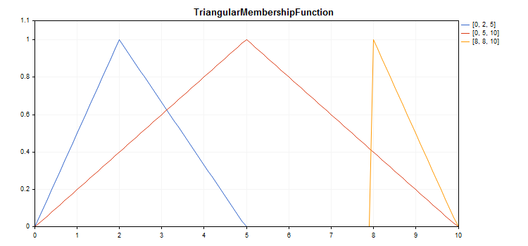

# CTriangularMembershipFunction

Class for implementing a triangle membership function with the X1, X2 and X3 parameters.

### Description

The function sets a membership function in the form of a triangle. This is a simple and most frequently applied membership function.



[A sample code](/en/docs/standardlibrary/mathematics/fuzzy_logic/fuzzy_membership/ctriangularmembershipfunction#sample) for plotting a chart is displayed below.

### Declaration

```
   class CTriangularMembershipFuncion : public IMembershipFunction

```

### Title

```
   #include <Math\Fuzzy\membershipfunction.mqh>

```

```
Inheritance hierarchy
   CObject
       IMembershipFunction
           CTriangularMembershipFunction

```

### Class methods

| Class method | Description |
| --- | --- |
| X1 | Gets the value of the first point on the X axis. |
| X2 | Gets the value of the second point on the X axis. |
| X3 | Gets the value of the third point on the X axis. |
| ToNormalMF | Converts a triangle membership function into a Gaussian one. |
| GetValue | Calculates the value of the membership function by a specified argument. |

```
Methods inherited from class CObject
Prev, Prev, Next, Next, Save, Load, Type, Compare

```

Example

```
//+------------------------------------------------------------------+
//|                                 TriangularMembershipFunction.mq5 |
//|                         Copyright 2000-2024, MetaQuotes Ltd. |
//|                                             https://www.mql5.com |
//+------------------------------------------------------------------+
#property copyright "Copyright 2000-2024, MetaQuotes Ltd."
#property link      "https://www.mql5.com"
#property version   "1.00"
#include <Math\Fuzzy\membershipfunction.mqh>
#include <Graphics\Graphic.mqh>
//--- Create membership functions
CTriangularMembershipFunction func1(0,2,5);
CTriangularMembershipFunction func2(0,5,10);
CTriangularMembershipFunction func3(8,8,10);
//--- Create wrappers for membership functions
double TriangularMembershipFunction1(double x) { return(func1.GetValue(x)); }
double TriangularMembershipFunction2(double x) { return(func2.GetValue(x)); }
double TriangularMembershipFunction3(double x) { return(func3.GetValue(x)); }
//+------------------------------------------------------------------+
//| Script program start function                                    |
//+------------------------------------------------------------------+
void OnStart()
  {
//--- create graphic
   CGraphic graphic;
   if(!graphic.Create(0,"TriangularMembershipFunction",0,30,30,780,380))
     {
      graphic.Attach(0,"TriangularMembershipFunction");
     }
   graphic.HistoryNameWidth(70);
   graphic.BackgroundMain("TriangularMembershipFunction");
   graphic.BackgroundMainSize(16);
//--- create curve
   graphic.CurveAdd(TriangularMembershipFunction1,0.0,10.0,0.1,CURVE_LINES,"[0, 2, 5]");
   graphic.CurveAdd(TriangularMembershipFunction2,0.0,10.0,0.1,CURVE_LINES,"[0, 5, 10]");
   graphic.CurveAdd(TriangularMembershipFunction3,0.0,10.0,0.1,CURVE_LINES,"[8, 8, 10]");
//--- sets the X-axis properties
   graphic.XAxis().AutoScale(false);
   graphic.XAxis().Min(0.0);
   graphic.XAxis().Max(10.0);
   graphic.XAxis().DefaultStep(1.0);
//--- sets the Y-axis properties
   graphic.YAxis().AutoScale(false);
   graphic.YAxis().Min(0.0);
   graphic.YAxis().Max(1.1);
   graphic.YAxis().DefaultStep(0.2);
//--- plot
   graphic.CurvePlotAll();
   graphic.Update();
  }

```
