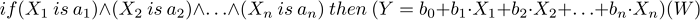

# CSugenoFuzzyRule

Sugeno-type fuzzy inference — one of the two basic types of fuzzy systems. Output variable values are set as a linear combination of input variables.

### Description

Unlike the Mamdani rule, an input variable value is set by a linear function from input parameters rather than by a fuzzy term. Fuzzy logic rule for the Sugeno algorithm can be described as follows:



where:

- X = (X1, X2, X3 ... Xn) — vector of input variables;
- Y — output variable;
- a = (a1, a2, a3 ... an) — vector of input variable values;
- b = (b1, b2, b3 ... bn) — free term ratio in the linear function for an output value
- W — rule weight.

### Declaration

```
   class CSugenoFuzzyRule : public CGenericFuzzyRule

```

### Title

```
   #include <Math\Fuzzy\fuzzyrule.mqh>

```

```
Inheritance hierarchy
   CObject
       IParsableRule
           CGenericFuzzyRule
               CSugenoFuzzyRule

```

### Class methods

| Class method | Description |
| --- | --- |
| Conclusion | Gets and sets the Sugeno fuzzy rule conclusion |

| Methods inherited from class CObject 
 Prev, Prev, Next, Next,  Save ,  Load ,  Type ,  Compare |
| --- |
| Methods inherited from class CGenericFuzzyRule 
 Condition ,  Condition ,  CreateCondition ,  CreateCondition ,  CreateCondition |
