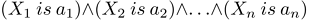

# CConditions

Class defines a set of fuzzy conditions connected to each other by an operator.

Description

A set of fuzzy conditions connected to each other by an operator may be described as follows:



where:

- X = (X1, X2, X3 ... Xn) — vector of input variables;

- a = (a1, a2, a3 ... an) — vector of input variable values.

In this example, the and operator is used. Besides, the or operator is available in this class.

### Declaration

```
   class CConditions : public ICondition

```

### Title

```
   #include <Math\Fuzzy\fuzzyrule.mqh>

```

```
Inheritance hierarchy
   CObject
       ICondition
           CConditions

```

### Class methods

| Class method | Description |
| --- | --- |
| ConditionsList | Gets the list of all conditions |
| Not | Gets and sets the flag indicating whether it is necessary to apply negation to these conditions |
| Op | Gets and sets a type of the conditions bundle operator. |

```
Methods inherited from class CObject
Prev, Prev, Next, Next, Save, Load, Type, Compare

```
