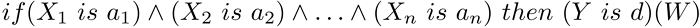

# Mamdani system

Output variable values in the Mamdani system are set using fuzzy terms.

### Description

Fuzzy logic rule for the Mamdani algorithm can be described as follows:



where:

- X = (X1, X2, X3 ... Xn) — vector of input variables;
- Y — output variable;
- a = (a1, a2, a3 ... an) — vector of input variable values;
- d — output variable value;
- W — rule weight.

### Class methods

| Class method | Description |
| --- | --- |
| AggregationMethod | Sets the type of conditions aggregation |
| Calculate | Calculates a fuzzy inference for the system |
| DefuzzificationMethod | Sets defuzzification method type |
| EmptyRule | Creates an empty fuzzy Mamdani rule based on the current system |
| ImplicationMethod | Sets a type of the system implication operator |
| Output | Gets the list of fuzzy Mamdani output variables. |
| OutputByName | Gets a fuzzy Mamdani output variable by a specified name. |
| ParseRule | Creates a fuzzy Mamdani rule based on a specified line. |
| Rules | Returns the list of fuzzy Mamdani rules. |

```
Methods inherited from class CGenericFuzzySystem
Input, AndMethod, AndMethod, OrMethod, OrMethod, InputByName, Fuzzify

```
