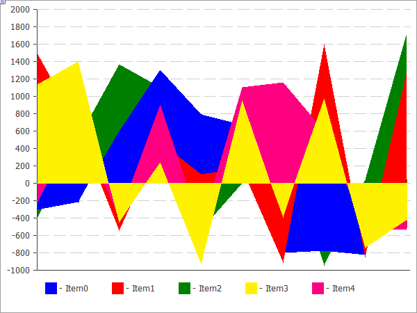

# CLineChart

A class for plotting curves.

### Description

The methods included in this class are designed for working with curves on the chart. It features the ability to fill the area limited by the plotted curve.



The code of the above figure is provided [below](/en/docs/standardlibrary/canvasgraphics/clinechart#sample).

### Declaration

```
   class CLineChart : public CChartCanvas

```

### Title

```
   #include <Canvas\Charts\LineChart.mqh>

```

```
Inheritance hierarchy
   CCanvas
       CChartCanvas
           CLineChart

```

### Class methods

| Method | Action |
| --- | --- |
| Filled | Sets the flag for filling the area under the curve defined by the data series. |
| Create | Creates a graphical resource. |
| SeriesAdd | Adds a new data series. |
| SeriesInsert | Inserts data series to the chart. |
| SeriesUpdate | Updates data series on the chart. |
| SeriesDelete | Deletes data series from the chart. |
| ValueUpdate | Updates the specified value in the specified series. |
| DrawChart | Virtual method which draws a curve and all its elements. |
| DrawData | Virtual method which draws a curve for the specified series. |
| CalcArea | Calculates the area under the curve defined by the data series. |

| Methods inherited from class CCanvas 
 CreateBitmap ,  CreateBitmap ,  CreateBitmapLabel ,  CreateBitmapLabel ,  Attach ,  Attach ,  Destroy ,  ChartObjectName ,  ResourceName ,  Width ,  Height ,  Update ,  Resize ,  Erase ,  PixelGet ,  PixelSet ,  LineVertical ,  LineHorizontal ,  Line ,  Polyline ,  Polygon ,  Rectangle ,  Triangle ,  Circle ,  Ellipse ,  Arc ,  Arc ,  Arc ,  Pie ,  Pie ,  FillRectangle ,  FillTriangle ,  FillPolygon ,  FillCircle ,  FillEllipse ,  Fill ,  Fill ,  PixelSetAA ,  LineAA ,  PolylineAA ,  PolygonAA ,  TriangleAA ,  CircleAA ,  EllipseAA ,  LineWu ,  PolylineWu ,  PolygonWu ,  TriangleWu ,  CircleWu ,  EllipseWu ,  LineThickVertical ,  LineThickHorizontal ,  LineThick ,  PolylineThick ,  PolygonThick ,  PolylineSmooth ,  PolygonSmooth ,  FontSet ,  FontNameSet ,  FontSizeSet ,  FontFlagsSet ,  FontAngleSet ,  FontGet ,  FontNameGet ,  FontSizeGet ,  FontFlagsGet ,  FontAngleGet ,  TextOut ,  TextWidth ,  TextHeight ,  TextSize ,  GetDefaultColor ,  TransparentLevelSet ,  LoadFromFile , LineStyleGet,  LineStyleSet |
| --- |
| Methods inherited from class CChartCanvas 
 ColorBackground ,  ColorBackground ,  ColorBorder ,  ColorBorder ,  ColorText ,  ColorText ,  ColorGrid ,  ColorGrid ,  MaxData ,  MaxData ,  MaxDescrLen ,  MaxDescrLen ,  AllowedShowFlags ,  ShowFlags ,  ShowFlags ,  IsShowLegend ,  IsShowScaleLeft ,  IsShowScaleRight ,  IsShowScaleTop ,  IsShowScaleBottom ,  IsShowGrid ,  IsShowDescriptors ,  IsShowPercent ,  ShowLegend ,  ShowScaleLeft ,  ShowScaleRight ,  ShowScaleTop ,  ShowScaleBottom ,  ShowGrid ,  ShowDescriptors ,  ShowValue ,  ShowPercent ,  LegendAlignment ,  Accumulative ,  VScaleMin ,  VScaleMin ,  VScaleMax ,  VScaleMax ,  NumGrid ,  NumGrid ,  VScaleParams ,  DataOffset ,  DataOffset ,  DataTotal ,  DescriptorUpdate ,  ColorUpdate |

Example

```
//+------------------------------------------------------------------+
//|                                              LineChartSample.mq5 |
//|                   Copyright 2009-2017, MetaQuotes Software Corp. |
//|                                              http://www.mql5.com |
//+------------------------------------------------------------------+
#property copyright   "2009-2017, MetaQuotes Software Corp."
#property link        "http://www.mql5.com"
#property description "Example of using line chart"
//---
#include <Canvas\Charts\LineChart.mqh>
//+------------------------------------------------------------------+
//| inputs                                                           |
//+------------------------------------------------------------------+
input bool Accumulative=false;
//+------------------------------------------------------------------+
//| Script program start function                                    |
//+------------------------------------------------------------------+
int OnStart(void)
  {
   int k=100;
   double arr[10];
//--- create chart
   CLineChart chart;
//--- create chart
   if(!chart.CreateBitmapLabel("SampleHistogrammChart",10,10,600,450))
     {
      Print("Error creating line chart: ",GetLastError());
      return(-1);
     }
   if(Accumulative)
     {
      chart.Accumulative();
      chart.VScaleParams(20*k*10,-10*k*10,20);
     }
   else
      chart.VScaleParams(20*k,-10*k,15);
   chart.ShowScaleTop(false);
   chart.ShowScaleRight(false);
   chart.ShowLegend();
   chart.Filled();
   for(int j=0;j<5;j++)
     {
      for(int i=0;i<10;i++)
        {
         k=-k;
         if(k>0)
            arr[i]=k*(i+10-j);
         else
            arr[i]=k*(i+10-j)/2;
        }
      chart.SeriesAdd(arr,"Item"+IntegerToString(j));
     }
//--- play with values
   while(!IsStopped())
     {
      int i=rand()%5;
      int j=rand()%10;
      k=rand()%3000-1000;
      chart.ValueUpdate(i,j,k);
      Sleep(200);
     }
//--- finish
   chart.Destroy();
   return(0);
  }

```
