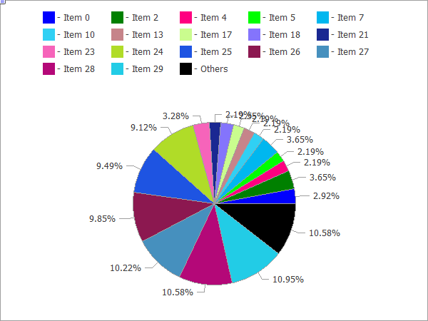

# CPieChart

Class for plotting pie charts.



The code of the above figure is provided [below](/en/docs/standardlibrary/canvasgraphics/cpiechart#sample).

### Description

The methods included in this class are designed for full-scale operation with pie charts, from the creating a graphical resource to designing labels to segments.

### Declaration

```
   class CPieChart : public CChartCanvas

```

### Title

```
   #include <Canvas\Charts\PieChart.mqh>

```

```
Inheritance hierarchy
   CCanvas
       CChartCanvas
           CPieChart

```

### Class methods

| Method | Action |
| --- | --- |
| Create | Virtual method that creates a graphical resource. |
| SeriesSet | Sets a series of values that will be shows on the pie chart. |
| ValueAdd | Adds a new value to the pie chart (to the end). |
| ValueInsert | Inserts a new value to the pie chart (at the specified position). |
| ValueUpdate | Updates the value on the pie chart (at the specified position). |
| ValueDelete | Removes a value from the pie chart (at the specified position). |
| DrawChart | Virtual method which draws a pie chart and all its elements. |
| DrawPie | Draws a segment of the pie chart, which corresponds to a specified value. |
| LabelMake | Generates a segment label based on its value and the original label. |

| Methods inherited from class CCanvas 
 CreateBitmap ,  CreateBitmap ,  CreateBitmapLabel ,  CreateBitmapLabel ,  Attach ,  Attach ,  Destroy ,  ChartObjectName ,  ResourceName ,  Width ,  Height ,  Update ,  Resize ,  Erase ,  PixelGet ,  PixelSet ,  LineVertical ,  LineHorizontal ,  Line ,  Polyline ,  Polygon ,  Rectangle ,  Triangle ,  Circle ,  Ellipse ,  Arc ,  Arc ,  Arc ,  Pie ,  Pie ,  FillRectangle ,  FillTriangle ,  FillPolygon ,  FillCircle ,  FillEllipse ,  Fill ,  Fill ,  PixelSetAA ,  LineAA ,  PolylineAA ,  PolygonAA ,  TriangleAA ,  CircleAA ,  EllipseAA ,  LineWu ,  PolylineWu ,  PolygonWu ,  TriangleWu ,  CircleWu ,  EllipseWu ,  LineThickVertical ,  LineThickHorizontal ,  LineThick ,  PolylineThick ,  PolygonThick ,  PolylineSmooth ,  PolygonSmooth ,  FontSet ,  FontNameSet ,  FontSizeSet ,  FontFlagsSet ,  FontAngleSet ,  FontGet ,  FontNameGet ,  FontSizeGet ,  FontFlagsGet ,  FontAngleGet ,  TextOut ,  TextWidth ,  TextHeight ,  TextSize ,  GetDefaultColor ,  TransparentLevelSet ,  LoadFromFile , LineStyleGet,  LineStyleSet |
| --- |
| Methods inherited from class CChartCanvas 
 ColorBackground ,  ColorBackground ,  ColorBorder ,  ColorBorder ,  ColorText ,  ColorText ,  ColorGrid ,  ColorGrid ,  MaxData ,  MaxData ,  MaxDescrLen ,  MaxDescrLen ,  AllowedShowFlags ,  ShowFlags ,  ShowFlags ,  IsShowLegend ,  IsShowScaleLeft ,  IsShowScaleRight ,  IsShowScaleTop ,  IsShowScaleBottom ,  IsShowGrid ,  IsShowDescriptors ,  IsShowPercent ,  ShowLegend ,  ShowScaleLeft ,  ShowScaleRight ,  ShowScaleTop ,  ShowScaleBottom ,  ShowGrid ,  ShowDescriptors ,  ShowValue ,  ShowPercent ,  LegendAlignment ,  Accumulative ,  VScaleMin ,  VScaleMin ,  VScaleMax ,  VScaleMax ,  NumGrid ,  NumGrid ,  VScaleParams ,  DataOffset ,  DataOffset ,  DataTotal ,  DescriptorUpdate ,  ColorUpdate |

Example

```
//+------------------------------------------------------------------+
//|                                               PieChartSample.mq5 |
//|                   Copyright 2009-2017, MetaQuotes Software Corp. |
//|                                              http://www.mql5.com |
//+------------------------------------------------------------------+
#property copyright   "2009-2017, MetaQuotes Software Corp."
#property link        "http://www.mql5.com"
#property description "Example of using pie chart"
//---
#include <Canvas\Charts\PieChart.mqh>
//+------------------------------------------------------------------+
//| inputs                                                           |
//+------------------------------------------------------------------+
input int      Width=600;
input int      Height=450;
//+------------------------------------------------------------------+
//| Script program start function                                    |
//+------------------------------------------------------------------+
int OnStart(void)
  {
//--- check
   if(Width<=0 || Height<=0)
     {
      Print("Too simple.");
      return(-1);
     }
//--- create chart
   CPieChart pie_chart;
   if(!pie_chart.CreateBitmapLabel("PieChart",10,10,Width,Height))
     {
      Print("Error creating pie chart: ",GetLastError());
      return(-1);
     }
   pie_chart.ShowPercent();
//--- draw
   for(uint i=0;i<30;i++)
     {
      pie_chart.ValueAdd(100*(i+1),"Item "+IntegerToString(i));
      Sleep(10);
     }
   Sleep(2000);
//--- disable legend
   pie_chart.LegendAlignment(ALIGNMENT_LEFT);
   Sleep(2000);
//--- disable legend
   pie_chart.LegendAlignment(ALIGNMENT_RIGHT);
   Sleep(2000);
//--- disable legend
   pie_chart.LegendAlignment(ALIGNMENT_TOP);
   Sleep(2000);
//--- disable legend
   pie_chart.ShowLegend(false);
   Sleep(2000);
//--- disable percentage
   pie_chart.ShowPercent(false);
   Sleep(2000);
//--- disable descriptors
   pie_chart.ShowDescriptors(false);
   Sleep(2000);
//--- enable all
   pie_chart.ShowLegend();
   pie_chart.ShowValue();
   pie_chart.ShowDescriptors();
   Sleep(2000);
//--- or like this
   pie_chart.ShowFlags(FLAG_SHOW_LEGEND|FLAG_SHOW_DESCRIPTORS|FLAG_SHOW_PERCENT);
   uint total=pie_chart.DataTotal();
//--- play with values
   for(uint i=0;i<total && !IsStopped();i++)
     {
      pie_chart.ValueUpdate(i,100*(rand()%10+1));
      Sleep(1000);
     }
//--- play with colors
   for(uint i=0;i<total && !IsStopped();i++)
     {
      pie_chart.ColorUpdate(i%total,RandomRGB());
      Sleep(1000);
     }
//--- rotate
   while(!IsStopped())
     {
      pie_chart.DataOffset(pie_chart.DataOffset()+1);
      Sleep(200);
     }
//--- finish
   pie_chart.Destroy();
   return(0);
  }
//+------------------------------------------------------------------+
//| Random RGB color                                                 |
//+------------------------------------------------------------------+
uint RandomRGB(void)
  {
   return(XRGB(rand()%255,rand()%255,rand()%255));
  }

```
