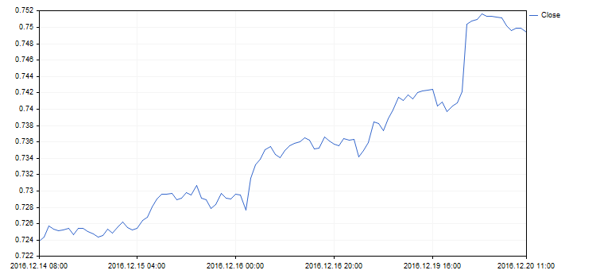

# ValuesFunctionFormat (Get method)

Get the pointer to the function defining the format of displaying values on the axis.

```
DoubleToStringFunction  ValuesFunctionFormat()

```

Return Value

Pointer to the function defining the format of displaying values on the axis.

# ValuesFunctionFormat (Set method)

Set the pointer to the function defining the format of displaying values on the axis.

```
void  ValuesFunctionFormat(
   DoubleToStringFunction  func      // function for converting numerical values into a string 
   )

```

Parameters

func

[in]  Custom function for converting numerical values into a string.

Example:



The format of displaying X axis values has been changed using the following code:

```
//+------------------------------------------------------------------+
//|                                              DateAxisGraphic.mq5 |
//|                        Copyright 2016, MetaQuotes Software Corp. |
//|                                             https://www.mql5.com |
//+------------------------------------------------------------------+
#include <Graphics\Graphic.mqh>
//--- array for store values
double arrX[];
double arrY[];
//+------------------------------------------------------------------+
//| Custom function for create values on X-axis                      |
//+------------------------------------------------------------------+
string TimeFormat(double x,void *cbdata)
  {
   return(TimeToString((datetime)arrX[ArraySize(arrX)-(int)x-1]));
  }
//+------------------------------------------------------------------+
void OnStart()
  {
   MqlRates rates[];
   CopyRates(Symbol(),Period(),0,100,rates);
   ArraySetAsSeries(rates,true);
   int size=ArraySize(rates);
   ArrayResize(arrX,size);
   ArrayResize(arrY,size);
   for(int i=0; i<size;++i)
     {
      arrX[i]=(double)rates[i].time;
      arrY[i]=rates[i].close;
     }
//--- create graphic
   CGraphic graphic;
   if(!graphic.Create(0,"DateAxisGraphic",0,30,30,780,380))
     {
      graphic.Attach(0,"DateAxisGraphic");
     }
//--- create curve
   CCurve *curve=graphic.CurveAdd(arrY,CURVE_LINES);
//--- gets the X-axis
   CAxis *xAxis=graphic.XAxis();
//--- sets the X-axis properties
   xAxis.AutoScale(false);
   xAxis.Type(AXIS_TYPE_CUSTOM);
   xAxis.ValuesFunctionFormat(TimeFormat);
   xAxis.DefaultStep(20.0);
//--- plot 
   graphic.CurvePlotAll();
   graphic.Update();
  }

```
