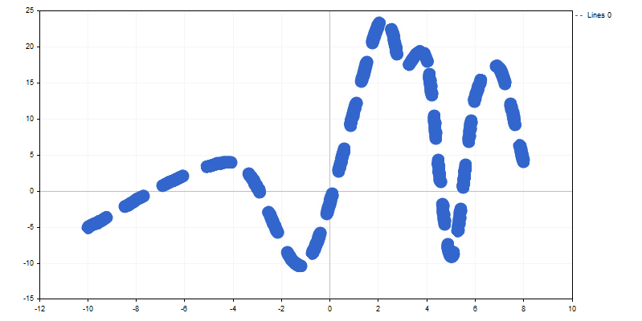

# LinesWidth (Get method)

Get lines width when plotting a curve using lines.

```
int  LinesWidth()

```

Return Value

Lines width.

# LinesWidth (Set method)

Set lines width when plotting a curve using lines.

```
void  LinesWidth(
   const int  width      // lines width
   )

```

Parameters

width

[in]  Lines width when plotting a curve using lines.

Example:



A line width has been changed using the following code:

```
//+------------------------------------------------------------------+
//|                                                CandleGraphic.mq5 |
//|                         Copyright 2000-2024, MetaQuotes Ltd. |
//|                                             https://www.mql5.com |
//+------------------------------------------------------------------+
#include <Graphics\Graphic.mqh>
//+------------------------------------------------------------------+
//| Script program start function                                    |
//+------------------------------------------------------------------+
void OnStart()
  {
   double x[]= { -100,-40,-10,20,30,40,50,60,70,80,120 };
   double y[]= { -5,4,-10,23,17,18,-9,13,17,4,9 };
//--- create graphic
   CGraphic graphic;
   if(!graphic.Create(0,"ThickLineGraphic",0,30,30,780,380))
     {
      graphic.Attach(0,"ThickLineGraphic");
     }
//--- create curve
   CCurve *curve=graphic.CurveAdd(x,y,CURVE_LINES);
//--- sets the curve properties
   curve.LinesSmooth(true);
   curve.LinesStyle(STYLE_DASH);
   curve.LinesEndStyle(LINE_END_ROUND);
   curve.LinesWidth(10);
//--- plot 
   graphic.CurvePlotAll();
   graphic.Update();
  }

```
