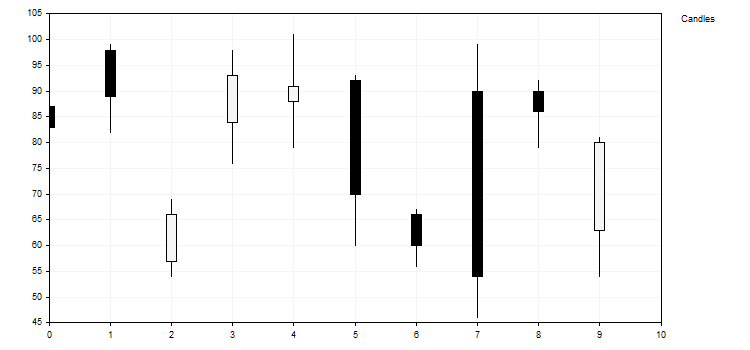

# CustomPlotFunction (Get method)

Get the pointer to the function implementing the custom curve plotting mode.

```
PlotFucntion  CustomPlotFunction()

```

Return Value

Pointer to the function implementing the custom curve plotting mode.

# CustomPlotFunction (Set method)

Set the pointer to the function implementing the custom curve plotting mode.

```
void  CustomPlotFunction(
   PlotFucntion  func      // pointer to the function
   )

```

Parameters

func

[in]  Pointer to the function implementing the custom curve plotting mode

Example:



This curve consisting of bars is built using the following code:

```
//+------------------------------------------------------------------+
//|                                                CandleGraphic.mq5 |
//|                         Copyright 2000-2024, MetaQuotes Ltd. |
//|                                             https://www.mql5.com |
//+------------------------------------------------------------------+
#include <Graphics\Graphic.mqh>
//+------------------------------------------------------------------+
//| Class CCandle                                                    |
//| Usage: class to represent the candle                             |
//+------------------------------------------------------------------+
class CCandle: public CObject
  {
private:
   double            m_open;
   double            m_close;
   double            m_high;
   double            m_low;
   uint              m_clr_inc;
   uint              m_clr_dec;
   int               m_width;
 
public:
                     CCandle(const double open,const double close,const double high,const double low,
                                                       const int width,const uint clr_inc=0x000000,const uint clr_dec=0xF5F5F5);
                    ~CCandle(void);
   double            OpenValue(void)            const { return(m_open);     }
   double            CloseValue(void)           const { return(m_close);    }
   double            HigthValue(void)           const { return(m_high);     }
   double            LowValue(void)             const { return(m_low);      }
   uint              CandleColorIncrement(void) const { return(m_clr_inc);  }
   uint              CandleColorDecrement(void) const { return(m_clr_dec);  }
   int               CandleWidth(void)          const { return(m_width);    }
  };
//+------------------------------------------------------------------+
//| Constructor                                                      |
//+------------------------------------------------------------------+
CCandle::CCandle(const double open,const double close,const double high,const double low,
                                 const int width,const uint clr_inc=0x000000,const uint clr_dec=0xF5F5F5):
                                 m_open(open),m_close(close),m_high(high),m_low(low),
                                 m_clr_inc(clr_inc),m_clr_dec(clr_dec),m_width(width)
  {
  }
//+------------------------------------------------------------------+
//| Destructor                                                       |
//+------------------------------------------------------------------+
CCandle::~CCandle(void)
  {
  }
//+------------------------------------------------------------------+
//| Custom method for plot candles                                   |
//+------------------------------------------------------------------+
void PlotCandles(double &x[],double &y[],int size,CGraphic *graphic,CCanvas *canvas,void *cbdata)
  {
//--- check obj
   CArrayObj *candles=dynamic_cast<CArrayObj*>(cbdata);
   if(candles==NULL || candles.Total()!=size)
      return;
//--- plot candles  
   for(int i=0; i<size; i++)
     {
      CCandle *candle=dynamic_cast<CCandle*>(candles.At(i));
      if(candle==NULL)
         return;
      //--- primary calculate
      int xc=graphic.ScaleX(x[i]);
      int width_2=candle.CandleWidth()/2;
      int open=graphic.ScaleY(candle.OpenValue());
      int close=graphic.ScaleY(candle.CloseValue());
      int high=graphic.ScaleY(candle.HigthValue());
      int low=graphic.ScaleY(candle.LowValue());
      uint clr=(open<=close) ? candle.CandleColorIncrement() :  candle.CandleColorDecrement();
      //--- plot candle
      canvas.LineVertical(xc,high,low,0x000000);
      //--- plot candle real body
      canvas.FillRectangle(xc+width_2,open,xc-width_2,close,clr);
      canvas.Rectangle(xc+width_2,open,xc-width_2,close,0x000000);
     }
  }
//+------------------------------------------------------------------+
//| Script program start function                                    |
//+------------------------------------------------------------------+
void OnStart()
  {
   int count=10;
   int width=10;
   double x[];
   double y[];
   ArrayResize(x,count);
   ArrayResize(y,count);
   CArrayObj candles();
   double max=0;
   double min=0;
//--- create values 
   for(int i=0; i<count; i++)
     {
      x[i] = i;
      y[i] = i;
      //--- calculate values
      double open=MathRound(50.0+(MathRand()/32767.0)*50.0);
      double close=MathRound(50.0+(MathRand()/32767.0)*50.0);
      double high=MathRound(MathMax(open,close)+(MathRand()/32767.0)*10.0);
      double low=MathRound(MathMin(open,close) -(MathRand()/32767.0)*10.0);
      //--- find max and min
      if(i==0 || max<high)
         max=high;
      if(i==0 || min>low)
         min=low;
      //--- create candle
      CCandle *candle=new CCandle(open,close,high,low,width);
      candles.Add(candle);
     }
//--- create graphic
   CGraphic graphic;
   if(!graphic.Create(0,"CandleGraphic",0,30,30,780,380))
     {
      graphic.Attach(0,"CandleGraphic");
     }
//--- create curve
   CCurve *curve=graphic.CurveAdd(x,y,CURVE_CUSTOM,"Candles");
//--- sets the curve properties
   curve.CustomPlotFunction(PlotCandles);
   curve.CustomPlotCBData(GetPointer(candles));
//--- sets the graphic properties
   graphic.YAxis().Max((int)max);
   graphic.YAxis().Min((int)min);
//--- plot 
   graphic.CurvePlotAll();
   graphic.Update();
  }

```
