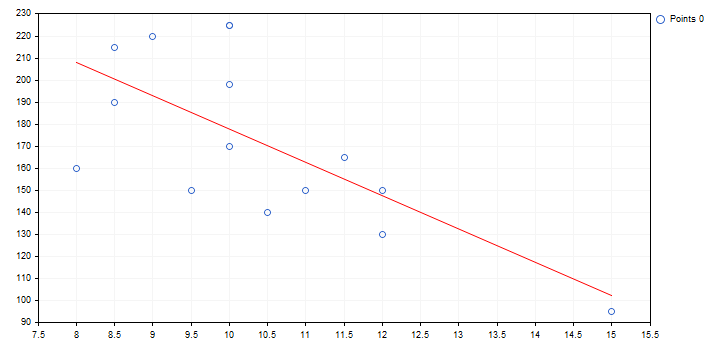

# TrendLineVisible (Get method)

Get the trend line visibility flag.

```
bool  TrendLineVisible()

```

Return Value

A value of the flag that specifies if a trend line is visible.

# TrendLineVisible (Set method)

Set the trend line visibility flag.

```
void  TrendLineVisible(
   const bool  visible      // flag value 
   )

```

Parameters

visible

[in]  A value of the trend line visibility flag.

Example:



Below is the code of the mentioned trend line and its plotting on the chart:

```
//+------------------------------------------------------------------+
//|                                             TrendLineGraphic.mq5 |
//|                         Copyright 2000-2024, MetaQuotes Ltd. |
//|                                             https://www.mql5.com |
//+------------------------------------------------------------------+
#include <Graphics\Graphic.mqh>
//+------------------------------------------------------------------+
//| Script program start function                                    |
//+------------------------------------------------------------------+
void OnStart()
  {
   double x[]={12.0,11.5,11.0,12.0,10.5,10.0,9.0,8.5,10.0,8.5,10.0,8.0,9.5,10.0,15.0};
   double y[]={130.0,165.0,150.0,150.0,140.0,198.0,220.0,215.0,225.0,190.0,170.0,160.0,150.0,225.0,95.00};
//--- create graphic
   CGraphic graphic;
   if(!graphic.Create(0,"TrendLineGraphic",0,30,30,780,380))
     {
      graphic.Attach(0,"TrendLineGraphic");
     }
//--- create curve
   CCurve *curve=graphic.CurveAdd(x,y,CURVE_POINTS);
//--- sets the curve properties 
   curve.TrendLineVisible(true);
   curve.TrendLineColor(ColorToARGB(clrRed));
//--- plot 
   graphic.CurvePlotAll();
   graphic.Update();
  }

```
