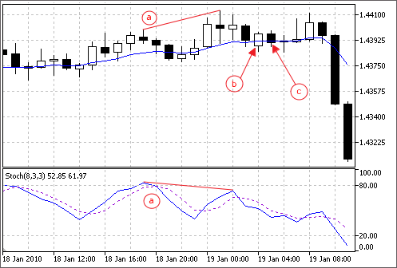

# Modules of Trade Signals

The standard delivery of the client terminal includes a set of ready-made modules of trade signals for "MQL5 Wizard". When creating an Expert Advisor in MQL5 Wizard, you can use any combination of the modules of trade signals (up to 64). The final decision on a trade operation is made on the basis of complex analysis of signals obtained from all included modules. The detailed description of the mechanism of making trade decisions is given [below](/en/docs/standardlibrary/expertclasses/csignal#mechanism).

The standard delivery includes the following modules of signals:

- [Signals of the Indicator Accelerator Oscillator](/en/docs/standardlibrary/expertclasses/csignal/signal_ac)
- [Signals of the Indicator Adaptive Moving Average](/en/docs/standardlibrary/expertclasses/csignal/signal_ama)
- [Signals of the Indicator Awesome Oscillator](/en/docs/standardlibrary/expertclasses/csignal/signal_ao)
- [Signals of the Oscillator Bears Power](/en/docs/standardlibrary/expertclasses/csignal/signal_bears)
- [Signals of the Oscillator Bulls Power](/en/docs/standardlibrary/expertclasses/csignal/signal_bulls)
- [Signals of the Oscillator Commodity Channel Index](/en/docs/standardlibrary/expertclasses/csignal/signal_cci)
- [Signals of the Oscillator DeMarker](/en/docs/standardlibrary/expertclasses/csignal/signal_demarker)
- [Signals of the Indicator Double Exponential Moving Average](/en/docs/standardlibrary/expertclasses/csignal/signal_dema)
- [Signals of the Indicator Envelopes](/en/docs/standardlibrary/expertclasses/csignal/signal_envelopes)
- [Signals of the Indicator Fractal Adaptive Moving Average](/en/docs/standardlibrary/expertclasses/csignal/signal_frama)
- [Signals of the Intraday Time Filter](/en/docs/standardlibrary/expertclasses/csignal/signal_time_filter)
- [Signals of the Oscillator MACD](/en/docs/standardlibrary/expertclasses/csignal/signal_macd)
- [Signals of the Indicator Moving Average](/en/docs/standardlibrary/expertclasses/csignal/signal_ma)
- [Signals of the Indicator Parabolic SAR](/en/docs/standardlibrary/expertclasses/csignal/signal_sar)
- [Signals of the Oscillator Relative Strength Index](/en/docs/standardlibrary/expertclasses/csignal/signal_rsi)
- [Signals of the Oscillator Relative Vigor Index](/en/docs/standardlibrary/expertclasses/csignal/signal_rvi)
- [Signals of the Oscillator Stochastic](/en/docs/standardlibrary/expertclasses/csignal/signal_stochastic)
- [Signals of the Oscillator Triple Exponential Average](/en/docs/standardlibrary/expertclasses/csignal/signal_trix)
- [Signals of the Indicator Triple Exponential Moving Average](/en/docs/standardlibrary/expertclasses/csignal/signal_tema)
- [Signals of the Oscillator Williams Percent Range](/en/docs/standardlibrary/expertclasses/csignal/signal_wpr)

## The Mechanism of Making Trade Decisions on the Basis of Signal Modules  #

The mechanism of making trade decisions can be represented as the following list of basic principles:

- Each of the modules of signals has its set of market modules (certain combination of prices and values of an indicator).
- Each market model has a significance that may vary with the range of 1 to 100. The higher is the significance, the stronger the model is.
- Each of the models generates a forecast of direction of the price movement.
- A forecast of a module is the result of search for embedded models, and it is outputted as a number within the range of -100 to 100. The sign determines the direction of forecast movement (negative sign means the price will fall, positive sign means the price will rise). The absolute value corresponds to the strength of the best found model.
- The forecast of each module is sent to the final "voting" with a weight coefficient of 0 to 1 specified in its settings ("Weight").
- The result of voting is a number within the range of -100 to 100, where the sign determines direction of the forecast movement, and the absolute value characterizes the strength of the signal. It is calculated as the Arithmetic mean of weighted forecasts of all the modules of signals. The absolute value is used by an Expert Advisor to make trade decisions.

Each generated Expert Advisor has two adjustable settings — threshold levels of opening and closing a position (ThresholdOpen and ThresholdClose) that can be equal to a value in the range of 0 to 100.  If the strength of final signal exceeds a threshold level, a trade operation that corresponds to the sign of the signal is performed.

### Examples

Consider an Expert Advisor with the following threshold levels: ThresholdOpen=20 and ThresholdClose=90. Two modules of signals participate in making decisions on trade operations: the [MA](/en/docs/standardlibrary/expertclasses/csignal/signal_ma) module with weight 0.4 and the [Stochastic](/en/docs/standardlibrary/expertclasses/csignal/signal_stochastic) module with weight 0.8. Let's analyze two variants of obtained trade signals:

Variant 1

The price crossed the rising MA upwards. This case corresponds to one of the market models implemented in the [MA module](/en/docs/standardlibrary/expertclasses/csignal/signal_ma). This model implies a rise of price. Its significance is equal to 100. At the same time, the Stochastic oscillator turned down and formed a divergence with price. This case corresponds to one of the models implemented in the [Stochastic module](/en/docs/standardlibrary/expertclasses/csignal/signal_stochastic). This model implies a fall of price. The weight of this model is 80.

Let's calculate the result of final "voting". The rate obtained from the MA module is calculated as 0.4 * 100 = 40. The value from the Stochastic module is calculated as 0.8 * (-80) = -64. The final value is calculated as the Arithmetic mean of these two rates: (40 - 64)/2 = -12. The result of voting is the signal for selling with relative strength equal to 12. The threshold level that is equal to 20 is not reached. Thus a trade operation is not performed.

Variant 2

The price crossed the rising MA downwards. This case corresponds to one of the models implemented in the [MA module](/en/docs/standardlibrary/expertclasses/csignal/signal_ma).This model implies a rise of price. Its significance is equal to 10. At the same time, the Stochastic oscillator turned down and formed a divergence with price. This case corresponds to one of the models implemented in the [Stochastic module](/en/docs/standardlibrary/expertclasses/csignal/signal_stochastic). This model implies a fall of price. The weight of this model is 80.

Let's calculate the result of final "voting". The rate obtained from the MA module is calculated as 0.4 * 10 = 4. The value from the Stochastic module is calculated as 0.8 * (-80) = -64. The final value is calculated as the Arithmetic mean of these two rates: (4 - 64)/2 = -30. The result of voting is the signal for selling with relative strength equal to 30. The threshold level that is equal to 20 is reached. Thus the result is the signal for opening a short position.

a) Divergence of the price and the Stochastic oscillator (variants 1 and 2).

b) The price crossed the MA indicator upwards (variant 1).

c) The price crossed the MA indicator downwards (variant 2).
