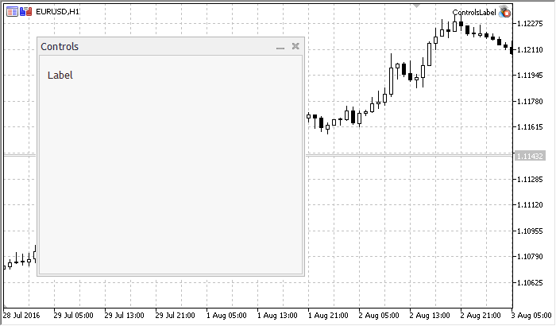

# CLabel

CLabel is class of the simple control based on "Text label" chart object.

### Description

CLabel is intended for creation of simple non-editable text labels.

### Declaration

```
   class CLabel : public CWndObj

```

### Title

```
   #include <Controls\Label.mqh>

```

```
Inheritance hierarchy
   CObject
       CWnd
           CWndObj
               CLabel

```

Result of the [code](/en/docs/standardlibrary/controls/clabel#sample) provided below:



### Class Methods by Groups

| Create |  |
| --- | --- |
| Create | Creates control |
| Properties change event handlers |  |
| OnSetText | "SetText" event handler |
| OnSetColor | "SetColor" event handler |
| OnSetFont | "SetFont" event handler |
| OnSetFontSize | "SetFontSize" event handler |
| Internal event handlers |  |
| OnCreate | "Create" internal event handler |
| OnShow | "Show" internal event handler |
| OnHide | "Hide" internal event handler |
| OnMove | "Move" internal event handler |

| Methods inherited from class CObject 
 Prev, Prev, Next, Next,  Save ,  Load ,  Type ,  Compare |
| --- |
| Methods inherited from class CWnd 
 Destroy ,  OnMouseEvent ,  Name ,  ControlsTotal ,  Control ,  ControlFind ,  Rect ,  Left ,  Left ,  Top ,  Top ,  Right ,  Right ,  Bottom ,  Bottom ,  Width ,  Width ,  Height ,  Height , Size, Size, Size,  Move ,  Move ,  Shift ,  Contains ,  Contains ,  Alignment ,  Align ,  Id ,  Id ,  IsEnabled ,  Enable ,  Disable ,  IsVisible ,  Visible ,  Show ,  Hide ,  IsActive ,  Activate ,  Deactivate ,  StateFlags ,  StateFlags ,  StateFlagsSet ,  StateFlagsReset ,  PropFlags ,  PropFlags ,  PropFlagsSet ,  PropFlagsReset ,  MouseX ,  MouseX ,  MouseY ,  MouseY ,  MouseFlags ,  MouseFlags ,  MouseFocusKill , BringToTop |
| Methods inherited from class CWndObj 
 OnEvent ,  Text ,  Text ,  Color ,  Color ,  ColorBackground ,  ColorBackground ,  ColorBorder ,  ColorBorder ,  Font ,  Font ,  FontSize ,  FontSize ,  ZOrder ,  ZOrder |

Example of creating a panel with text label:

```
//+------------------------------------------------------------------+
//|                                                ControlsLabel.mq5 |
//|                         Copyright 2000-2024, MetaQuotes Ltd. |
//|                                             https://www.mql5.com |
//+------------------------------------------------------------------+
#property copyright "Copyright 2017, MetaQuotes Software Corp."
#property link      "https://www.mql5.com"
#property version   "1.00"
#property description "Control Panels and Dialogs. Demonstration class CLabel"
#include <Controls\Dialog.mqh>
#include <Controls\Label.mqh>
//+------------------------------------------------------------------+
//| defines                                                          |
//+------------------------------------------------------------------+
//--- indents and gaps
#define INDENT_LEFT                         (11)      // indent from left (with allowance for border width)
#define INDENT_TOP                          (11)      // indent from top (with allowance for border width)
#define INDENT_RIGHT                        (11)      // indent from right (with allowance for border width)
#define INDENT_BOTTOM                       (11)      // indent from bottom (with allowance for border width)
#define CONTROLS_GAP_X                      (5)       // gap by X coordinate
#define CONTROLS_GAP_Y                      (5)       // gap by Y coordinate
//--- for buttons
#define BUTTON_WIDTH                        (100)     // size by X coordinate
#define BUTTON_HEIGHT                       (20)      // size by Y coordinate
//--- for the indication area
#define EDIT_HEIGHT                         (20)      // size by Y coordinate
//--- for group controls
#define GROUP_WIDTH                         (150)     // size by X coordinate
#define LIST_HEIGHT                         (179)     // size by Y coordinate
#define RADIO_HEIGHT                        (56)      // size by Y coordinate
#define CHECK_HEIGHT                        (93)      // size by Y coordinate
//+------------------------------------------------------------------+
//| Class CControlsDialog                                            |
//| Usage: main dialog of the Controls application                   |
//+------------------------------------------------------------------+
class CControlsDialog : public CAppDialog
  {
private:
   CLabel            m_label;                         // CLabel object
public:
                     CControlsDialog(void);
                    ~CControlsDialog(void);
   //--- create
   virtual bool      Create(const long chart,const string name,const int subwin,const int x1,const int y1,const int x2,const int y2);
   //--- chart event handler
   virtual bool      OnEvent(const int id,const long &lparam,const double &dparam,const string &sparam);
protected:
   //--- create dependent controls
   bool              CreateLabel(void);
   //--- handlers of the dependent controls events
   void              OnClickLabel(void);
  };
//+------------------------------------------------------------------+
//| Event Handling                                                   |
//+------------------------------------------------------------------+
EVENT_MAP_BEGIN(CControlsDialog)
 
EVENT_MAP_END(CAppDialog)
//+------------------------------------------------------------------+
//| Constructor                                                      |
//+------------------------------------------------------------------+
CControlsDialog::CControlsDialog(void)
  {
  }
//+------------------------------------------------------------------+
//| Destructor                                                       |
//+------------------------------------------------------------------+
CControlsDialog::~CControlsDialog(void)
  {
  }
//+------------------------------------------------------------------+
//| Create                                                           |
//+------------------------------------------------------------------+
bool CControlsDialog::Create(const long chart,const string name,const int subwin,const int x1,const int y1,const int x2,const int y2)
  {
   if(!CAppDialog::Create(chart,name,subwin,x1,y1,x2,y2))
      return(false);
//--- create dependent controls
   if(!CreateLabel())
      return(false);
//--- succeed
   return(true);
  }
//+------------------------------------------------------------------+
//| Create the "CLabel"                                              |
//+------------------------------------------------------------------+
bool CControlsDialog::CreateLabel(void)
  {
//--- coordinates
   int x1=INDENT_RIGHT;
   int y1=INDENT_TOP+CONTROLS_GAP_Y;
   int x2=x1+100;
   int y2=y1+20;
//--- create
   if(!m_label.Create(m_chart_id,m_name+"Label",m_subwin,x1,y1,x2,y2))
      return(false);
   if(!m_label.Text("Label"))
      return(false);
   if(!Add(m_label))
      return(false);
//--- succeed
   return(true);
  }
//+------------------------------------------------------------------+
//| Global Variables                                                 |
//+------------------------------------------------------------------+
CControlsDialog ExtDialog;
//+------------------------------------------------------------------+
//| Expert initialization function                                   |
//+------------------------------------------------------------------+
int OnInit()
  {
//--- create application dialog
   if(!ExtDialog.Create(0,"Controls",0,40,40,380,344))
      return(INIT_FAILED);
//--- run application
   ExtDialog.Run();
//--- succeed
   return(INIT_SUCCEEDED);
  }
//+------------------------------------------------------------------+
//| Expert deinitialization function                                 |
//+------------------------------------------------------------------+
void OnDeinit(const int reason)
  {
//--- 
   Comment("");
//--- destroy dialog
   ExtDialog.Destroy(reason);
  }
//+------------------------------------------------------------------+
//| Expert chart event function                                      |
//+------------------------------------------------------------------+
void OnChartEvent(const int id,         // event ID  
                  const long& lparam,   // event parameter of the long type
                  const double& dparam, // event parameter of the double type
                  const string& sparam) // event parameter of the string type
  {
   ExtDialog.ChartEvent(id,lparam,dparam,sparam);
  }

```

###
