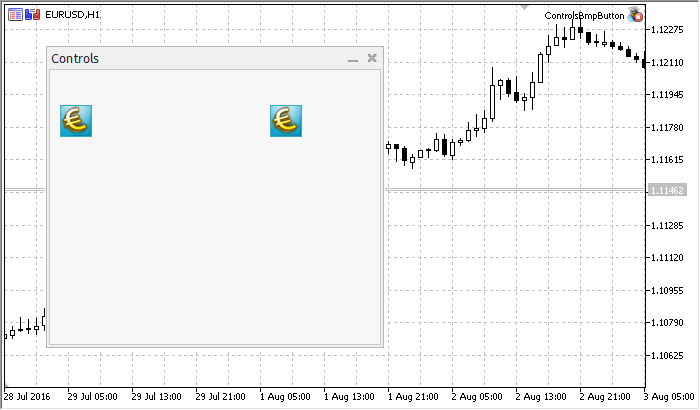

# CBmpButton

CBmpButton is class of the simple control based on "Bitmap label" chart object.

### Description

CBmpButton is intended for creation of buttons with graphic image.

### Declaration

```
   class CBmpButton : public CWndObj

```

### Title

```
   #include <Controls\BmpButton.mqh>

```

```
Inheritance hierarchy
   CObject
       CWnd
           CWndObj
               CBmpButton

```

Result of the [code](/en/docs/standardlibrary/controls/cbmpbutton#sample) provided below:



### Class Methods by Groups

| Create |  |
| --- | --- |
| Create | Creates control |
| Properties |  |
| Border | Gets/sets the "Border" property of the control |
| BmpNames | Sets the name of bmp files of the control |
| BmpOffName | Gets/sets the name of bmp file for the OFF state |
| BmpOnName | Gets/sets the name of bmp file for the ON state |
| BmpPassiveName | Gets/sets the name of bmp file for the passive state |
| BmpActiveName | Gets/sets the name of bmp file for the active state |
| State |  |
| Pressed | Gets/sets the state of the control |
| Locking | Gets/sets the "Locking" property of the control |
| Internal event handlers |  |
| OnSetZOrder | "SetZOrder" internal event handler |
| OnCreate | "Create" internal event handler |
| OnShow | "Show" internal event handler |
| OnHide | "Hide" internal event handler |
| OnMove | "Move" internal event handler |
| OnChange | "Change" internal event handler |
| OnActivate | "Activate" internal event handler |
| OnDeactivate | "Deactivate" internal event handler |
| OnMouseDown | "MouseDown" internal event handler |
| OnMouseUp | "MouseUp" internal event handler |

| Methods inherited from class CObject 
 Prev, Prev, Next, Next,  Save ,  Load ,  Type ,  Compare |
| --- |
| Methods inherited from class CWnd 
 Destroy ,  OnMouseEvent ,  Name ,  ControlsTotal ,  Control ,  ControlFind ,  Rect ,  Left ,  Left ,  Top ,  Top ,  Right ,  Right ,  Bottom ,  Bottom ,  Width ,  Width ,  Height ,  Height , Size, Size, Size,  Move ,  Move ,  Shift ,  Contains ,  Contains ,  Alignment ,  Align ,  Id ,  Id ,  IsEnabled ,  Enable ,  Disable ,  IsVisible ,  Visible ,  Show ,  Hide ,  IsActive ,  Activate ,  Deactivate ,  StateFlags ,  StateFlags ,  StateFlagsSet ,  StateFlagsReset ,  PropFlags ,  PropFlags ,  PropFlagsSet ,  PropFlagsReset ,  MouseX ,  MouseX ,  MouseY ,  MouseY ,  MouseFlags ,  MouseFlags ,  MouseFocusKill , BringToTop |
| Methods inherited from class CWndObj 
 OnEvent ,  Text ,  Text ,  Color ,  Color ,  ColorBackground ,  ColorBackground ,  ColorBorder ,  ColorBorder ,  Font ,  Font ,  FontSize ,  FontSize ,  ZOrder ,  ZOrder |

Example of creating a panel with Bitmap label:

```
//+------------------------------------------------------------------+
//|                                            ControlsBmpButton.mq5 |
//|                         Copyright 2000-2024, MetaQuotes Ltd. |
//|                                             https://www.mql5.com |
//+------------------------------------------------------------------+
#property copyright "Copyright 2017, MetaQuotes Software Corp."
#property link      "https://www.mql5.com"
#property version   "1.00"
#property description "Control Panels and Dialogs. Demonstration class CBmpButton"
#include <Controls\Dialog.mqh>
#include <Controls\BmpButton.mqh>
//+------------------------------------------------------------------+
//| defines                                                          |
//+------------------------------------------------------------------+
//--- indents and gaps
#define INDENT_LEFT                         (11)      // indent from left (with allowance for border width)
#define INDENT_TOP                          (11)      // indent from top (with allowance for border width)
#define INDENT_RIGHT                        (11)      // indent from right (with allowance for border width)
#define INDENT_BOTTOM                       (11)      // indent from bottom (with allowance for border width)
#define CONTROLS_GAP_X                      (5)       // gap by X coordinate
#define CONTROLS_GAP_Y                      (5)       // gap by Y coordinate
//--- for buttons
#define BUTTON_WIDTH                        (100)     // size by X coordinate
#define BUTTON_HEIGHT                       (20)      // size by Y coordinate
//--- for the indication area
#define EDIT_HEIGHT                         (20)      // size by Y coordinate
//--- for group controls
#define GROUP_WIDTH                         (150)     // size by X coordinate
#define LIST_HEIGHT                         (179)     // size by Y coordinate
#define RADIO_HEIGHT                        (56)      // size by Y coordinate
#define CHECK_HEIGHT                        (93)      // size by Y coordinate
//+------------------------------------------------------------------+
//| Class CControlsDialog                                            |
//| Usage: main dialog of the Controls application                   |
//+------------------------------------------------------------------+
class CControlsDialog : public CAppDialog
  {
private:
   CBmpButton        m_bmpbutton1;                    // CBmpButton object
   CBmpButton        m_bmpbutton2;                    // CBmpButton object
 
public:
                     CControlsDialog(void);
                    ~CControlsDialog(void);
   //--- create
   virtual bool      Create(const long chart,const string name,const int subwin,const int x1,const int y1,const int x2,const int y2);
   //--- chart event handler
   virtual bool      OnEvent(const int id,const long &lparam,const double &dparam,const string &sparam);
 
protected:
   //--- create dependent controls
   bool              CreateBmpButton1(void);
   bool              CreateBmpButton2(void);
   //--- handlers of the dependent controls events
   void              OnClickBmpButton1(void);
   void              OnClickBmpButton2(void);
  };
//+------------------------------------------------------------------+
//| Event Handling                                                   |
//+------------------------------------------------------------------+
EVENT_MAP_BEGIN(CControlsDialog)
ON_EVENT(ON_CLICK,m_bmpbutton1,OnClickBmpButton1)
ON_EVENT(ON_CLICK,m_bmpbutton2,OnClickBmpButton2)
EVENT_MAP_END(CAppDialog)
//+------------------------------------------------------------------+
//| Constructor                                                      |
//+------------------------------------------------------------------+
CControlsDialog::CControlsDialog(void)
  {
  }
//+------------------------------------------------------------------+
//| Destructor                                                       |
//+------------------------------------------------------------------+
CControlsDialog::~CControlsDialog(void)
  {
  }
//+------------------------------------------------------------------+
//| Create                                                           |
//+------------------------------------------------------------------+
bool CControlsDialog::Create(const long chart,const string name,const int subwin,const int x1,const int y1,const int x2,const int y2)
  {
   if(!CAppDialog::Create(chart,name,subwin,x1,y1,x2,y2))
      return(false);
//--- create dependent controls
   if(!CreateBmpButton1())
      return(false);
   if(!CreateBmpButton2())
      return(false);
//--- succeed
   return(true);
  }
//+------------------------------------------------------------------+
//| Create the "BmpButton1" button                                   |
//+------------------------------------------------------------------+
bool CControlsDialog::CreateBmpButton1(void)
  {
//--- coordinates
   int x1=INDENT_LEFT;
   int y1=INDENT_TOP+(EDIT_HEIGHT+CONTROLS_GAP_Y);
   int x2=x1+BUTTON_WIDTH;
   int y2=y1+BUTTON_HEIGHT;
//--- create
   if(!m_bmpbutton1.Create(m_chart_id,m_name+"BmpButton1",m_subwin,x1,y1,x2,y2))
      return(false);
//--- sets the name of bmp files of the control CBmpButton
   m_bmpbutton1.BmpNames("\\Images\\euro.bmp","\\Images\\dollar.bmp");
   if(!Add(m_bmpbutton1))
      return(false);
//--- succeed
   return(true);
  }
//+------------------------------------------------------------------+
//| Create the "BmpButton2" fixed button                             |
//+------------------------------------------------------------------+
bool CControlsDialog::CreateBmpButton2(void)
  {
//--- coordinates
   int x1=INDENT_LEFT+2*(BUTTON_WIDTH+CONTROLS_GAP_X);
   int y1=INDENT_TOP+(EDIT_HEIGHT+CONTROLS_GAP_Y);
   int x2=x1+BUTTON_WIDTH;
   int y2=y1+BUTTON_HEIGHT;
//--- create
   if(!m_bmpbutton2.Create(m_chart_id,m_name+"BmpButton2",m_subwin,x1,y1,x2,y2))
      return(false);
//--- sets the name of bmp files of the control CBmpButton
   m_bmpbutton2.BmpNames("\\Images\\euro.bmp","\\Images\\dollar.bmp");
   if(!Add(m_bmpbutton2))
      return(false);
   m_bmpbutton2.Locking(true);
//--- succeed
   return(true);
  }
//+------------------------------------------------------------------+
//| Event handler                                                    |
//+------------------------------------------------------------------+
void CControlsDialog::OnClickBmpButton1(void)
  {
   Comment(__FUNCTION__);
  }
//+------------------------------------------------------------------+
//| Event handler                                                    |
//+------------------------------------------------------------------+
void CControlsDialog::OnClickBmpButton2(void)
  {
   if(m_bmpbutton2.Pressed())
      Comment(__FUNCTION__+" State of the control is: On");
   else
      Comment(__FUNCTION__+" State of the control is: Off");
  }
//+------------------------------------------------------------------+
//| Global Variables                                                 |
//+------------------------------------------------------------------+
CControlsDialog ExtDialog;
//+------------------------------------------------------------------+
//| Expert initialization function                                   |
//+------------------------------------------------------------------+
int OnInit()
  {
//--- create application dialog
   if(!ExtDialog.Create(0,"Controls",0,40,40,380,344))
      return(INIT_FAILED);
//--- run application
   ExtDialog.Run();
//--- succeed
   return(INIT_SUCCEEDED);
  }
//+------------------------------------------------------------------+
//| Expert deinitialization function                                 |
//+------------------------------------------------------------------+
void OnDeinit(const int reason)
  {
//--- 
   Comment("");
//--- destroy dialog
   ExtDialog.Destroy(reason);
  }
//+------------------------------------------------------------------+
//| Expert chart event function                                      |
//+------------------------------------------------------------------+
void OnChartEvent(const int id,         // event ID  
                  const long& lparam,   // event parameter of the long type
                  const double& dparam, // event parameter of the double type
                  const string& sparam) // event parameter of the string type
  {
   ExtDialog.ChartEvent(id,lparam,dparam,sparam);
  }

```

###
