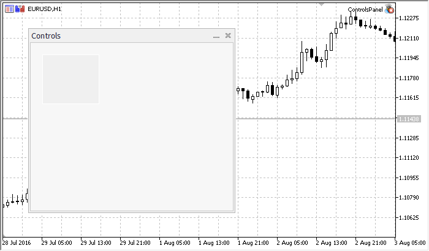

# CPanel

CPanel is a class of the simple control based on "Rectangle label" chart object.

### Description

CPanel class is intended to combine the controls with similar functions in the group.

### Declaration

```
   class CPanel : public CWndObj

```

### Title

```
   #include <Controls\Panel.mqh>

```

```
Inheritance hierarchy
   CObject
       CWnd
           CWndObj
               CPanel

```

Result of the [code](/en/docs/standardlibrary/controls/cpanel#sample) provided below:



### Class Methods by Groups

| Create |  |
| --- | --- |
| Create | Creates control |
| Chart object properties |  |
| BorderType | Gets the "BorderType" property of the chart object |
| Chart object event handlers |  |
| OnSetText | "SetText" event handler |
| OnSetColorBackground | "SetColorBackground" event handler |
| OnSetColorBorder | "SetColorBorder" event handler |
| Internal event handlers |  |
| OnCreate | "Create" internal event handler |
| OnShow | "Show" internal event handler |
| OnHide | "Hide" internal event handler |
| OnMove | "Move" internal event handler |
| OnResize | "Resize" internal event handler |
| OnChange | "Change" internal event handler |

| Methods inherited from class CObject 
 Prev, Prev, Next, Next,  Save ,  Load ,  Type ,  Compare |
| --- |
| Methods inherited from class CWnd 
 Destroy ,  OnMouseEvent ,  Name ,  ControlsTotal ,  Control ,  ControlFind ,  Rect ,  Left ,  Left ,  Top ,  Top ,  Right ,  Right ,  Bottom ,  Bottom ,  Width ,  Width ,  Height ,  Height , Size, Size, Size,  Move ,  Move ,  Shift ,  Contains ,  Contains ,  Alignment ,  Align ,  Id ,  Id ,  IsEnabled ,  Enable ,  Disable ,  IsVisible ,  Visible ,  Show ,  Hide ,  IsActive ,  Activate ,  Deactivate ,  StateFlags ,  StateFlags ,  StateFlagsSet ,  StateFlagsReset ,  PropFlags ,  PropFlags ,  PropFlagsSet ,  PropFlagsReset ,  MouseX ,  MouseX ,  MouseY ,  MouseY ,  MouseFlags ,  MouseFlags ,  MouseFocusKill , BringToTop |
| Methods inherited from class CWndObj 
 OnEvent ,  Text ,  Text ,  Color ,  Color ,  ColorBackground ,  ColorBackground ,  ColorBorder ,  ColorBorder ,  Font ,  Font ,  FontSize ,  FontSize ,  ZOrder ,  ZOrder |

Example of creating a panel with Rectangle label:

```
//+------------------------------------------------------------------+
//|                                                ControlsPanel.mq5 |
//|                         Copyright 2000-2024, MetaQuotes Ltd. |
//|                                             https://www.mql5.com |
//+------------------------------------------------------------------+
#property copyright "Copyright 2017, MetaQuotes Software Corp."
#property link      "https://www.mql5.com"
#property version   "1.00"
#property description "Control Panels and Dialogs. Demonstration class CPanel"
#include <Controls\Dialog.mqh>
//+------------------------------------------------------------------+
//| defines                                                          |
//+------------------------------------------------------------------+
//--- indents and gaps
#define INDENT_LEFT                         (11)      // indent from left (with allowance for border width)
#define INDENT_TOP                          (11)      // indent from top (with allowance for border width)
#define INDENT_RIGHT                        (11)      // indent from right (with allowance for border width)
#define INDENT_BOTTOM                       (11)      // indent from bottom (with allowance for border width)
#define CONTROLS_GAP_X                      (5)       // gap by X coordinate
#define CONTROLS_GAP_Y                      (5)       // gap by Y coordinate
//--- for buttons
#define BUTTON_WIDTH                        (100)     // size by X coordinate
#define BUTTON_HEIGHT                       (20)      // size by Y coordinate
//--- for the indication area
#define EDIT_HEIGHT                         (20)      // size by Y coordinate
//--- for group controls
#define GROUP_WIDTH                         (150)     // size by X coordinate
#define LIST_HEIGHT                         (179)     // size by Y coordinate
#define RADIO_HEIGHT                        (56)      // size by Y coordinate
#define CHECK_HEIGHT                        (93)      // size by Y coordinate
//+------------------------------------------------------------------+
//| Class CControlsDialog                                            |
//| Usage: main dialog of the Controls application                   |
//+------------------------------------------------------------------+
class CControlsDialog : public CAppDialog
  {
public:
                     CControlsDialog(void);
                    ~CControlsDialog(void);
   //--- create
   virtual bool      Create(const long chart,const string name,const int subwin,const int x1,const int y1,const int x2,const int y2);
 
protected:
   //--- create dependent controls
   bool              CreatePanel(void);
  };
//+------------------------------------------------------------------+
//| Constructor                                                      |
//+------------------------------------------------------------------+
CControlsDialog::CControlsDialog(void)
  {
  }
//+------------------------------------------------------------------+
//| Destructor                                                       |
//+------------------------------------------------------------------+
CControlsDialog::~CControlsDialog(void)
  {
  }
//+------------------------------------------------------------------+
//| Create                                                           |
//+------------------------------------------------------------------+
bool CControlsDialog::Create(const long chart,const string name,const int subwin,const int x1,const int y1,const int x2,const int y2)
  {
   if(!CAppDialog::Create(chart,name,subwin,x1,y1,x2,y2))
      return(false);
//--- create dependent controls
   if(!CreatePanel())
      return(false);
//--- succeed
   return(true);
  }
//+------------------------------------------------------------------+
//| Create the "CPanel"                                              |
//+------------------------------------------------------------------+
bool CControlsDialog::CreatePanel(void)
  {
//--- coordinates
   int x1=20;
   int y1=20;
   int x2=ExtDialog.Width()/3;
   int y2=ExtDialog.Height()/3;
//--- create
   if(!my_white_border.Create(0,ExtDialog.Name()+"MyWhiteBorder",m_subwin,x1,y1,x2,y2))
      return(false);
   if(!my_white_border.ColorBackground(CONTROLS_DIALOG_COLOR_BG))
      return(false);
   if(!my_white_border.ColorBorder(CONTROLS_DIALOG_COLOR_BORDER_LIGHT))
      return(false);
   if(!ExtDialog.Add(my_white_border))
      return(false);
   my_white_border.Alignment(WND_ALIGN_CLIENT,0,0,0,0);
//--- succeed
   return(true);
  }
//+------------------------------------------------------------------+
//| Global Variables                                                 |
//+------------------------------------------------------------------+
CControlsDialog ExtDialog;
//--- 
CPanel   my_white_border;        // object CPanel
bool     pause=true;             // true - pause
//+------------------------------------------------------------------+
//| Expert initialization function                                   |
//+------------------------------------------------------------------+
int OnInit()
  {
//--- 
   EventSetTimer(3);
   pause=true;
//--- create application dialog
   if(!ExtDialog.Create(0,"Controls",0,40,40,380,344))
      return(INIT_FAILED);
//--- run application
   ExtDialog.Run();
//--- succeed
   return(INIT_SUCCEEDED);
  }
//+------------------------------------------------------------------+
//| Expert deinitialization function                                 |
//+------------------------------------------------------------------+
void OnDeinit(const int reason)
  {
//--- clear comments
   Comment("");
//--- destroy dialog
   ExtDialog.Destroy(reason);
  }
//+------------------------------------------------------------------+
//| Expert chart event function                                      |
//+------------------------------------------------------------------+
void OnChartEvent(const int id,         // event ID  
                  const long& lparam,   // event parameter of the long type
                  const double& dparam, // event parameter of the double type
                  const string& sparam) // event parameter of the string type
  {
   ExtDialog.ChartEvent(id,lparam,dparam,sparam);
  }
//+------------------------------------------------------------------+
//|  Timer                                                           |
//+------------------------------------------------------------------+
void OnTimer()
  {
   pause=!pause;
  }

```

###
