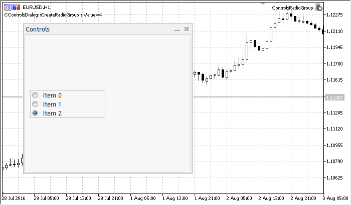

# CRadioGroup

CRadioGroup is a class of RadioGroup complex control (with dependent controls).

### Description

CRadioGroup enables creation of a control allowing the display and editing the enumerable type field.

### Declaration

```
   class CRadioGroup : public CWndClient

```

### Title

```
   #include <Controls\RadioGroup.mqh>

```

```
Inheritance hierarchy
   CObject
       CWnd
           CWndContainer
               CWndClient
                   CRadioGroup

```

Result of the [code](/en/docs/standardlibrary/controls/cradiogroup#sample) provided below:



### Class Methods by Groups

| Create |  |
| --- | --- |
| Create | Creates control |
| Chart event handlers |  |
| OnEvent | Event handler of all chart events |
| Add |  |
| AddItem | Adds new item |
| Read-only data |  |
| Value | Gets the value associated with the control |
| Dependent controls |  |
| CreateButton | Creates new CRadioButton item at a specified index |
| Dependent controls event handlers |  |
| OnVScrollShow | "Show" internal event handler (virtual) of VScroll dependent control |
| OnVScrollHide | "Hide" internal event handler (virtual) of VScroll dependent control |
| OnScrollLineDown | "ScrollLineDown" internal  event handler (virtual) of VScroll  dependent control |
| OnScrollLineUp | "ScrollLineUp" internal event handler (virtual) of VScroll dependent control |
| OnChangeItem | "ChangeItem" internal event handler (virtual) |
| Redraw |  |
| Redraw | Redraws the group of items |
| RowState | Sets the state of the specified item |
| Select | Selects the current item |

| Methods inherited from class CObject 
 Prev, Prev, Next, Next,  Type ,  Compare |
| --- |
| Methods inherited from class CWnd 
 Name ,  ControlsTotal ,  Control ,  Rect ,  Left ,  Left ,  Top ,  Top ,  Right ,  Right ,  Bottom ,  Bottom ,  Width ,  Width ,  Height ,  Height , Size, Size, Size,  Contains ,  Contains ,  Alignment ,  Align ,  Id ,  IsEnabled ,  IsVisible ,  Visible ,  IsActive ,  Activate ,  Deactivate ,  StateFlags ,  StateFlags ,  StateFlagsSet ,  StateFlagsReset ,  PropFlags ,  PropFlags ,  PropFlagsSet ,  PropFlagsReset ,  MouseX ,  MouseX ,  MouseY ,  MouseY ,  MouseFlags ,  MouseFlags ,  MouseFocusKill , BringToTop |
| Methods inherited from class CWndContainer 
 OnMouseEvent ,  ControlsTotal ,  Control ,  ControlFind ,  MouseFocusKill ,  Add ,  Add ,  Delete ,  Delete ,  Move ,  Move ,  Shift ,  Enable ,  Disable ,  Hide |
| Methods inherited from class CWndClient 
 ColorBackground ,  ColorBorder ,  BorderType ,  VScrolled ,  VScrolled ,  HScrolled ,  HScrolled , Id |

Example of creating a panel with group of radio buttons:

```
//+------------------------------------------------------------------+
//|                                           ControlsRadioGroup.mq5 |
//|                         Copyright 2000-2024, MetaQuotes Ltd. |
//|                                             https://www.mql5.com |
//+------------------------------------------------------------------+
#property copyright "Copyright 2017, MetaQuotes Software Corp."
#property link      "https://www.mql5.com"
#property version   "1.00"
#property description "Control Panels and Dialogs. Demonstration class CRadioGroup"
#include <Controls\Dialog.mqh>
#include <Controls\RadioGroup.mqh>
//+------------------------------------------------------------------+
//| defines                                                          |
//+------------------------------------------------------------------+
//--- indents and gaps
#define INDENT_LEFT                         (11)      // indent from left (with allowance for border width)
#define INDENT_TOP                          (11)      // indent from top (with allowance for border width)
#define INDENT_RIGHT                        (11)      // indent from right (with allowance for border width)
#define INDENT_BOTTOM                       (11)      // indent from bottom (with allowance for border width)
#define CONTROLS_GAP_X                      (5)       // gap by X coordinate
#define CONTROLS_GAP_Y                      (5)       // gap by Y coordinate
//--- for buttons
#define BUTTON_WIDTH                        (100)     // size by X coordinate
#define BUTTON_HEIGHT                       (20)      // size by Y coordinate
//--- for the indication area
#define EDIT_HEIGHT                         (20)      // size by Y coordinate
//--- for group controls
#define GROUP_WIDTH                         (150)     // size by X coordinate
#define LIST_HEIGHT                         (179)     // size by Y coordinate
#define RADIO_HEIGHT                        (56)      // size by Y coordinate
#define CHECK_HEIGHT                        (93)      // size by Y coordinate
//+------------------------------------------------------------------+
//| Class CControlsDialog                                            |
//| Usage: main dialog of the Controls application                   |
//+------------------------------------------------------------------+
class CControlsDialog : public CAppDialog
  {
private:
   CRadioGroup       m_radio_group;                   // CRadioGroup object
 
public:
                     CControlsDialog(void);
                    ~CControlsDialog(void);
   //--- create
   virtual bool      Create(const long chart,const string name,const int subwin,const int x1,const int y1,const int x2,const int y2);
   //--- chart event handler
   virtual bool      OnEvent(const int id,const long &lparam,const double &dparam,const string &sparam);
 
protected:
   //--- create dependent controls
   bool              CreateRadioGroup(void);
   //--- handlers of the dependent controls events
   void              OnChangeRadioGroup(void);
  };
//+------------------------------------------------------------------+
//| Event Handling                                                   |
//+------------------------------------------------------------------+
EVENT_MAP_BEGIN(CControlsDialog)
ON_EVENT(ON_CHANGE,m_radio_group,OnChangeRadioGroup)
EVENT_MAP_END(CAppDialog)
//+------------------------------------------------------------------+
//| Constructor                                                      |
//+------------------------------------------------------------------+
CControlsDialog::CControlsDialog(void)
  {
  }
//+------------------------------------------------------------------+
//| Destructor                                                       |
//+------------------------------------------------------------------+
CControlsDialog::~CControlsDialog(void)
  {
  }
//+------------------------------------------------------------------+
//| Create                                                           |
//+------------------------------------------------------------------+
bool CControlsDialog::Create(const long chart,const string name,const int subwin,const int x1,const int y1,const int x2,const int y2)
  {
   if(!CAppDialog::Create(chart,name,subwin,x1,y1,x2,y2))
      return(false);
//--- create dependent controls
   if(!CreateRadioGroup())
      return(false);
//--- succeed
   return(true);
  }
//+------------------------------------------------------------------+
//| Create the "RadioGroup" element                                  |
//+------------------------------------------------------------------+
bool CControlsDialog::CreateRadioGroup(void)
  {
//--- coordinates
   int x1=INDENT_LEFT;
   int y1=INDENT_TOP+(EDIT_HEIGHT+CONTROLS_GAP_Y)+
          (BUTTON_HEIGHT+CONTROLS_GAP_Y)+
          (EDIT_HEIGHT+CONTROLS_GAP_Y)+
          (EDIT_HEIGHT+CONTROLS_GAP_Y);
   int x2=x1+GROUP_WIDTH;
   int y2=y1+RADIO_HEIGHT;
//--- create
   if(!m_radio_group.Create(m_chart_id,m_name+"RadioGroup",m_subwin,x1,y1,x2,y2))
      return(false);
   if(!Add(m_radio_group))
      return(false);
//--- fill out with strings
   for(int i=0;i<3;i++)
      if(!m_radio_group.AddItem("Item "+IntegerToString(i),1<<i))
         return(false);
   m_radio_group.Value(1<<2);
   Comment(__FUNCTION__+" : Value="+IntegerToString(m_radio_group.Value()));
//--- succeed
   return(true);
  }
//+------------------------------------------------------------------+
//| Event handler                                                    |
//+------------------------------------------------------------------+
void CControlsDialog::OnChangeRadioGroup(void)
  {
   Comment(__FUNCTION__+" : Value="+IntegerToString(m_radio_group.Value()));
  }
//+------------------------------------------------------------------+
//| Global Variables                                                 |
//+------------------------------------------------------------------+
CControlsDialog ExtDialog;
//+------------------------------------------------------------------+
//| Expert initialization function                                   |
//+------------------------------------------------------------------+
int OnInit()
  {
//--- create application dialog
   if(!ExtDialog.Create(0,"Controls",0,40,40,380,344))
      return(INIT_FAILED);
//--- run application
   ExtDialog.Run();
//--- succeed
   return(INIT_SUCCEEDED);
  }
//+------------------------------------------------------------------+
//| Expert deinitialization function                                 |
//+------------------------------------------------------------------+
void OnDeinit(const int reason)
  {
//--- clear comments
   Comment("");
//--- destroy dialog
   ExtDialog.Destroy(reason);
  }
//+------------------------------------------------------------------+
//| Expert chart event function                                      |
//+------------------------------------------------------------------+
void OnChartEvent(const int id,         // event ID  
                  const long& lparam,   // event parameter of the long type
                  const double& dparam, // event parameter of the double type
                  const string& sparam) // event parameter of the string type
  {
   ExtDialog.ChartEvent(id,lparam,dparam,sparam);
  }

```

###
